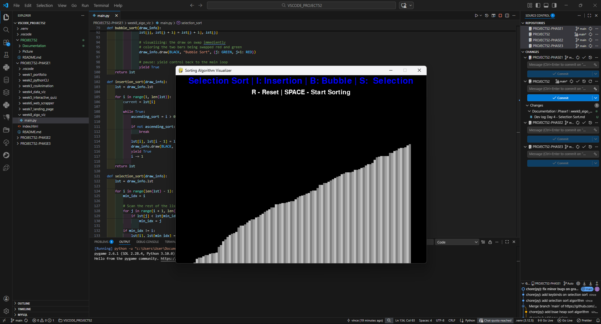

# 📝 DEV LOG: WEEK 08 - DAY 4

**Focus:** Implementing Selection Sort, upgrading the visual rendering with gradients, and debugging Python data structures.

## 1. The Initiative
The visualizer needed its third classic algorithm: **Selection Sort**. At the same time, the solid white bars were making it difficult to track individual elements during the sorting process. 
Today's goal was to add the new algorithm, update the UI with a repeating gradient for better visibility, and map the new controls to the HUD.

## 2. The Concepts

### Concept A: Selection Sort Logic
Unlike Bubble Sort (constant swapping) or Insertion Sort (sliding backwards), Selection Sort is surgical.
1.  **Scan:** Look at the entire unsorted portion of the list.
2.  **Locate:** Find the absolute minimum value.
3.  **Swap:** Swap that minimum value directly to the front of the unsorted section.
*Visual Result:* It makes far fewer swaps than the other algorithms, but it spends a lot of time "thinking" (scanning).

### Concept B: Visual Gradients & Modulo Math
To make the bars distinct, I applied a 3-shade grey gradient.
* **The Math:** I used the modulo operator (`i % 3`) to cycle through the gradient list. 
* **Result:** Bar 0 gets shade 0, Bar 1 gets shade 1, Bar 2 gets shade 2, Bar 3 gets shade 0 again. This creates a repeating visual texture across the entire screen.

### Concept C: Python Bug (Sets vs. Lists)
I encountered a `TypeError: 'set' object is not subscriptable` when trying to apply the gradients.
* **The Cause:** I defined the `GRADIENTS` variable using curly braces `{}` instead of square brackets `[]`. In Python, `{}` creates a **Set**, which is an *unordered* collection. You cannot ask a Set for its "first" item because it doesn't track order.
* **The Fix:** Changing to `[]` created a **List**, which is ordered and can be indexed.

## 3. The Output
A visually upgraded application featuring:
* **3 Algorithms:** Bubble (`B`), Insertion (`I`), and Selection (`S`).
* **Enhanced UI:** Bars now have a repeating grey gradient, making it much easier to track individual blocks as they move.





---

## 4. Source Code (Current Version)

```python
import pygame
import math
import random
import sys
from pygame.locals import * # type: ignore

# --- GLOBAL CONFIGURATION ---
BLACK = (0, 0, 0)
WHITE = (255, 255, 255)
GREEN = (0, 255, 0)
RED = (255, 0, 0)
BLUE = (0, 0, 255)

class DrawInformation:
    SIDE_PAD = 100
    TOP_PAD = 150
    
    # 3 shades of grey to create a repeating texture (LIST, not SET!)
    GRADIENTS = [
        (128, 128, 128),
        (160, 160, 160),
        (192, 192, 192)
    ]

    def __init__(self, width, height, lst):
        self.width = width
        self.height = height
        
        self.window = pygame.display.get_surface()
        self.set_list(lst)
        
        self.font = pygame.font.SysFont('arial', 30)
        self.large_font = pygame.font.SysFont('arial', 40)

    def set_list(self, lst):
        self.lst = lst
        self.min_val = min(lst)
        self.max_val = max(lst)

        self.block_width = round((self.width - self.SIDE_PAD) / len(lst))
        self.block_height = math.floor((self.height - self.TOP_PAD) / (self.max_val - self.min_val))
        self.start_x = self.SIDE_PAD // 2

    def draw(self, bg_color, algo_name, color_positions={}):
        self.window.fill(bg_color)
        
        controls = "R - Reset | SPACE - Start Sorting"
        sorting_text = f"{algo_name} | I: Insertion | B: Bubble | S: Selection"
        
        controls_surface = self.font.render(controls, 1, WHITE)
        sorting_surface = self.large_font.render(sorting_text, 1, BLUE)
        
        self.window.blit(controls_surface, (self.width/2 - controls_surface.get_width()/2, 45))
        self.window.blit(sorting_surface, (self.width/2 - sorting_surface.get_width()/2, 5))

        for i, val in enumerate(self.lst):
            x = self.start_x + i * self.block_width
            y = self.height - (val - self.min_val) * self.block_height
            
            # Assign gradient based on index
            color = self.GRADIENTS[i % 3]
            
            if i in color_positions:
                color = color_positions[i]
            
            pygame.draw.rect(self.window, color, (x, y, self.block_width, self.height))
            
        pygame.display.update()

# --- ALGORITHMS ---

def bubble_sort(draw_info):
    lst = draw_info.lst
    for i in range(len(lst) - 1):
        for j in range(len(lst) - 1 - i):
            if lst[j] > lst[j + 1]:
                lst[j], lst[j + 1] = lst[j + 1], lst[j]
                draw_info.draw(BLACK, "Bubble Sort", {j: GREEN, j+1: RED})
                yield True
    return lst

def insertion_sort(draw_info):
    lst = draw_info.lst
    for i in range(1, len(lst)):
        current = lst[i]
        while True:
            ascending_sort = i > 0 and lst[i - 1] > lst[i]
            if not ascending_sort:
                break
            
            lst[i], lst[i - 1] = lst[i - 1], lst[i]
            draw_info.draw(BLACK, "Insertion Sort", {i - 1: GREEN, i: RED})
            yield True
            i -= 1
    return lst

def selection_sort(draw_info):
    lst = draw_info.lst
    for i in range(len(lst) - 1):
        min_idx = i
        for j in range(i + 1, len(lst)):
            if lst[j] < lst[min_idx]:
                min_idx = j
                
        if min_idx != i:
            lst[i], lst[min_idx] = lst[min_idx], lst[i]
            draw_info.draw(BLACK, "Selection Sort", {i: GREEN, min_idx: RED})
            yield True
            
    return lst

class Main:
    pygame.init()
    
    DISPLAY_WIDTH = 800
    DISPLAY_HEIGHT = 600
    DISPLAY = pygame.display.set_mode((DISPLAY_WIDTH, DISPLAY_HEIGHT))
    
    def __init__(self):
        pygame.display.set_caption("Sorting Algorithm Visualizer")
        self.lst = self.generate_starting_list()
        self.draw_info = DrawInformation(self.DISPLAY_WIDTH, self.DISPLAY_HEIGHT, self.lst)
        
        self.sorting = False
        self.sorting_algorithm = bubble_sort
        self.sorting_algo_name = "Bubble Sort"
        self.sorting_algorithm_generator = None

    def generate_starting_list(self):
        return [random.randint(0, 100) for _ in range(50)]

    def run(self):
        clock = pygame.time.Clock()
        
        while True:
            clock.tick(60)
            
            if self.sorting:
                try:
                    next(self.sorting_algorithm_generator) # type: ignore
                except StopIteration:
                    self.sorting = False
            else:
                self.draw_info.draw(BLACK, self.sorting_algo_name)

            for event in pygame.event.get():
                if event.type == QUIT: #type: ignore
                    pygame.quit()
                    sys.exit()
                
                if event.type == KEYDOWN: #type: ignore
                    if event.key == K_r: #type: ignore
                        self.lst = self.generate_starting_list()
                        self.draw_info.set_list(self.lst)
                        self.sorting = False
                    
                    elif event.key == K_SPACE and not self.sorting: #type: ignore
                        self.sorting = True
                        self.sorting_algorithm_generator = self.sorting_algorithm(self.draw_info)
                    
                    elif event.key == K_i and not self.sorting: #type: ignore
                        self.sorting_algorithm = insertion_sort
                        self.sorting_algo_name = "Insertion Sort"
                    
                    elif event.key == K_b and not self.sorting: #type: ignore
                        self.sorting_algorithm = bubble_sort
                        self.sorting_algo_name = "Bubble Sort"
                        
                    elif event.key == K_s and not self.sorting: #type: ignore
                        self.sorting_algorithm = selection_sort
                        self.sorting_algo_name = "Selection Sort"

if __name__ == "__main__":
    app = Main()
    app.run()
````
