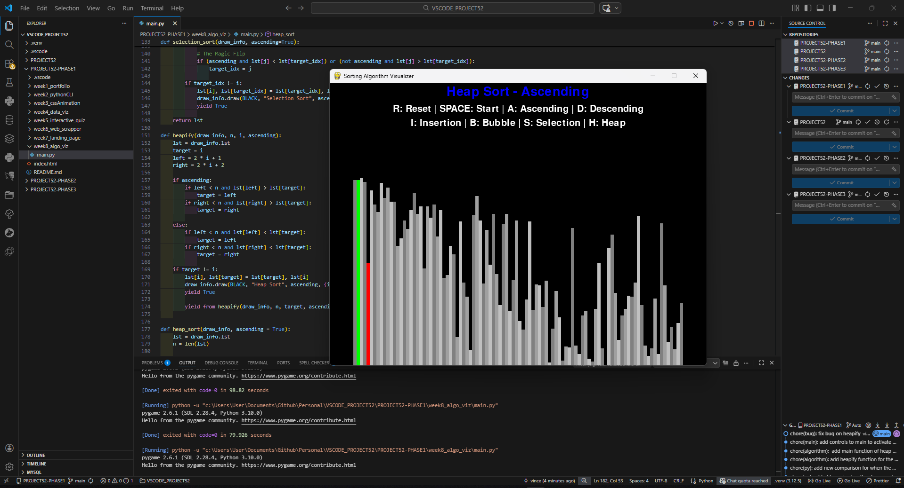
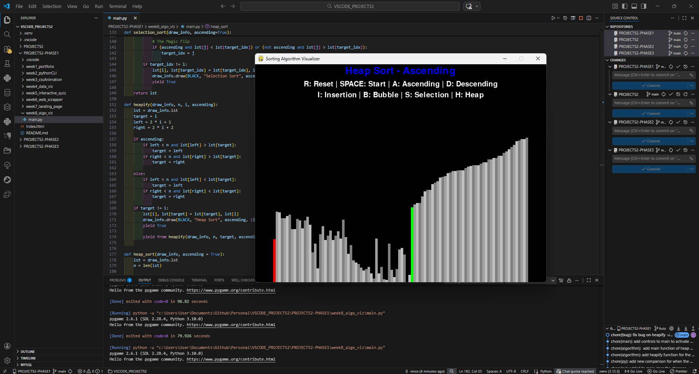
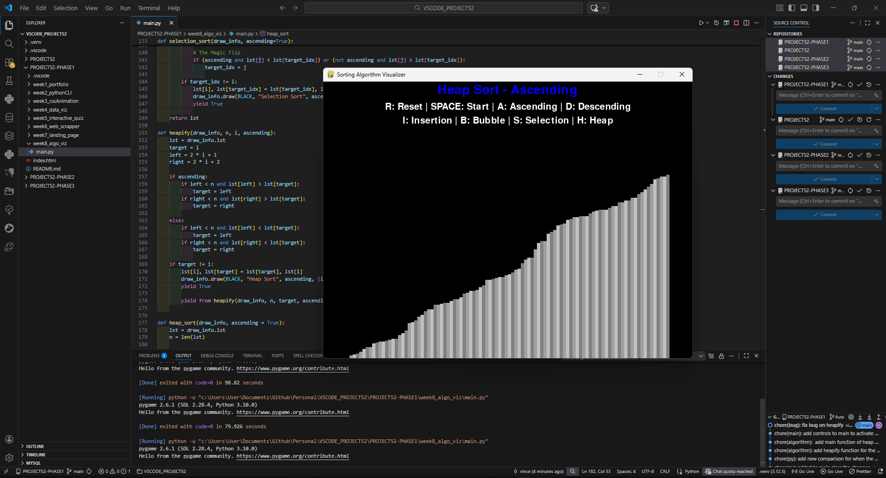

# 📝 DEV LOG: WEEK 08 - DAY 6 (OVERTIME)

**Focus:** Implementing Heap Sort, dealing with recursive generators, and debugging tree logic.

## 1. The Initiative

Even though the visualizer was complete with three $O(n^2)$ algorithms (Bubble, Insertion, Selection), I wanted to push further by adding an $O(n \log n)$ algorithm: **Heap Sort**. This required a completely different approach using recursive functions to build and deconstruct a binary tree.

## 2. The Concepts

### Concept A: Heap Sort Logic

Heap Sort doesn't just scan left to right; it treats the list like a pyramid (Binary Tree).

1.  **Heapify:** Reorganize the list so the absolute largest (or smallest) element is sitting at the "root" (index 0).
2.  **Extract:** Swap the root with the last unsorted element in the list.
3.  **Repeat:** Shrink the active list size by 1, and run `heapify` again to find the next root.

### Concept B: Recursive Generators (`yield from`)

Because `heapify` calls itself (recursion), a standard `yield` would pause the inner function but break the main Pygame loop. To animate a recursive function in Python, I had to use `yield from heapify(...)`. This tells Python to pass the pause command all the way up the chain to the main loop.

### Concept C: The "Broken Pyramid" Bug

I encountered a bug where the sort claimed to be finished, but the bars were completely jagged.

- **The Cause:** Inside the `heapify` logic for Ascending sorts, I accidentally used a `<` sign instead of a `>` sign when comparing the left/right child nodes to the target. It was building the pyramid upside down!
- **The Fix:** Changing it back to `>` fixed the tree structure, and the visualizer immediately produced a perfect staircase.

## 3. The Output

The visualizer now includes 4 algorithms, fully integrated with the directional HUD:

- `I`: Insertion Sort
- `B`: Bubble Sort
- `S`: Selection Sort
- `H`: Heap Sort







---

## 4. Source Code (Final Version v1.1)

```python
import pygame
import math
import random
import sys
from pygame.locals import * # type: ignore

# --- GLOBAL CONFIGURATION ---
BLACK = (0, 0, 0)
WHITE = (255, 255, 255)
GREEN = (0, 255, 0)
RED = (255, 0, 0)
BLUE = (0, 0, 255)

class DrawInformation:
    SIDE_PAD = 100
    TOP_PAD = 150

    GRADIENTS = [
        (128, 128, 128),
        (160, 160, 160),
        (192, 192, 192)
    ]

    def __init__(self, width, height, lst):
        self.width = width
        self.height = height

        self.window = pygame.display.get_surface()
        self.set_list(lst)

        self.font = pygame.font.SysFont('Ariel', 30)
        self.large_font = pygame.font.SysFont('Ariel', 40)

    def set_list(self, lst):
        self.lst = lst
        self.min_val = min(lst)
        self.max_val = max(lst)

        self.block_width = round((self.width - self.SIDE_PAD) / len(lst))
        self.block_height = math.floor((self.height - self.TOP_PAD) / (self.max_val - self.min_val))
        self.start_x = self.SIDE_PAD // 2

    def draw(self, bg_color, algo_name, ascending, color_positions={}):
        self.window.fill(bg_color)

        direction = "Ascending" if ascending else "Descending"
        title_text = f"{algo_name} - {direction}"
        controls_1 = "R: Reset | SPACE: Start | A: Ascending | D: Descending"
        controls_2 = "I: Insertion | B: Bubble | S: Selection | H: Heap"

        title_surface = self.large_font.render(title_text, 1, BLUE)
        controls_1_surface = self.font.render(controls_1, 1, WHITE)
        controls_2_surface = self.font.render(controls_2, 1, WHITE)

        self.window.blit(title_surface, (self.width/2 - title_surface.get_width()/2, 5))
        self.window.blit(controls_1_surface, (self.width/2 - controls_1_surface.get_width()/2, 45))
        self.window.blit(controls_2_surface, (self.width/2 - controls_2_surface.get_width()/2, 75))

        for i, val in enumerate(self.lst):
            x = self.start_x + i * self.block_width
            y = self.height - (val - self.min_val) * self.block_height

            color = self.GRADIENTS[i % 3]

            if i in color_positions:
                color = color_positions[i]
            pygame.draw.rect(self.window, color, (x, y, self.block_width, self.height))
        pygame.display.update()

# --- ALGORITHMS ---
def bubble_sort(draw_info, ascending=True):
    lst = draw_info.lst
    for i in range(len(lst) - 1):
        for j in range(len(lst) - 1 - i):
            num1 = lst[j]
            num2 = lst[j + 1]
            if (ascending and num1 > num2) or (not ascending and num1 < num2):
                lst[j], lst[j + 1] = lst[j + 1], lst[j]
                draw_info.draw(BLACK, "Bubble Sort", ascending, {j: GREEN, j+1: RED})
                yield True
    return lst

def insertion_sort(draw_info, ascending=True):
    lst = draw_info.lst
    for i in range(1, len(lst)):
        current = lst[i]
        while True:
            if i == 0:
                break
            if ascending and lst[i - 1] > lst[i]:
                swap = True
            elif not ascending and lst[i - 1] < lst[i]:
                swap = True
            else:
                swap = False

            if not swap:
                break

            lst[i], lst[i - 1] = lst[i - 1], lst[i]
            draw_info.draw(BLACK, "Insertion Sort", ascending, {i - 1: GREEN, i: RED})
            yield True
            i -= 1
    return lst

def selection_sort(draw_info, ascending=True):
    lst = draw_info.lst
    for i in range(len(lst) - 1):
        target_idx = i
        for j in range(i + 1, len(lst)):
            if (ascending and lst[j] < lst[target_idx]) or (not ascending and lst[j] > lst[target_idx]):
                target_idx = j

        if target_idx != i:
            lst[i], lst[target_idx] = lst[target_idx], lst[i]
            draw_info.draw(BLACK, "Selection Sort", ascending, {i: GREEN, target_idx: RED})
            yield True
    return lst

def heapify(draw_info, n, i, ascending):
    lst = draw_info.lst
    target = i
    left = 2 * i + 1
    right = 2 * i + 2

    if ascending:
        if left < n and lst[left] > lst[target]:
            target = left
        if right < n and lst[right] > lst[target]:
            target = right
    else:
        if left < n and lst[left] < lst[target]:
            target = left
        if right < n and lst[right] < lst[target]:
            target = right

    if target != i:
        lst[i], lst[target] = lst[target], lst[i]
        draw_info.draw(BLACK, "Heap Sort", ascending, {i: GREEN, target: RED})
        yield True

        yield from heapify(draw_info, n, target, ascending)

def heap_sort(draw_info, ascending=True):
    lst = draw_info.lst
    n = len(lst)

    for i in range(n // 2 - 1, -1, -1):
        yield from heapify(draw_info, n, i, ascending)

    for i in range(n - 1, 0, -1):
        lst[i], lst[0] = lst[0], lst[i]
        draw_info.draw(BLACK, "Heap Sort", ascending, {i: GREEN, 0: RED})
        yield True
        yield from heapify(draw_info, i, 0, ascending)

    return lst

class Main:
    pygame.init()

    BACKGROUND_COLOR = BLACK
    DISPLAY_WIDTH = 800
    DISPLAY_HEIGHT = 600
    DISPLAY = pygame.display.set_mode((DISPLAY_WIDTH, DISPLAY_HEIGHT))

    def __init__(self):
        pygame.display.set_caption("Sorting Algorithm Visualizer")
        self.lst = self.generate_starting_list()
        self.draw_info = DrawInformation(self.DISPLAY_WIDTH, self.DISPLAY_HEIGHT, self.lst)

        self.sorting = False
        self.ascending = True
        self.sorting_algorithm = bubble_sort
        self.sorting_algo_name = "Bubble Sort"
        self.sorting_algorithm_generator = None

    def generate_starting_list(self):
        return [random.randint(0, 200) for _ in range(100)]

    def run(self):
        clock = pygame.time.Clock()

        while True:
            clock.tick(60)

            if self.sorting:
                try:
                    next(self.sorting_algorithm_generator) # type: ignore
                except StopIteration:
                    self.sorting = False
            else:
                self.draw_info.draw(BLACK, self.sorting_algo_name, self.ascending)

            for event in pygame.event.get():
                if event.type == QUIT: #type: ignore
                    pygame.quit()
                    sys.exit()

                if event.type == KEYDOWN: #type: ignore
                    if event.key == K_r: #type: ignore
                        self.lst = self.generate_starting_list()
                        self.draw_info.set_list(self.lst)
                        self.sorting = False

                    if event.key == K_SPACE and not self.sorting: #type: ignore
                        self.sorting = True
                        self.sorting_algorithm_generator = self.sorting_algorithm(self.draw_info, self.ascending)

                    elif event.key == K_a and not self.sorting: #type: ignore
                        self.ascending = True

                    elif event.key == K_d and not self.sorting: #type: ignore
                        self.ascending = False

                    elif event.key == K_i and not self.sorting: #type: ignore
                        self.sorting_algorithm = insertion_sort
                        self.sorting_algo_name = "Insertion Sort"

                    elif event.key == K_b and not self.sorting: #type: ignore
                        self.sorting_algorithm = bubble_sort
                        self.sorting_algo_name = "Bubble Sort"

                    elif event.key == K_s and not self.sorting: #type: ignore
                        self.sorting_algorithm = selection_sort
                        self.sorting_algo_name = "Selection Sort"

                    elif event.key == K_h and not self.sorting: #type: ignore
                        self.sorting_algorithm = heap_sort
                        self.sorting_algo_name = "Heap Sort"

if __name__ == "__main__":
    app = Main()
    app.run()
```
