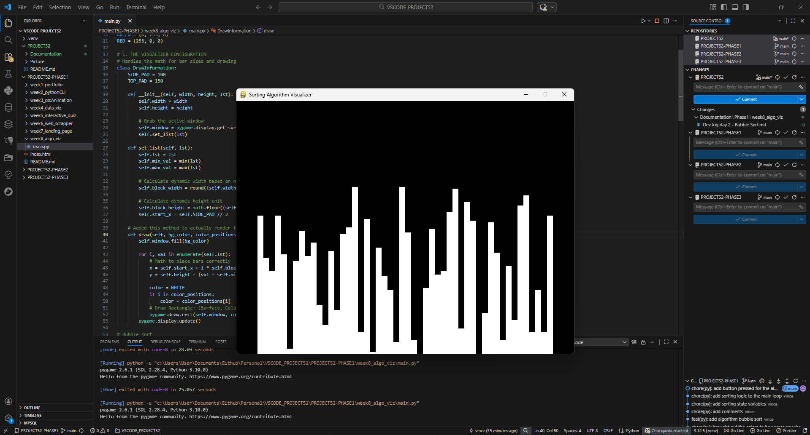
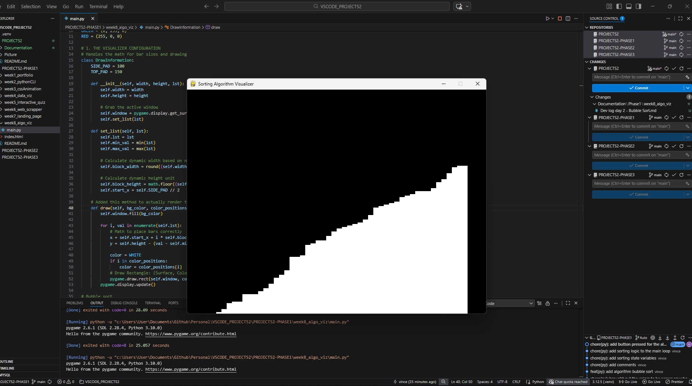

# 📝 DEV LOG: WEEK 08 - DAY 2

**Focus:** Implementing Bubble Sort with real-time visualization.

## 1. The Initiative
After building the rendering engine yesterday, the goal today was to make the bars actually move.
I implemented **Bubble Sort**, the standard "Hello World" of sorting algorithms. The challenge was not just sorting the list, but visualizing every single swap in real-time without freezing the window.

## 2. The Concepts

### Concept A: The Generator Pattern (`yield`)
Standard functions run from top to bottom instantly. If I ran `bubble_sort` normally, the screen would freeze for a fraction of a second and then jump to the sorted state.
To animate it step-by-step, I used a Python **Generator**.
* **How it works:** The `yield` keyword pauses the function and saves its exact state (local variables, loop position).
* **The Loop:** The Main Loop calls `next(generator)`, which runs the sort logic *only until* it hits `yield`. Then it updates the screen. Then it repeats.

### Concept B: Bubble Sort Logic
The algorithm pushes the largest number to the end of the list in each pass (like a bubble rising to the surface).
* **Comparison:** Look at element `j` and `j+1`.
* **Swap:** If `j > j+1`, swap them.
* **Visualize:** I color element `j` **Green** and `j+1` **Red** to show exactly which two bars are being compared.

## 3. The Output
A visualizer where pressing `SPACE` triggers an animated sort. You can see the Green and Red blocks moving across the screen, pushing the tallest bars to the right side until the list is perfectly ascending.





---

## 4. Source Code (Current Version)

```python
import pygame
import math
import random
import sys
from pygame.locals import * # type: ignore

# --- GLOBAL COLORS ---
BLACK = (0, 0, 0)
WHITE = (255, 255, 255)
GREEN = (0, 255, 0)
RED = (255, 0, 0)
GREY = (128, 128, 128)

class DrawInformation:
    SIDE_PAD = 100
    TOP_PAD = 150

    def __init__(self, width, height, lst):
        self.width = width
        self.height = height
        
        self.window = pygame.display.get_surface()
        self.set_list(lst)

    def set_list(self, lst):
        self.lst = lst
        self.min_val = min(lst)
        self.max_val = max(lst)

        self.block_width = round((self.width - self.SIDE_PAD) / len(lst))
        self.block_height = math.floor((self.height - self.TOP_PAD) / (self.max_val - self.min_val))
        self.start_x = self.SIDE_PAD // 2

    # UPDATED: Now accepts a dictionary of positions to color differently
    # color_positions = { index: (R, G, B) }
    def draw(self, bg_color, color_positions={}):
        self.window.fill(bg_color)
        
        for i, val in enumerate(self.lst):
            x = self.start_x + i * self.block_width
            y = self.height - (val - self.min_val) * self.block_height
            
            # Default color is White, unless specified in color_positions
            color = WHITE
            if i in color_positions:
                color = color_positions[i]
            
            pygame.draw.rect(self.window, color, (x, y, self.block_width, self.height))
            
        pygame.display.update()

# --- ALGORITHM SECTION ---
def bubble_sort(draw_info):
    lst = draw_info.lst
    
    # Standard Bubble Sort Loop
    for i in range(len(lst) - 1):
        for j in range(len(lst) - 1 - i):
            num1 = lst[j]
            num2 = lst[j + 1]

            # Compare adjacent numbers
            if num1 > num2:
                # SWAP THEM
                lst[j], lst[j + 1] = lst[j + 1], lst[j]
                
                # VISUALIZE: Draw the swap immediately
                # We color the two bars being swapped RED and GREEN
                draw_info.draw(BLACK, {j: GREEN, j+1: RED})
                
                # PAUSE: Yield control back to the main loop
                yield True

    return lst

class Main:
    pygame.init()
    
    DISPLAY_WIDTH = 800
    DISPLAY_HEIGHT = 600
    DISPLAY = pygame.display.set_mode((DISPLAY_WIDTH, DISPLAY_HEIGHT))
    
    def __init__(self):
        pygame.display.set_caption("Sorting Algorithm Visualizer")
        self.lst = self.generate_starting_list()
        self.draw_info = DrawInformation(self.DISPLAY_WIDTH, self.DISPLAY_HEIGHT, self.lst)
        
        # Sorting State Variables
        self.sorting = False
        self.sorting_algorithm_generator = None

    def generate_starting_list(self):
        return [random.randint(0, 100) for _ in range(50)]

    def run(self):
        clock = pygame.time.Clock()
        
        while True:
            clock.tick(60)
            
            # --- SORTING LOGIC ---
            if self.sorting:
                try:
                    # Request the next step from the algorithm
                    next(self.sorting_algorithm_generator)
                except StopIteration:
                    # The algorithm is finished
                    self.sorting = False
            else:
                # Only draw freely when not sorting (saves resources)
                self.draw_info.draw(BLACK)

            # --- EVENT HANDLING ---
            for event in pygame.event.get():
                if event.type == QUIT:
                    pygame.quit()
                    sys.exit()
                
                if event.type == KEYDOWN:
                    # R = Reset
                    if event.key == K_r:
                        self.lst = self.generate_starting_list()
                        self.draw_info.set_list(self.lst)
                        self.sorting = False
                    
                    # SPACE = Start Bubble Sort
                    if event.key == K_SPACE and not self.sorting:
                        self.sorting = True
                        # Initialize the Generator
                        self.sorting_algorithm_generator = bubble_sort(self.draw_info)

if __name__ == "__main__":
    app = Main()
    app.run()
````

---
