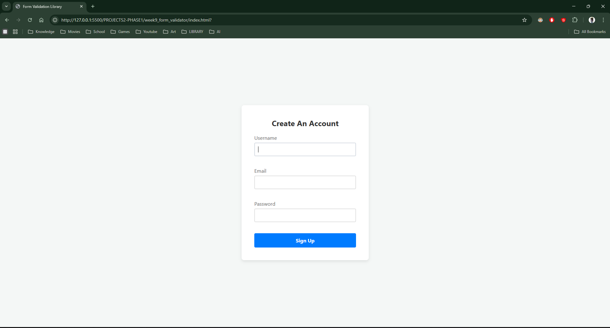
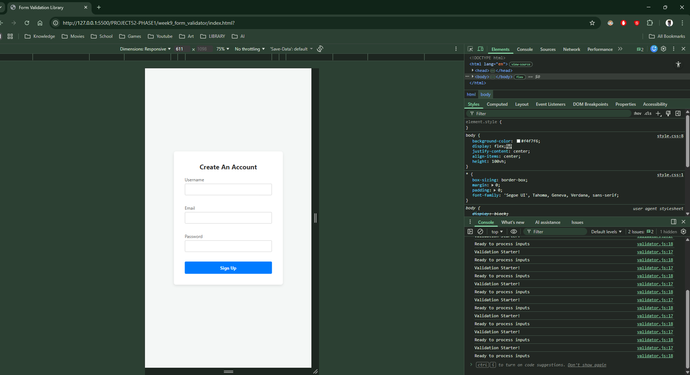

# 📝 DEV LOG: WEEK 09 - DAY 1

**Focus:** Setting up the HTML/CSS canvas and building the Object-Oriented JavaScript skeleton.

## 1. The Initiative

Instead of writing messy, hard-coded validation rules for a single specific form, I am building a reusable Library. The goal today was to set up the UI and connect a JavaScript `Class` that can "hijack" any form it is attached to.

## 2. The Concepts

### Concept A: Declarative Configuration (`data-rules`)

Instead of putting the validation logic deep inside the JavaScript (e.g., `if username.length < 3`), I embedded the rules directly into the HTML using custom data attributes: `<input data-rules="required|min:3">`.
This is a professional design pattern. It means my JavaScript engine will be "blind" but smart—it will just read whatever rules the HTML tells it to enforce.

### Concept B: Object-Oriented Architecture (Classes)

By wrapping the logic in a `class Validator {}`, I created a blueprint. I can now validate multiple forms on the same page simply by instantiating new objects: `new Validator('login-form')` and `new Validator('register-form')`. They won't interfere with each other.

### Concept C: Event Hijacking (`preventDefault`)

Browsers naturally want to refresh the page and send data to a server when a `<button type="submit">` is clicked. By using `event.preventDefault()` inside the submit event listener, I stopped the browser in its tracks. The JavaScript engine now has total control over what happens next.

## 3. The Output

A clean, styled registration form connected to a JavaScript Validator class. Clicking "Sign Up" successfully triggers the JS engine without reloading the page.

---
