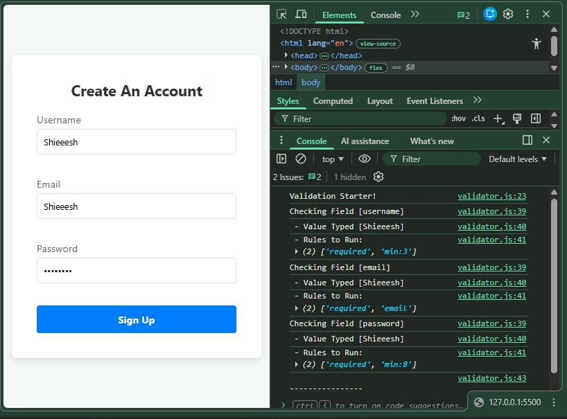

# 📝 DEV LOG: WEEK 09 - DAY 2

**Focus:** Extracting declarative rules from the HTML and converting them into actionable JavaScript data structures.

## 1. The Initiative
The HTML has `data-rules` attached to the inputs, but the JavaScript was completely blind to them. The goal today was to write an "Extraction Engine" that finds those inputs, reads their rules, and formats them so the logic engine can process them later.

## 2. The Concepts

### Concept A: Attribute Targeting (`querySelectorAll`)
Instead of selecting inputs by their IDs one by one, I used `querySelectorAll('input[data-rules]')`. This is incredibly powerful because it makes the library scaleable. The engine will automatically find *any* input that needs validation, whether there are 3 inputs or 30, without me writing extra code.

### Concept B: String Manipulation (`split`)
HTML attributes are always read as raw Strings (e.g., `"required|min:3"`). To make this useful for JavaScript, I used the `.split('|')` method. This acts like a machete, cutting the string wherever the pipe character is found, and returning a clean Array: `['required', 'min:3']`. 

## 3. The Output
The Validator class now successfully:
1. Hijacks the form submission.
2. Scans the form for inputs needing validation.
3. Extracts the typed value.
4. Breaks the validation rules down into an Array.
5. Logs the intelligence cleanly to the console.

---
