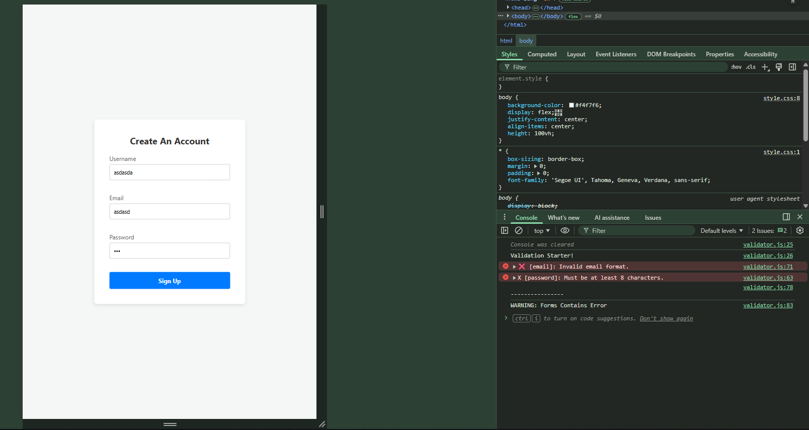
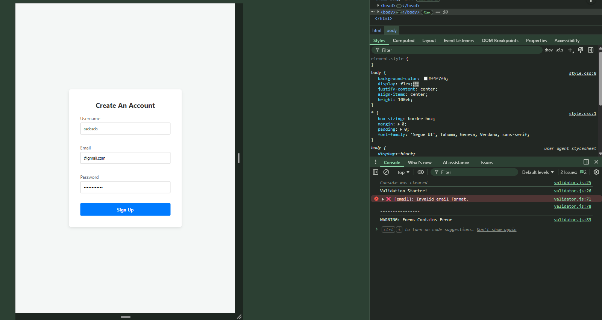

# 📝 DEV LOG: WEEK 09 - DAY 3

**Focus:** Building the core logic engine to process arrays of rules and validate user input against them.

## 1. The Initiative
Extracting the rules was only half the battle. Today, I needed to build a routing system that takes those extracted rules (like `required` or `email`) and runs the specific JavaScript tests associated with them. 

## 2. The Concepts

### Concept A: Parameter Splitting
Some rules contain variables, like `min:8`. I wrote logic to detect the colon (`:`) and split the string again. This allowed me to separate the *Name* of the rule (`min`) from the *Parameter* of the rule (`8`), making the validation dynamic instead of hardcoded.

### Concept B: The Switch Router
Instead of a massive, messy block of `if / else if` statements, I used a `switch` statement. As the engine loops through an input's rules, the `switch` acts like a train dispatcher, routing the data to the correct test case (`case 'required':`, `case 'min':`, etc.).

### Concept C: Regular Expressions (Regex)
To validate the email format, I used a Regex pattern (`/^[^\s@]+@[^\s@]+\.[^\s@]+$/`). This string of characters instructs the computer to verify that the input contains text, an `@` symbol, a domain, a dot, and an extension, without relying on clunky manual string checks.

## 3. The Output
The engine now successfully validates data in memory. It detects blank fields, inputs that are too short, and improperly formatted emails, logging specific errors to the console. If all tests pass, it logs a final Success message.

---

