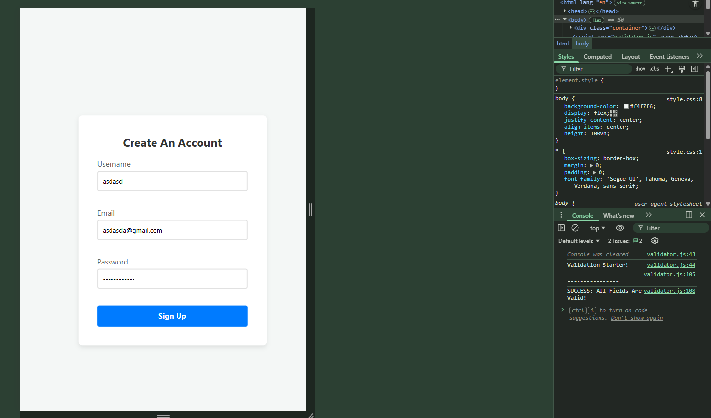
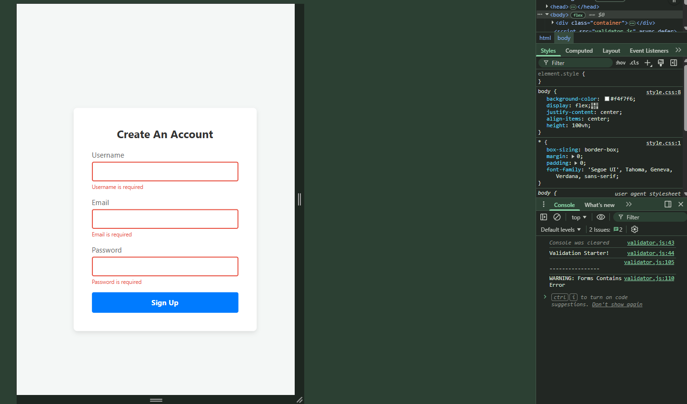
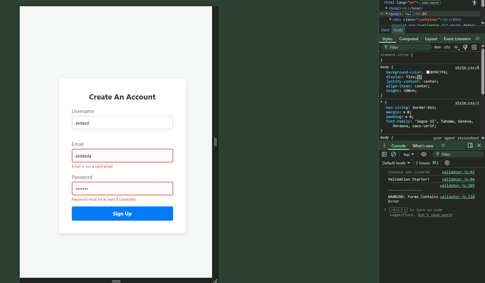

# 📝 DEV LOG: WEEK 09 - DAY 4

**Focus:** Connecting the logic engine to the User Interface to display dynamic, context-aware visual error states directly on the screen.

## 1. The Initiative
Up until today, the validation engine was working perfectly, but it was essentially "headless"—it only reported errors to the developer console. To make this a true, production-ready library, I needed to bridge the gap between backend-style logic and front-end User Experience (UX). The objective was to write UI helper methods that manipulate the Document Object Model (DOM) in real-time, injecting error text and triggering CSS animations the exact moment a user submits bad data.

## 2. The Concepts & Execution

### Concept A: Relative DOM Traversal (`parentElement`)
The amateur way to show errors is to give every single error text an ID (like `id="username-error"`) and target them one by one. But because this is a reusable library, the JavaScript cannot know the IDs of the HTML beforehand. 
Instead, I used **Relative DOM Traversal**. 
```javascript
const formControl = input.parentElement;
const small = formControl.querySelector('small');
````

When an `<input>` fails a test, the script looks "up" the DOM tree using `.parentElement` to grab the specific `<div>` that wraps it. From there, it looks "down" into that specific div using `.querySelector('small')` to inject the error message. This makes the library infinitely scalable to any form structure.

### Concept B: State Management via CSS Toggling

A key principle of clean architecture is "Separation of Concerns." JavaScript should handle logic, and CSS should handle appearance.

Instead of using JavaScript to manually change the border color to red and the text to visible, I simply swapped the class of the parent container:

``` JavaScript
formControl.className = 'form-control error';
```

This single line acts as a trigger. The CSS takes over, applying the red borders and making the hidden `<small>` text visible. When the field passes validation, JavaScript strips the `error` class away, and the UI instantly resets.

### Concept C: Error Cascading & Loop Control (`break`)

Good UX means not overwhelming the user. If a user leaves the password field blank, they only need to know it's "required." They don't need a second error yelling at them that it "must be at least 8 characters long" (which it obviously isn't, because it's blank).

By utilizing a `for...of` loop and a `break` statement:

``` JavaScript
if (hasError) break; 
```

The engine stops checking rules the exact millisecond a field fails its first test. This prevents confusing, overlapping error messages and saves processing power.

### Concept D: String Manipulation for UI Polish

Raw HTML IDs are usually lowercase (e.g., `username`, `password`). To make the dynamically generated error messages look professional, I created a helper method to capitalize the first letter before injecting it into the DOM.

``` JavaScript
// Turns "username" into "Username"
return input.id.charAt(0).toUpperCase() + input.id.slice(1);
```

## 3. The Output

The library has evolved from a silent logic engine into a fully interactive Front-End tool. It intercepts the form submission, grades the data, and if it fails, immediately manipulates the DOM to provide precise, highlighted visual feedback to the user.








---
