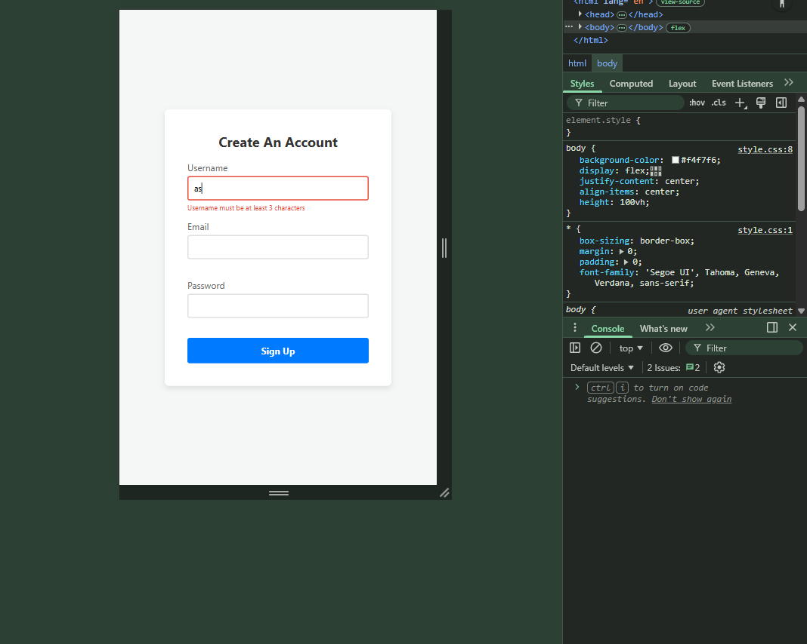
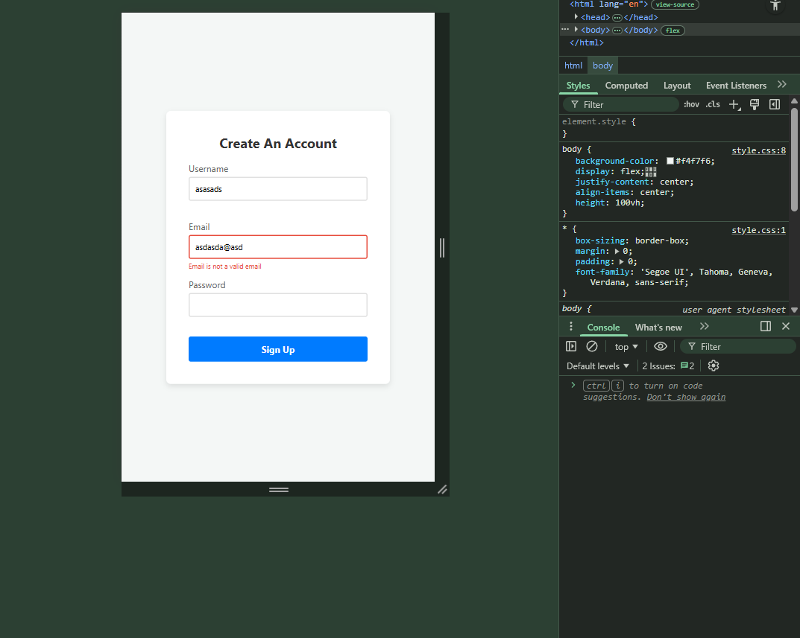
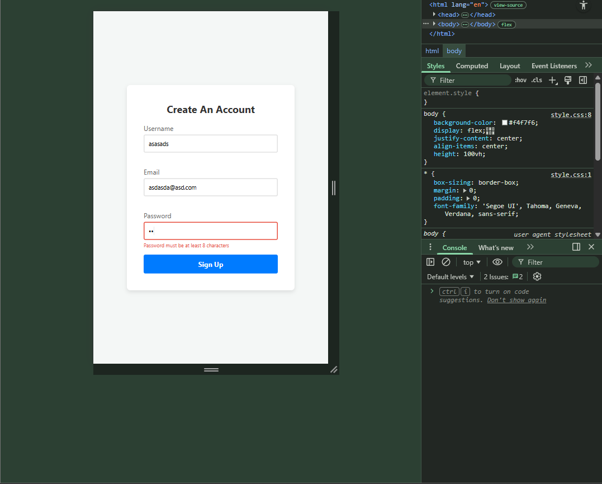
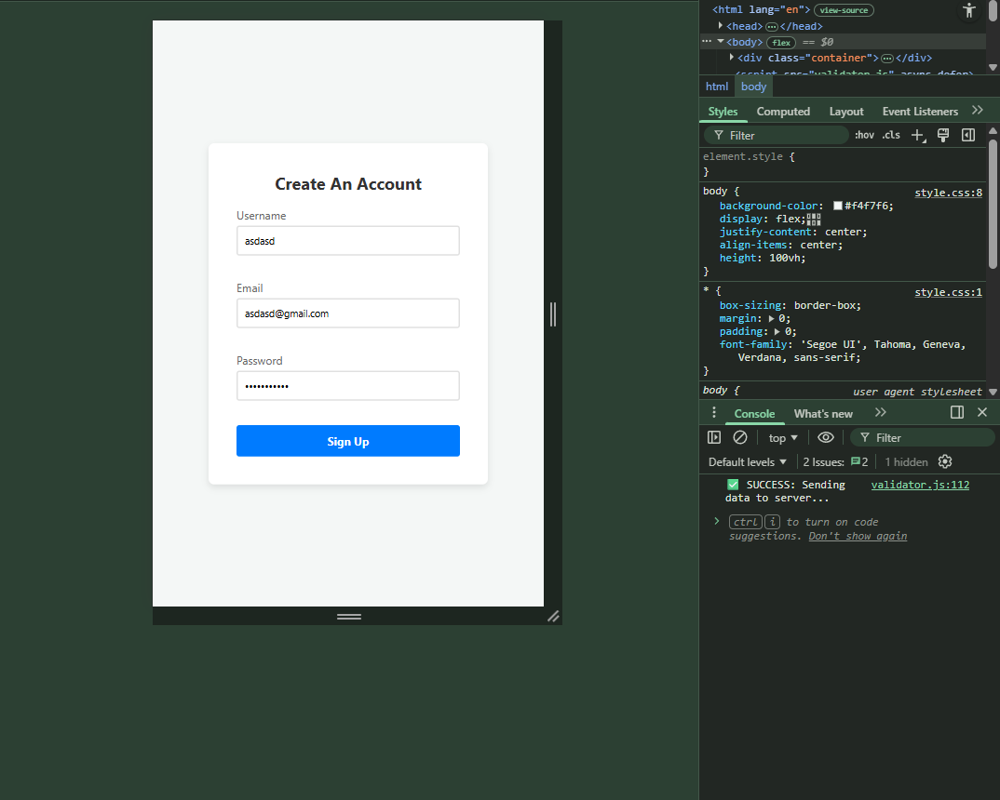

# 📝 DEV LOG: WEEK 09 - DAY 5

**Focus:** Refactoring the monolithic logic engine to support real-time, per-keystroke input validation for a frictionless User Experience (UX).

## 1. The Initiative
The library was successfully catching errors and manipulating the DOM, but the UX was clunky. Forcing a user to guess if they fixed an error, click "Submit", and wait for the UI to update is a frustrating cycle. Modern applications use "Micro-Interactions"—providing immediate visual feedback the exact millisecond a user resolves an issue. To achieve this, I had to fundamentally restructure (refactor) the engine's architecture.

## 2. The Concepts & Execution

### Concept A: Architectural Refactoring (Monolith to Modular)
Before today, the validation logic was trapped inside a single, giant loop (`validateForm`) that only ran when the Submit button was clicked. 
**Refactoring** is the practice of restructuring existing code without changing its external behavior. I ripped the core checking logic out of the giant loop and isolated it into a dedicated method:

```javascript
validateField(input) {
    // Logic to check rules, show errors, or show success
    // Returns true (passed) or false (failed)
    return !hasError; 
}
````

By making this logic modular, the engine is no longer chained to the "Submit" button. It can be called from anywhere, at any time, on any specific input field.

### Concept B: The `input` Event Lifecycle

To make the form react as the user types, I needed a new event listener. I could have used `keydown` or `keyup`, but those don't catch things like right-clicking and pasting text, or browser autofill.

Instead, I used the `input` event, which fires natively anytime the `value` of an element changes, regardless of how it happens:

``` JavaScript
this.inputs.forEach((input) => {
    input.addEventListener('input', () => {
        this.validateField(input); 
    });
});
```

This loops through every input on initialization and attaches a silent "watcher." When the user types, it grabs _only_ that specific input and feeds it to `validateField()`.

### Concept C: Boolean State Cascading

Because the logic is split, the `validateAll()` method (used for submitting the whole form) needs a way to know if the individual `validateField()` checks passed or failed.

I engineered a state cascade using Boolean flags:

``` JavaScript
validateAll() {
    let isFormValid = true; 

    this.inputs.forEach((input) => {
        const isFieldValid = this.validateField(input);
        if (!isFieldValid) {
            isFormValid = false; // The cascade: One failure ruins the whole form
        }
    });
}
```

If 5 fields pass, but 1 fails, `isFieldValid` reports `false`, which flips the master `isFormValid` switch to `false`, securely blocking the form from submitting.

### Concept D: UX Psychology

This refactor dramatically improves the user experience. By calling `this.showSuccess(input)` at the very top of the `validateField` method, the engine proactively strips away the red error box the moment a rule is satisfied (e.g., typing the 3rd character for `min:3`). It rewards the user instantly, reducing friction and frustration.

## 3. The Output
The Form Validation Library (v1.0) is officially complete.

- **Declarative:** Reads `data-rules` directly from HTML.
- **Object-Oriented:** Reusable across infinite forms via `new Validator('id')`.
- **Dynamic:** Uses DOM Traversal to inject UI states.
- **Real-Time:** Validates individually on keystrokes, and globally on submission.









---

