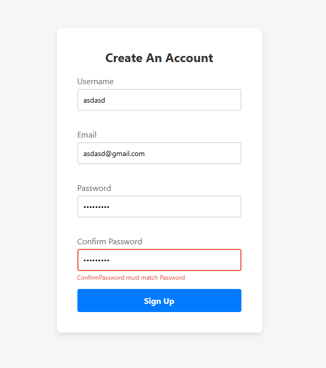
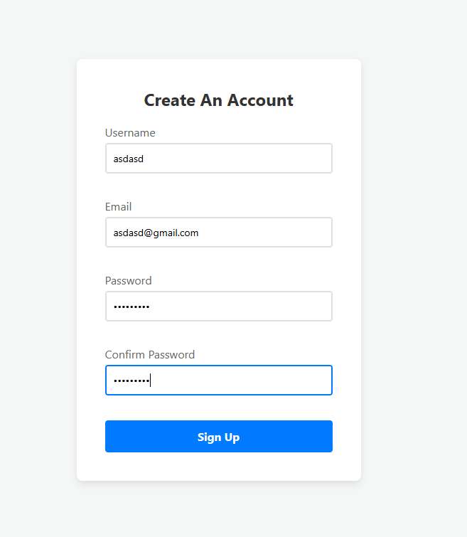

# 📝 DEV LOG: WEEK 09 - DAY 6

**Focus:** Implementing cross-field validation to handle dependent inputs like "Confirm Password".

## 1. The Initiative
Standard validation checks a field in isolation (e.g., "Is this empty?" or "Is this an email?"). However, real-world applications require dependent validation, where the validity of one input relies entirely on the value of another. I put in overtime today to add a `match` rule to the library's engine.

## 2. The Concepts

### Concept A: Cross-Field Logic (`match:id`)
I expanded the HTML declarative rules to accept a target ID as a parameter: `data-rules="match:password"`. When the JavaScript engine parses this rule, it splits the string, identifies `match` as the rule, and stores `password` as the target parameter.

### Concept B: Absolute DOM Targeting
While the UI error states use *Relative* DOM Traversal (`input.parentElement`) to find nearby elements, the `match` rule requires *Absolute* DOM Targeting. 

```javascript
const targetField = document.getElementById(ruleParam);
````

The engine searches the entire document for the specific ID provided in the parameter, extracts its current value, and compares it against the active input. If they differ, it throws a dynamic error using the target's formatted name.

## 3. The Output

The Validator Library now fully supports cross-field dependency checks in real-time. It successfully flags when "Confirm Password" does not match the original "Password" field and instantly clears the error when the keystrokes align.






---
