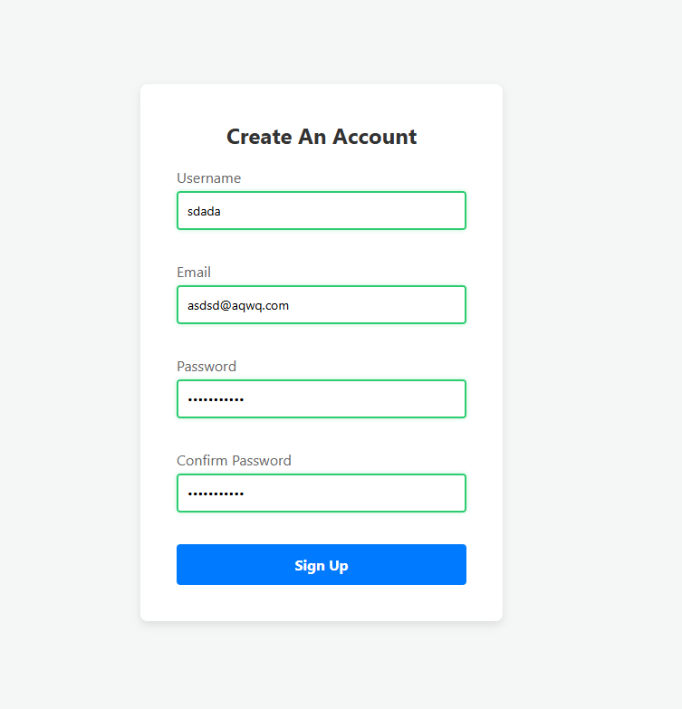

# 📝 DEV LOG: WEEK 09 - DAY 7 
**Focus:** Implementing positive visual reinforcement (success states) for valid inputs to improve the overall User Experience.

## 1. The Initiative
A good user interface shouldn't just yell at the user when they make a mistake; it should actively reward them when they do things correctly. To finalize the library, I added a "Success State" that triggers a green glow around inputs the moment they pass all validation rules.

## 2. The Concepts

### Concept A: UX Psychology & Positive Reinforcement
In UX design, colors communicate state. Red signifies a block or error, while green signifies safe passage. By actively changing the border to green as the user types a valid entry, the application builds user confidence and reduces form-abandonment rates. 

### Concept B: CSS Class Injection
I expanded the stylesheet to include a `.form-control.success` class utilizing a green border (`#2ecc71`) and a subtle `box-shadow`. 
In the JavaScript engine, I updated the `showSuccess` method to inject this class:

```javascript
showSuccess(input) {
    const formControl = input.parentElement;
    formControl.className = 'form-control success'; 
}
````

Because of the real-time event listeners built on Day 5, this method is called seamlessly as the user types, instantly switching the UI from red (error) to green (success) the millisecond the validation logic clears.

## 3. The Output
A fully polished, real-time validation library featuring declarative HTML rules, dynamic error generation, cross-field dependency checking, and positive visual reinforcement.




---

