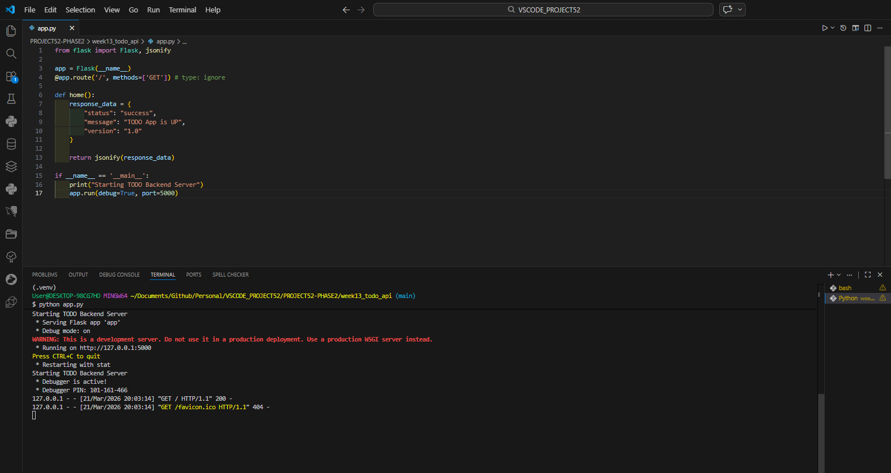
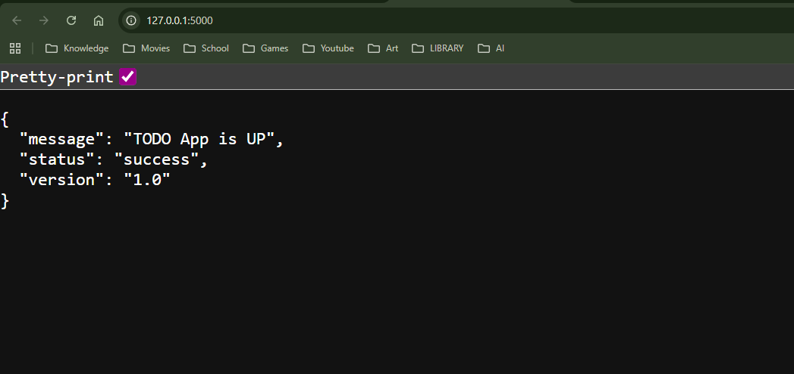

# 📝 DEV LOG: WEEK 13 - DAY 1

**Core Objective:** Initialize a local backend web server using Python and the Flask framework, and establish a root endpoint that successfully returns JSON data.

## 1. The Initiative & Context
Phase 2 shifts the focus from frontend presentation to backend architecture and data routing. The objective for Day 1 was to stand up a lightweight Python server capable of receiving HTTP requests and returning structured data, forming the foundation of a RESTful API for our Todo application.

## 2. Architectural Decisions & Concepts

### Concept A: Flask Framework Initialization
I utilized `Flask`, a micro web framework for Python, to handle the underlying WSGI (Web Server Gateway Interface) protocols.
* Instantiated the application engine using `app = Flask(__name__)`.
* Booted the server on port `5000` with `debug=True` enabled to allow for hot-reloading during the development cycle.

### Concept B: Endpoint Routing & JSON
APIs do not return visual interfaces (HTML/CSS); they return raw data.
* Defined the root route `@app.route('/', methods=['GET'])` to intercept standard browser requests.
* Engineered the endpoint to return a Python dictionary converted into JSON format using Flask's `jsonify` function. This provides a standardized data structure (`status`, `message`, `version`) that frontend applications can easily parse and utilize.

## 3. The Output & Result
The development server successfully launched on `localhost:5000`. When navigating to the root URL via a web browser, the server correctly processes the HTTP GET request and serves the raw JSON dictionary payload to the client.

---
