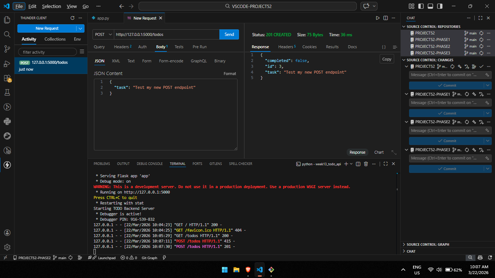
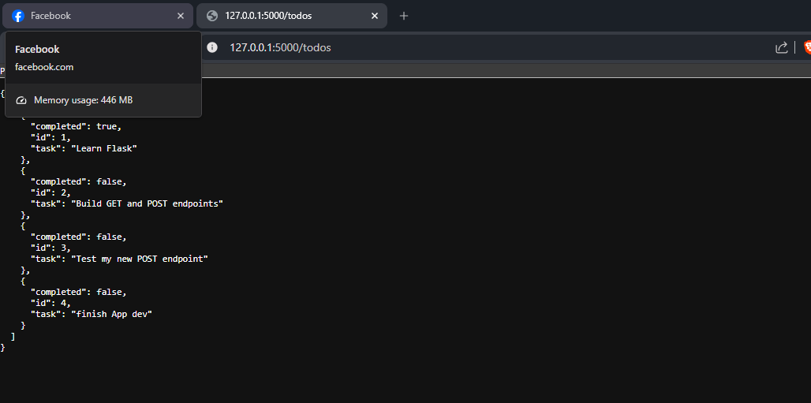

# 📝 DEV LOG: WEEK 13 - DAY 2

**Core Objective:** Establish an in-memory database structure and engineer RESTful endpoints capable of handling both HTTP `GET` (data retrieval) and `POST` (data creation) requests.

## 1. The Initiative & Context
A functional API requires the ability to perform CRUD (Create, Read, Update, Delete) operations. The objective for Day 2 was to implement the first two operations: "Read" via a `GET` request, and "Create" via a `POST` request, utilizing a temporary Python list to simulate a persistent database.

## 2. Architectural Decisions & Concepts

### Concept A: The In-Memory Data Store
Before integrating a complex SQL database, I instantiated a list of dictionaries (`todos = [...]`) to serve as a temporary state manager. This allows the server to hold data in memory while it remains active.

### Concept B: Endpoint Routing (GET vs POST)
* **The GET Route:** Engineered `@app.route('/todos', methods=['GET'])` to return the entire `todos` array. This allows client applications to retrieve the current state of the list.
* **The POST Route:** Engineered `@app.route('/todos', methods=['POST'])` to handle incoming data payloads.
  * Utilized Flask's `request.get_json()` method to parse the incoming request body.
  * Engineered an auto-incrementing ID mechanism (`len(todos) + 1`) to assign unique identifiers to new tasks.
  * Appended the new dictionary to the state list and returned a `201 Created` HTTP status code.

### Concept C: API Testing (Thunder Client)
Because standard web browsers natively execute `GET` requests from the URL bar, testing `POST` endpoints requires specialized tooling. I utilized the `Thunder Client` VS Code extension to manually forge HTTP POST requests, inject JSON payloads, and monitor the server's response headers and status codes.

## 3. The Output & Result
The server successfully intercepted the forged `POST` request from Thunder Client, parsed the incoming JSON task, dynamically generated a new ID, appended it to the dataset, and returned the exact `201 CREATED` confirmation payload.

---

