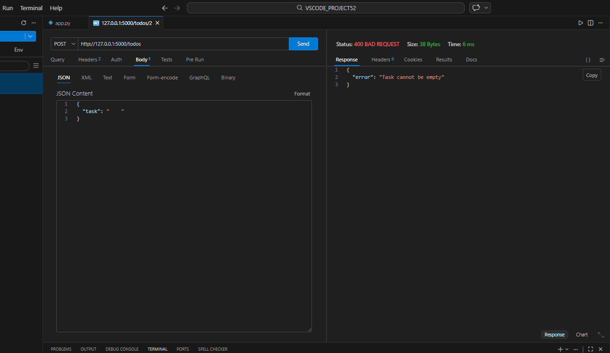
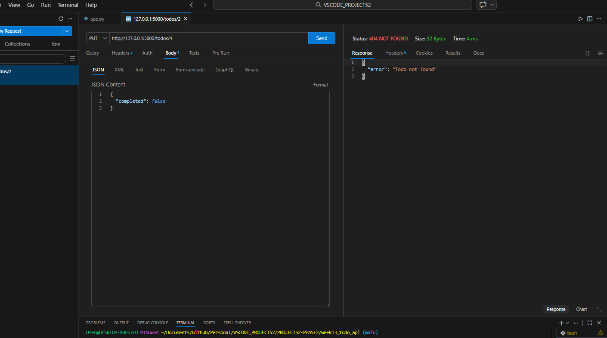

# 📝 DEV LOG: WEEK 13 - DAY 4

**Core Objective:** Prepare the REST API for frontend integration by configuring Cross-Origin Resource Sharing (CORS) policies, and implement backend data validation to secure endpoints against malformed or empty data payloads.

## 1. The Initiative & Context
With the CRUD operations fully functional, the API required hardening before it could be safely connected to a frontend client in Phase 2. Web browsers inherently block requests made from a frontend script to a backend server running on a different port (CORS policy). Additionally, the endpoints were vulnerable to accepting empty strings, which would pollute the database. Day 4 focused on resolving these two critical infrastructure requirements.

## 2. Architectural Decisions & Concepts

### Concept A: CORS Integration (`flask-cors`)
To allow a future frontend (e.g., running on port 5500 or 3000) to communicate with the Python server (running on port 5000), I installed the `flask-cors` library.
* Initialized `CORS(app)` immediately after instantiating the Flask application. This automatically appends the necessary HTTP headers to all outbound responses, instructing web browsers that it is safe to permit the data transfer.

### Concept B: Endpoint Data Validation (The Shield)
I engineered defensive logic within the `POST` and `PUT` endpoints to validate incoming JSON payloads before they interact with the database.
* **The Logic:** `if not incoming_data or "task" not in incoming_data or incoming_data["task"].strip() == "":`
* **The Execution:** This multi-stage conditional checks if the payload is entirely missing, if the specific `"task"` key is absent, or if the provided string contains only whitespace. 
* **The Response:** If the validation fails, the server aborts the operation and returns an HTTP `400 Bad Request` status alongside a clear error message (`{"error": "Task cannot be empty!"}`). This prevents server crashes (KeyErrors) and maintains database integrity.

## 3. The Output & Result
The API successfully intercepts and blocks malformed data. When tested via Thunder Client with an empty whitespace string, the server correctly rejected the payload, returning the anticipated 400 status code. The application is now secure, validated, and fully prepped for frontend integration.

---
