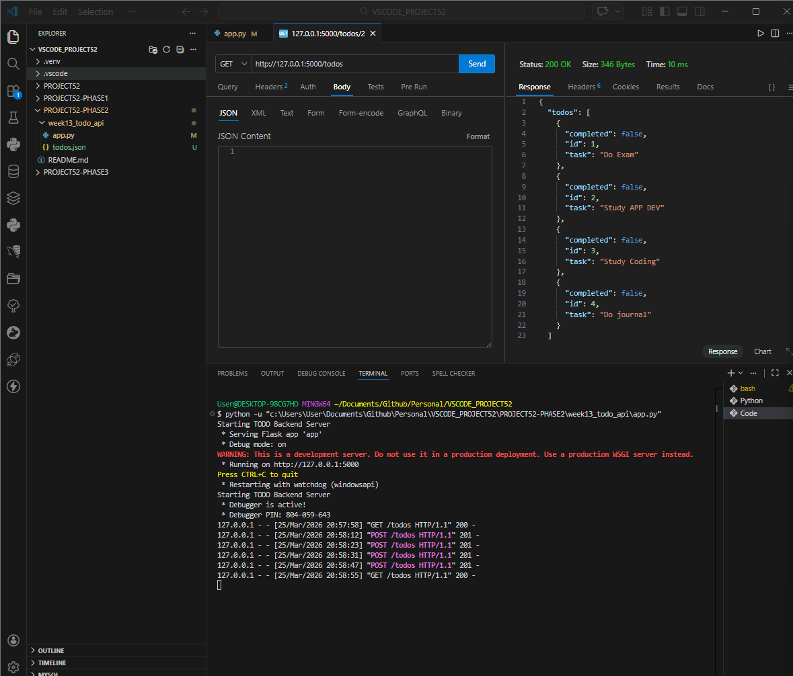
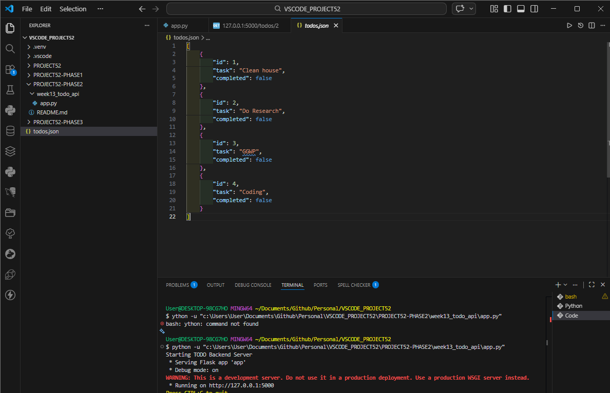
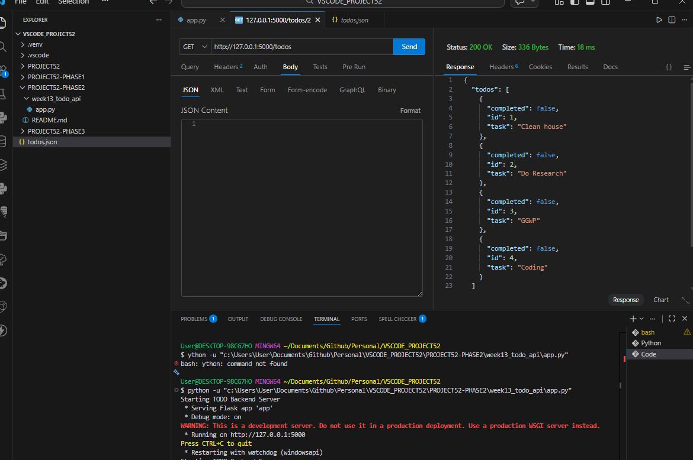

# 📝 DEV LOG: WEEK 13 - DAY 5

**Core Objective:** Replace the volatile, in-memory Python list with a persistent, flat-file database system using JSON to ensure data survives server restarts and power cycles.

## 1. The Initiative & Context

While the CRUD operations established earlier in the week were functionally sound, the data storage mechanism was critically flawed: it relied entirely on system RAM. Whenever the Flask server terminated, all state was lost (data amnesia). The objective for Day 5 was to implement physical data persistence by engineering the server to read from and write to a physical `.json` file on the hard drive, bridging the gap between temporary memory and a full SQL database integration planned for later phases.

## 2. Architectural Decisions & Concepts

### Concept A: Absolute Pathing vs. Relative Pathing

A critical bug was encountered where the JSON database was being generated in the root workspace directory rather than the specific API project folder. This occurred because the terminal's Current Working Directory (CWD) was at the root level.

- **The Solution:** I utilized Python's `os` module to construct a bulletproof absolute path:
  `BASE_DIR = os.path.dirname(os.path.abspath(__file__))`
  `FILE_PATH = os.path.join(BASE_DIR, "todos.json")`
- **The Impact:** This guarantees that the server will always generate and look for `todos.json` strictly in the exact same folder as the `app.py` execution script, regardless of where the terminal session is initiated.

### Concept B: File I/O Operations (`json` module)

Engineered dedicated helper functions to handle all database interactions, keeping the routing logic clean:

- **`load_todos()`:** Opens the file in `"r"` (read) mode and utilizes `json.load()` to deserialize the physical JSON string back into a workable Python list of dictionaries. Includes a safeguard to return an empty list `[]` if the file does not yet exist.
- **`save_todos()`:** Opens the file in `"w"` (write) mode. Utilizes `json.dump(todos, file, indent=4)` to serialize the Python list into standard JSON format. The `indent=4` argument ensures the physical file remains highly readable for human debugging.

### Concept C: Advanced ID Generation

Because tasks can now be permanently deleted, the previous ID generation logic (`len(todos) + 1`) became dangerous. If Task 1 and Task 2 exist, and Task 1 is deleted, the length is 1. A new task would be assigned ID 2, causing a fatal data collision with the existing Task 2.

- **The Fix:** Implemented list comprehension to scan for the absolute highest ID currently present in the database: `max(t["id"] for t in todos) + 1`. This ensures unique keys are always generated, mimicking auto-incrementing SQL primary keys.

## 3. The Output & Result

The API has achieved true data persistence. `POST`, `PUT`, and `DELETE` requests successfully rewrite the physical `todos.json` file in real-time. Upon server restart, `GET` requests successfully parse the file and return the preserved state. Week 13 backend architecture is complete, secure, and ready for client-side integration.

---
