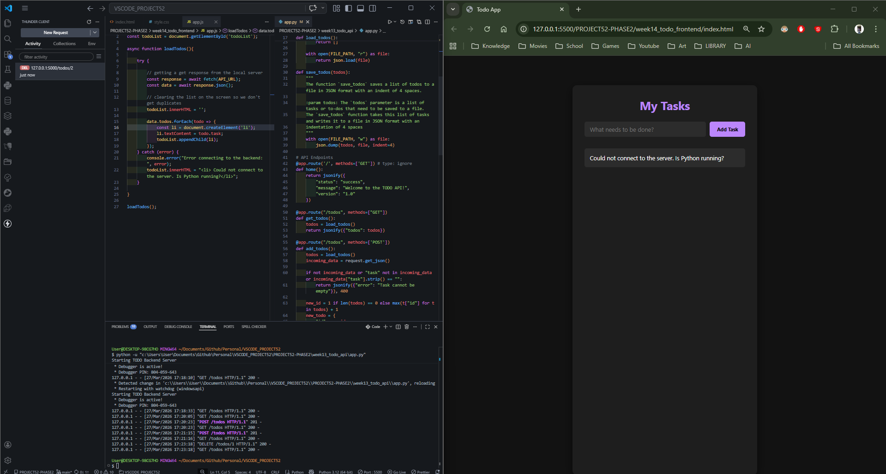
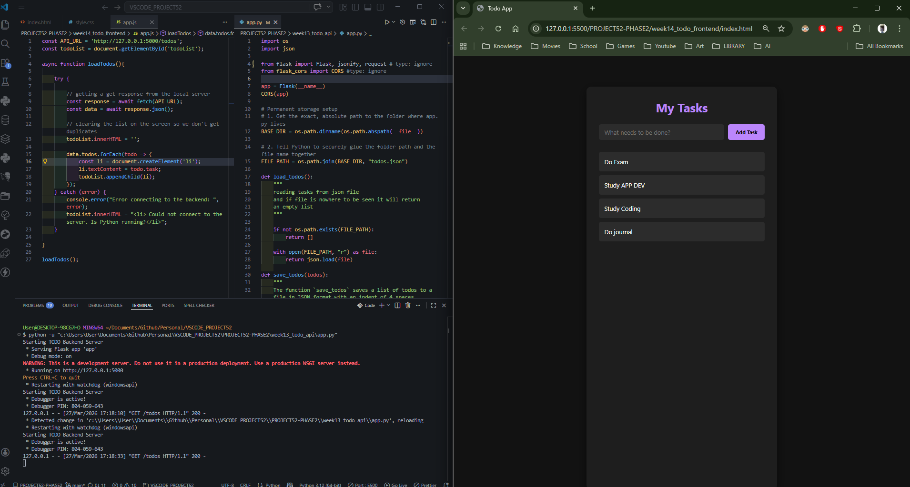
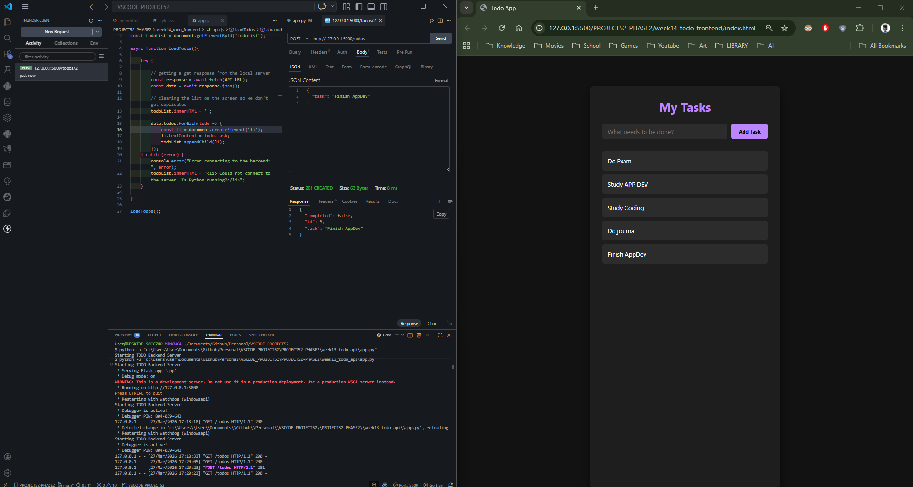
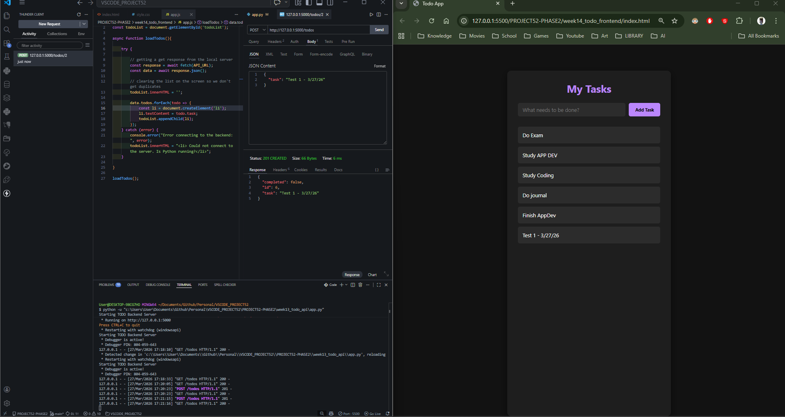
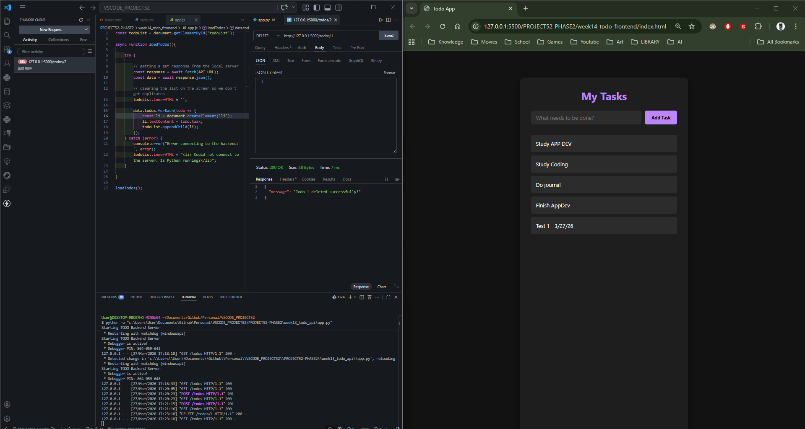

# 📝 DEV LOG: WEEK 14 - DAY 1

**Core Objective:** Establish the frontend architecture (HTML/CSS) and engineer a JavaScript bridge using the `fetch` API to asynchronously retrieve data from the Python backend. Verify real-time data synchronization between the server and the client interface.

## 1. The Initiative & Context

With the backend REST API fully completed, the objective for Week 14 shifted to building the client-facing user interface. Day 1 focused on separating the workspace environments, designing the UI skeleton, executing the foundational `GET` request, and running manual QA (Quality Assurance) tests to prove cross-origin communication between the frontend client and the backend server.

## 2. Architectural Decisions & Concepts

### Concept A: Workspace Separation

Created a dedicated `week14_todo_frontend` directory entirely separate from the Python API directory. This separation of concerns simulates a real-world microservice architecture where the frontend (client) and backend (server) are decoupled entities running on different ports (5500 and 5000, respectively).

### Concept B: The UI Skeleton (HTML/CSS)

- Engineered a semantic HTML structure utilizing inputs, buttons, and an unordered list (`<ul>`) to act as the dynamic rendering target for incoming data.
- Applied a modern, dark-mode CSS styling system using Flexbox to ensure a clean user experience and responsive layout structure.

### Concept C: The JavaScript Bridge (`fetch` API)

Instead of hardcoding tasks into the HTML, I utilized JavaScript to dynamically manipulate the DOM (Document Object Model):

- **Asynchronous Execution:** Engineered an `async` function (`loadTodos()`) to handle the network request without freezing the UI.
- **The Fetch Call:** Utilized `await fetch('http://127.0.0.1:5000/todos')` to execute an HTTP GET request against the local Python server.
- **DOM Manipulation:** Parsed the incoming JSON response, cleared the existing HTML list to prevent duplication, and iterated through the array using `.forEach()`. For each task, the script creates a new `<li>` element and appends it directly to the interface.

## 3. QA Testing & Verification

To verify the integrity of the Full-Stack bridge, manual Quality Assurance testing was conducted using Thunder Client as a secondary client interface:

- **POST Test:** Sent a `POST` request via Thunder Client to add a new task ("Finish AppDev"). Refreshed the browser, and the UI successfully fetched and displayed the updated database.
- **DELETE Test:** Sent a `DELETE` request via Thunder Client targeting ID 1 ("Do Exam"). Refreshed the browser, and the UI accurately reflected the state change, proving the Python server acts as the single source of truth for all connected clients.

---
