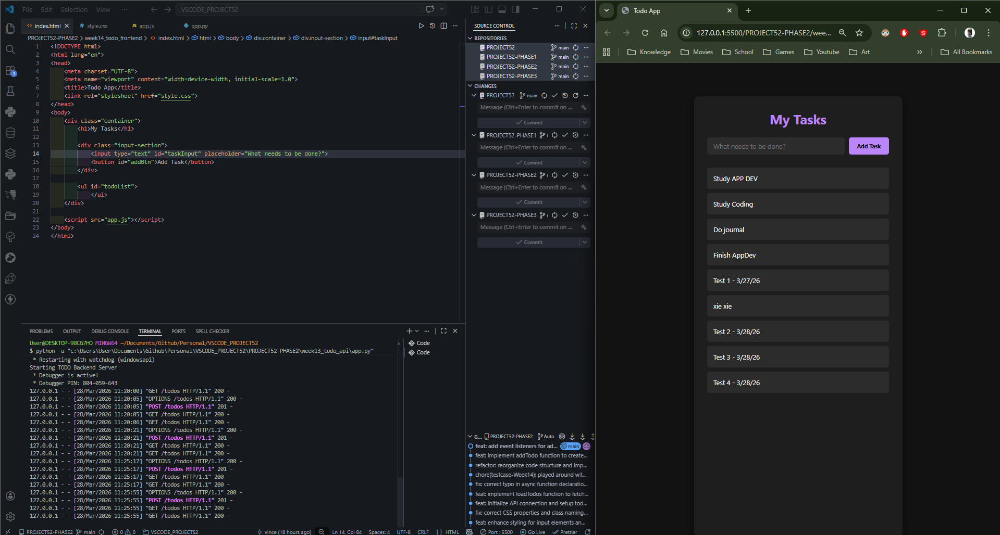
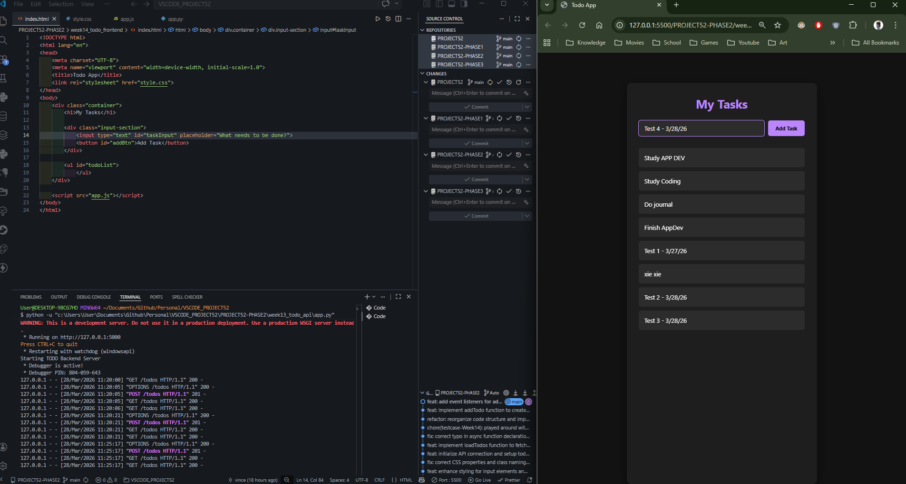
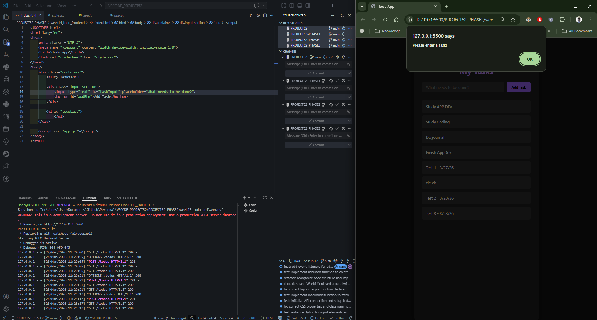
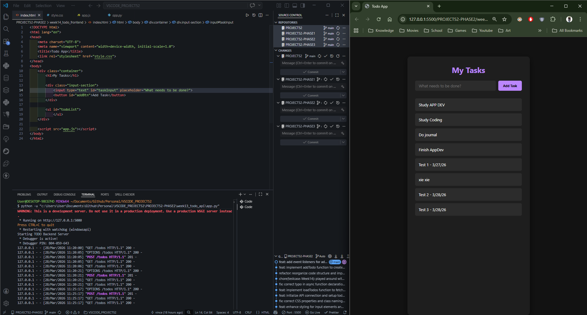
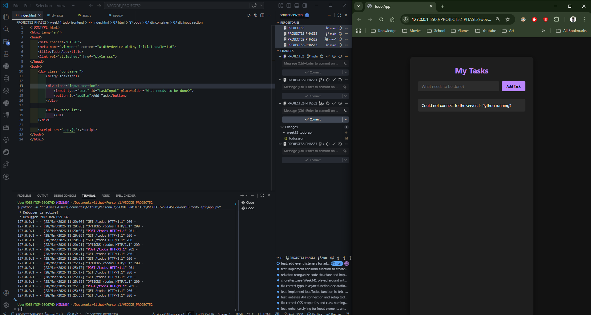

# 📝 DEV LOG: WEEK 14 - DAY 2

**Core Objective:** Implement a JavaScript `POST` request to allow users to create new tasks directly from the web interface, utilizing event listeners and payload serialization.

## 1. The Initiative & Context

Following Day 1's successful implementation of the `GET` request (Read), the frontend remained read-only. The objective for Day 2 was to engineer the "Create" portion of the CRUD cycle by capturing user input from the DOM, serializing it into JSON, and transmitting it to the Python backend via a `fetch` `POST` request.

## 2. Architectural Decisions & Concepts

### Concept A: DOM Element Binding & Event Listeners

To make the UI interactive, JavaScript must first bind to the HTML elements:

- Utilized `document.getElementById()` to capture the input field and the submit button.
- Engineered two event listeners: one bound to the `click` event of the button, and another bound to the `keypress` event of the input field (specifically listening for the 'Enter' key) to enhance UI/UX.

### Concept B: Frontend Data Validation (The First Shield)

Implemented a preliminary line of defense directly in the client browser:

- Captured the input value and utilized `.trim()` to strip whitespace.
- Evaluated if the string was empty. If true, the script halts execution (`return;`) and triggers an `alert()` box to the user. This prevents unnecessary network requests to the server for malformed data.

### Concept C: The POST Fetch Execution

Engineered an asynchronous function (`addTodo()`) to handle the data transmission:

- **Headers:** Explicitly declared `'Content-Type': 'application/json'` to inform the Python server of the incoming payload format.
- **Serialization:** Utilized `JSON.stringify({ task: taskValue })` to convert the native JavaScript object into a JSON-formatted string for HTTP transport.
- **State Synchronization:** Upon receiving a successful response (`response.ok`), the script clears the input field and immediately invokes `loadTodos()` to pull the fresh data from the server, keeping the UI perfectly synchronized with the database state.

## 3. QA Testing & Verification

- Successfully submitted standard text strings, observing the Python terminal register `201 CREATED` requests followed by UI updates.
- Successfully triggered the frontend validation shield by attempting to submit an empty string, prompting the expected browser alert box.

---
