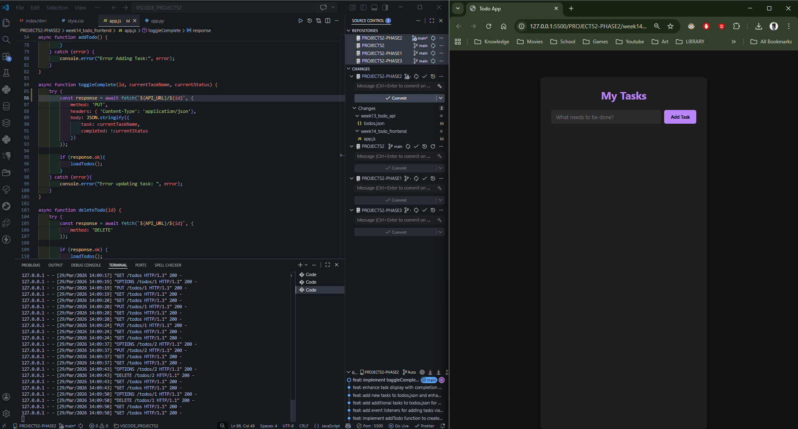
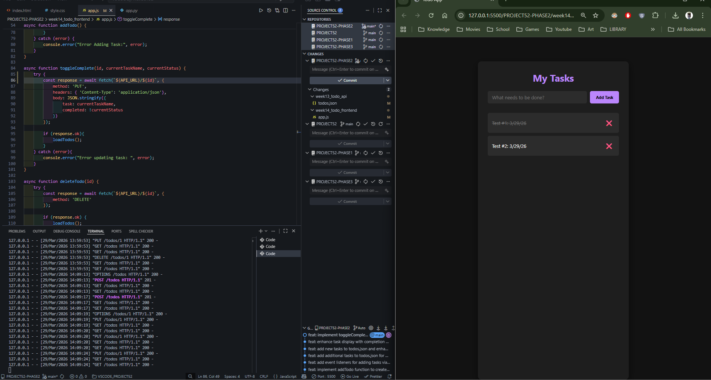
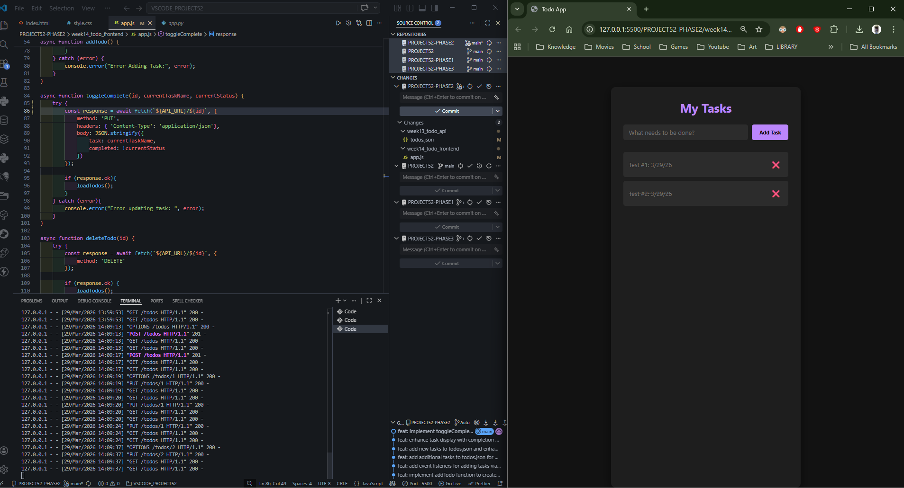
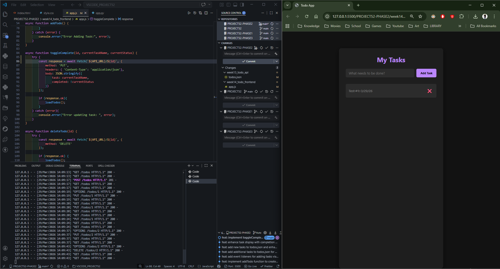

# 📝 DEV LOG: WEEK 14 - DAY 3

**Core Objective:** Finalize the Full-Stack CRUD lifecycle by implementing JavaScript `fetch` requests for `PUT` (Update) and `DELETE` (Destroy) operations, dynamically binding these network calls to generated UI elements.

## 1. The Initiative & Context

With data creation (POST) and retrieval (GET) operational, the interface needed the ability to mutate existing data. The objective for Day 3 was to engineer interactive elements (clickable task text and delete buttons) that trigger asynchronous network requests to modify or remove specific JSON records on the Python backend, followed by immediate UI state synchronization.

## 2. Architectural Decisions & Concepts

### Concept A: Dynamic Event Binding

Because the `<li>` task elements are generated dynamically via JavaScript rather than hardcoded in the HTML, event listeners must be attached during the creation phase:

- **The PUT Trigger:** Wrapped the task text in a `` and bound an `onclick` event to execute `toggleComplete()`, passing the specific task's ID, current name, and current boolean status as arguments.
- **The DELETE Trigger:** Created a dedicated delete button for each task, binding an `onclick` event to execute `deleteTodo()`, passing only the specific target ID.

### Concept B: The PUT & DELETE Fetch Executions

- **The Update Logic (`PUT`):** Engineered a fetch request targeting `${API_URL}/${id}`. The JSON payload actively inverts the current boolean status (`completed: !currentStatus`), allowing a single function to handle both "marking as done" and "unmarking."
- **The Delete Logic (`DELETE`):** Engineered a streamlined fetch request. Since deletion requires no data payload, the request only requires the `DELETE` method header and the targeted URL ID.
- **State Sync:** Upon receiving a successful `200 OK` response from the server, both functions immediately invoke `loadTodos()` to rebuild the UI with the fresh, mutated data.

## 3. QA Testing & Bug Resolution

- **The Bug:** During initial PUT testing, the tasks failed to update. Terminal logs revealed a `404 NOT FOUND` error on the Python backend: `"PUT /todos%20/%202 HTTP/1.1"`.
- **The Root Cause:** A syntax error in the JavaScript template literal (`${API_URL} / ${id}`) introduced literal spaces into the request URL. The browser encoded these spaces as `%20`, causing a route mismatch on the server.
- **The Resolution:** Removed the spaces to ensure strict URL conformity (`${API_URL}/${id}`). The subsequent tests successfully processed the PUT requests, updating the JSON file and rendering the CSS strikethrough classes on the UI.

---
