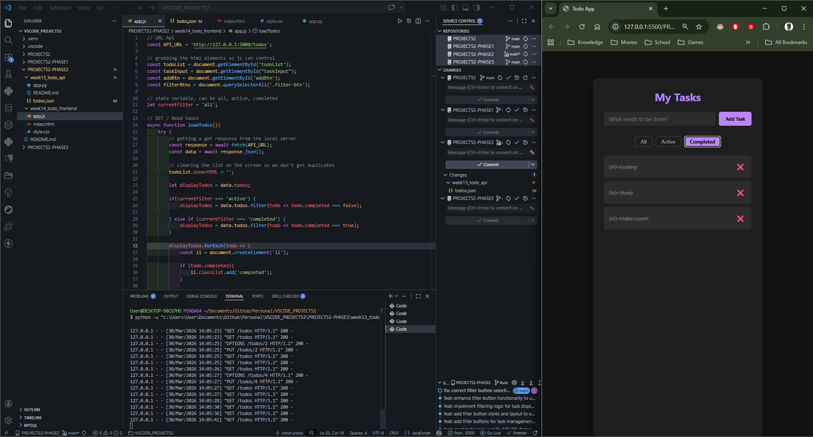
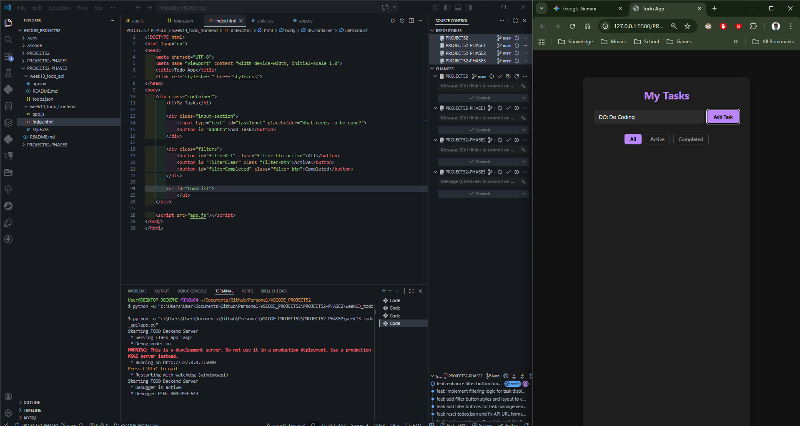
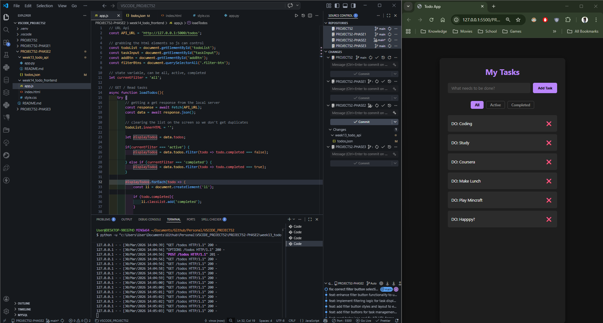
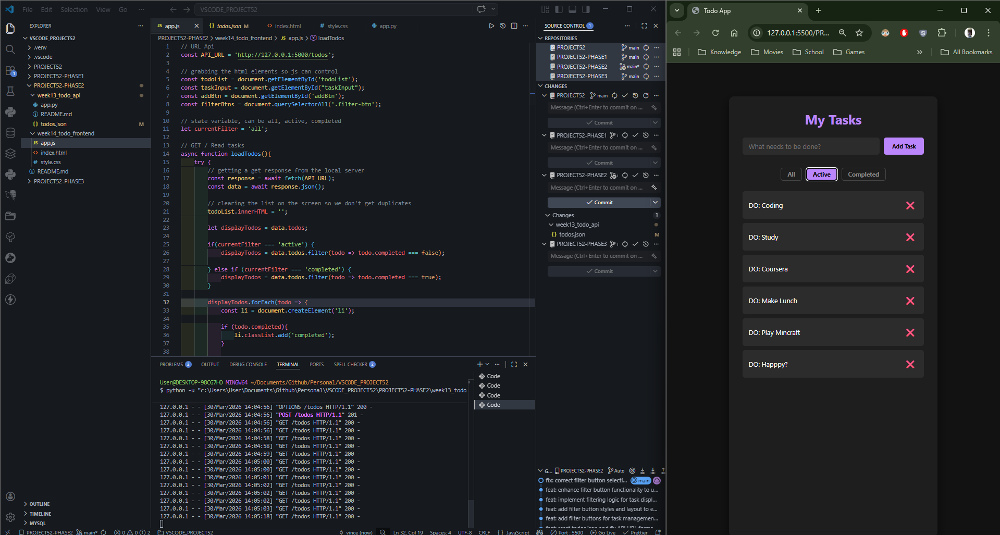
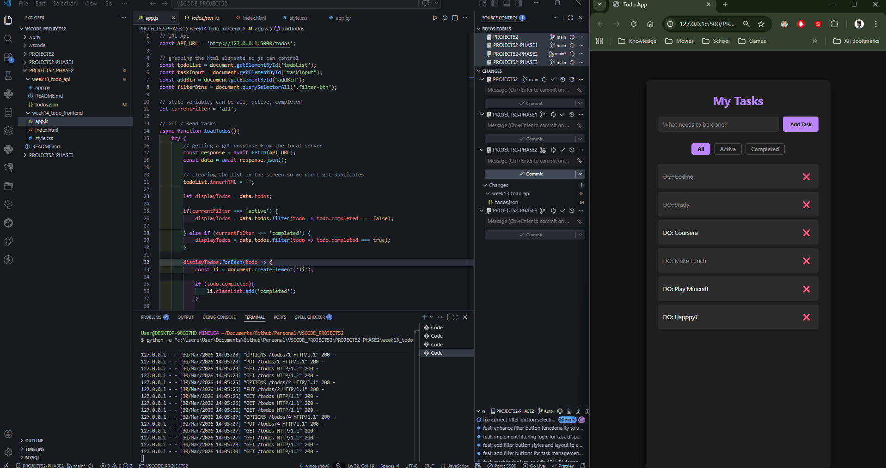
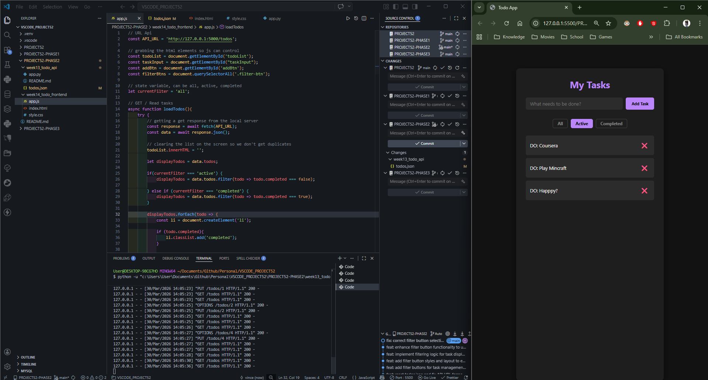

# 📝 DEV LOG: WEEK 14 - DAY 4

**Core Objective:** Implement client-side data filtering to allow the user to toggle between viewing "All", "Active", and "Completed" tasks without requiring additional network requests to the backend API.

## 1. The Initiative & Context
With the core CRUD cycle fully operational, the application required better data organization for the end-user. Instead of building new backend routes to filter the data, the objective for Day 4 was to utilize the frontend's processing power. By pulling the entire dataset once, JavaScript can filter and render the specific views locally, resulting in a lightning-fast, seamless user experience.

## 2. Architectural Decisions & Concepts

### Concept A: UI State Management
* Introduced a global state variable (`let currentFilter = 'all';`) to track the active UI context.
* Bound event listeners to the new filter tabs. When a tab is clicked, the script updates the state variable, shifts the `.active` CSS class to visually highlight the selected tab, and triggers a re-render of the DOM via `loadTodos()`.

### Concept B: Array Filtering (`.filter()`)
* Prior to rendering the HTML elements, the incoming JSON array (`data.todos`) is intercepted.
* Utilized JavaScript's native `.filter()` method to create a temporary, mutated array (`displayTodos`) based on the current state variable.
  * If 'active': Extracts only objects where `completed === false`.
  * If 'completed': Extracts only objects where `completed === true`.
* The `.forEach()` loop then iterates exclusively over the filtered `displayTodos` array rather than the raw data payload.

## 3. QA Testing & Bug Resolution
* **The Bug:** The application initially crashed, and the DOM failed to render.
* **Root Cause 1:** Attempted to select multiple elements using `document.getElementById('.filter-btn')`, which triggered a fatal error because IDs must be strictly unique.
* **Root Cause 2:** The rendering loop was mistakenly still iterating over the unfiltered `data.todos` array instead of the newly created `displayTodos` array.
* **The Resolution:** Swapped the selector to `document.querySelectorAll('.filter-btn')` to capture the NodeList, and updated the `.forEach()` target. The application immediately successfully rendered and filtered the tasks dynamically.

---
