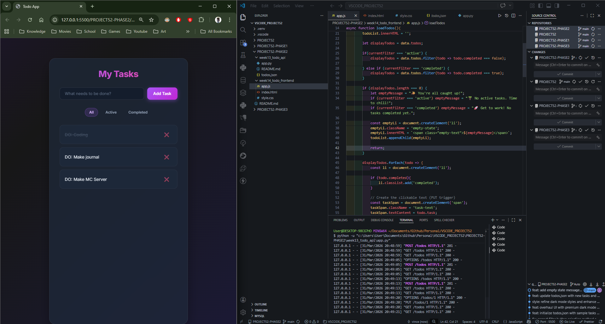
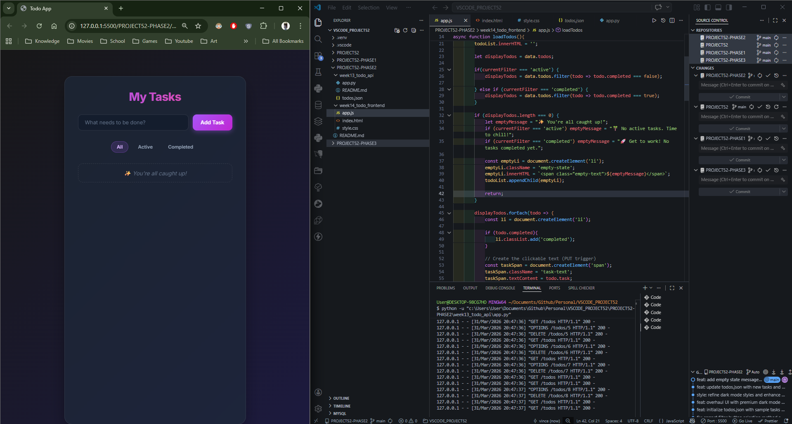
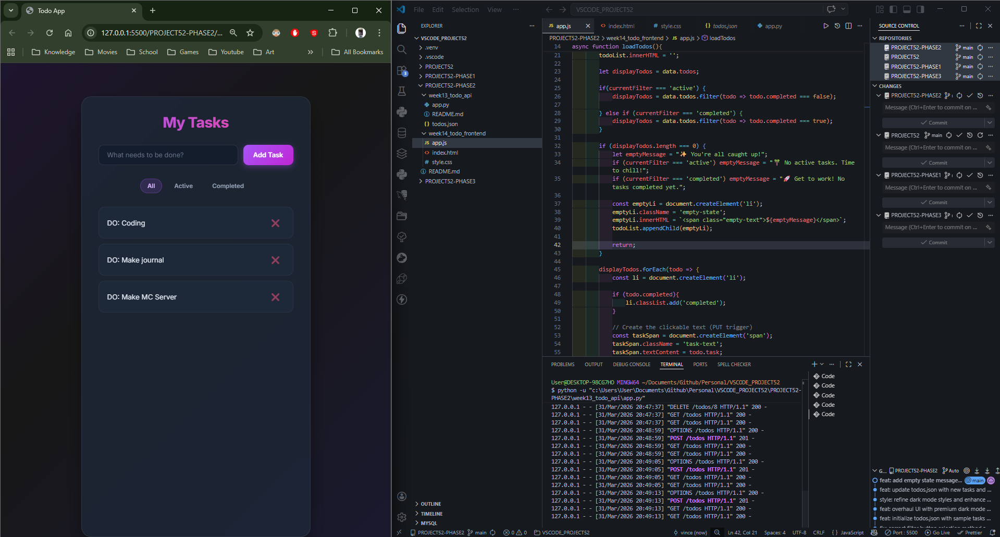

# 📝 DEV LOG: WEEK 14 - DAY 5

**Core Objective:** Finalize the frontend integration sprint by authoring comprehensive technical documentation (`README.md`), followed by executing a premium UI/UX overhaul utilizing glassmorphism and dynamic empty states.

## 1. The Initiative & Context

Day 5 was a massive dual-phase sprint. Phase 1 focused on creating professional documentation to explain the decoupled architecture (ensuring future developers know to boot the Python backend before the UI). Phase 2 focused on elevating the application's visual design from a basic functional state to a premium, production-ready interface, ensuring the user experience matches the quality of the backend engineering.

## 2. Architectural Decisions & Concepts

### Concept A: Decoupled Architecture Documentation

- Authored a professional `README.md` explicitly highlighting the **Critical Prerequisite**: the `week13_todo_api` must be initialized prior to launching the client UI.
- Documented the use of Async/Await Fetch API and client-side `.filter()` state management.

### Concept B: Premium Visual Overhaul (CSS)

- **Glassmorphism:** Replaced flat backgrounds with an animated CSS gradient and applied `backdrop-filter: blur(16px)` to the main container, achieving a frosted glass effect.
- **Micro-interactions & Typography:** Added CSS keyframe animations (`slideIn`) for task rendering, tactile hover transformations for buttons, and integrated the `Inter` font family with a gradient text-clip header.

### Concept C: Conditional Rendering & Empty States (JavaScript)

- Intercepted the rendering loop inside `loadTodos()` to evaluate the length of the filtered array.
- **Logic:** If the array is empty, the script halts the loop and injects a specialized `<li>` element.
- **Contextual Feedback:** The empty state message dynamically adapts based on the active filter (e.g., "✨ You're all caught up!" vs. "🚀 Get to work!"), preventing the user from seeing a confusing blank screen.

## 3. The Output & Result

The frontend module is now fully documented and visually mirrors premium SaaS products. The application successfully handles empty data arrays with graceful, contextual UI feedback, wrapping up the Week 14 Full-Stack sprint flawlessly.

---
