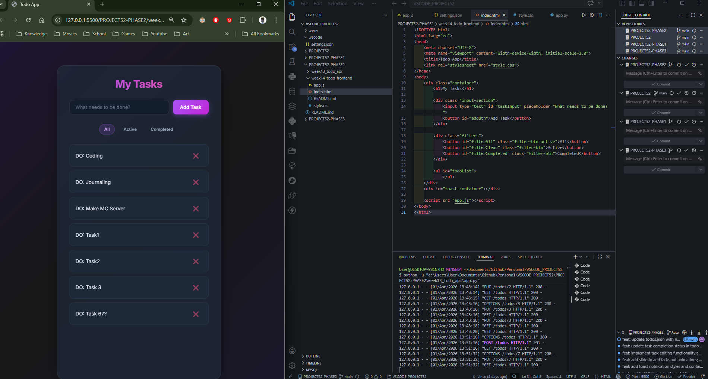
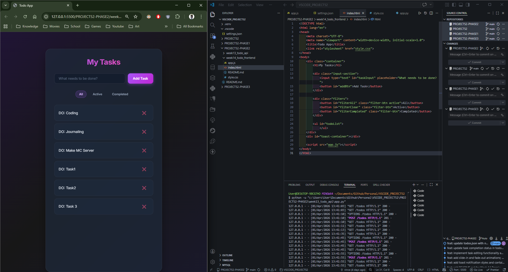
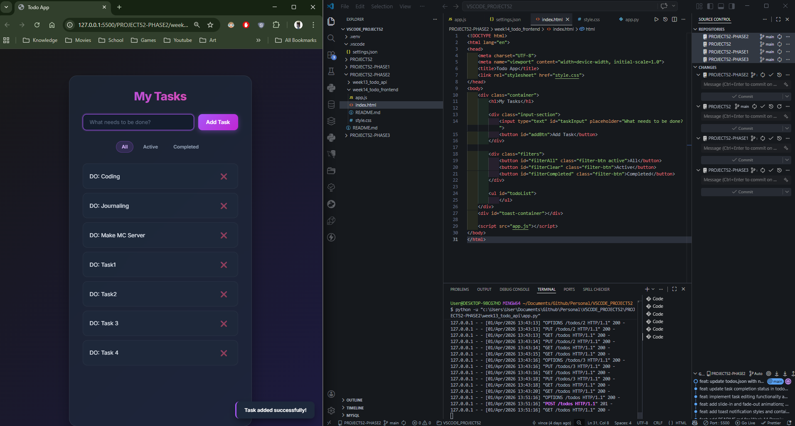
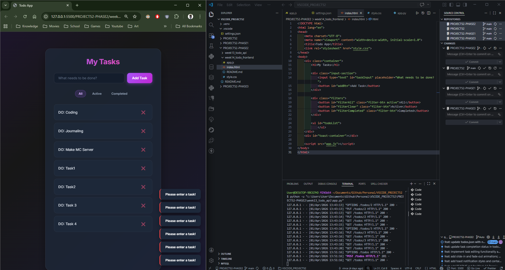
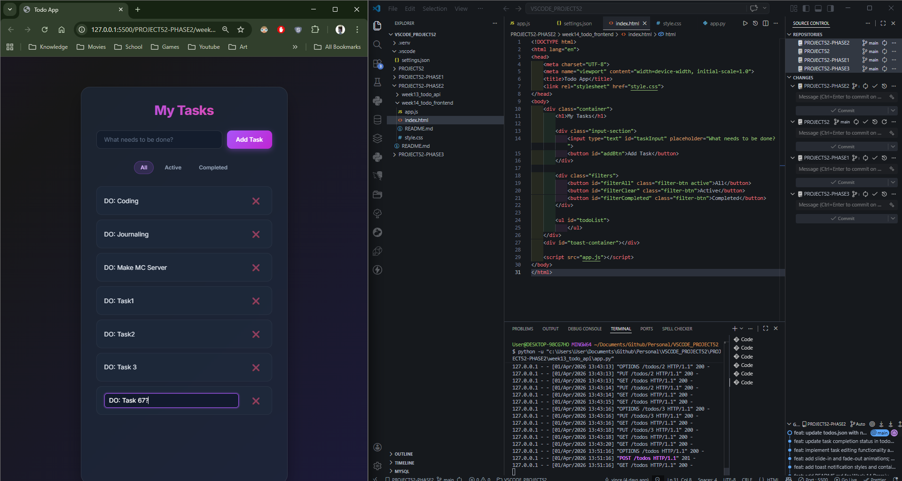

# 📝 DEV LOG: WEEK 14 - DAY 6

**Core Objective:** Implement advanced frontend interactions including custom Toast notifications and inline editing capabilities, while resolving complex environmental and event-driven bugs.

## 1. The Initiative & Context
To finalize the premium feel of the application, standard browser `alert()` boxes needed to be replaced with custom, non-blocking UI notifications (Toasts). Furthermore, the user experience required an inline editing feature, allowing users to update task text directly within the list rather than deleting and recreating records. 

## 2. Architectural Decisions & Concepts

### Concept A: Custom Toast Notifications
* Engineered a dynamic `showToast(message, type)` function that creates a temporary DOM element, injects it into a fixed `toast-container`, and automatically destroys it after 3 seconds using `setTimeout()`.
* Utilized CSS keyframes (`slideInRight`, `fadeOut`) to provide smooth entry and exit animations without blocking the main JavaScript thread.

### Concept B: Inline Editing (`PUT` logic)
* Bound an `ondblclick` event to the task text. When triggered, the script dynamically replaces the `` with an `<input type="text">` element and shifts browser focus to it.
* Bound `onblur` (clicking away) and `onkeypress` (hitting Enter) events to the input to capture the new text, fire a `PUT` request to the Python backend, and seamlessly redraw the UI.

## 3. QA Testing & Bug Resolution
During QA testing, two critical bugs were discovered and patched:

* **Bug 1: The "Ghost Reload" (Environmental):** * *Issue:* Toast notifications instantly vanished upon successful `POST` or `PUT` requests.
  * *Root Cause:* VS Code Live Server detected changes to the backend `todos.json` file and forcefully refreshed the browser window mid-animation.
  * *Resolution:* Created a `.vscode/settings.json` file and applied `"liveServer.settings.ignoreFiles": ["**/*.json"]` to decouple the frontend server from backend database updates.

* **Bug 2: The Race Condition (Event Logic):**
  * *Issue:* The `ondblclick` inline edit function failed to trigger.
  * *Root Cause:* The initial click of the double-click fired the `onclick` (toggle status) event, which redrew the DOM before the second click could register.
  * *Resolution:* Implemented a 250ms `setTimeout` delay on the single-click event. If a second click occurs within that window, `clearTimeout()` intercepts the single-click, allowing the double-click logic to execute flawlessly.

