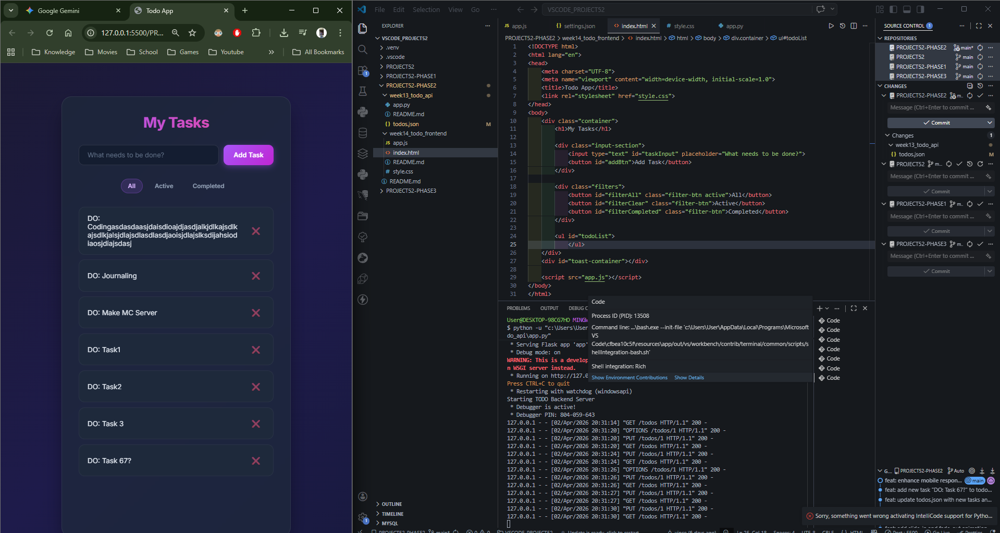
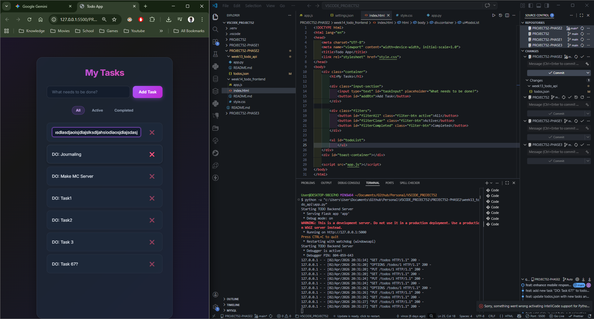

# 📝 DEV LOG: WEEK 14 - DAY 7

**Core Objective:** Bulletproof the frontend interface by handling data edge cases and implementing CSS Media Queries to ensure a seamless layout across all mobile and desktop viewports.

## 1. The Initiative & Context
While the application logic and premium design were completed, rigorous UI QA (Quality Assurance) testing revealed potential breaking points: text overflow from abnormally long string inputs (e.g., typing continuous gibberish without spaces), and layout squashing on screens smaller than 600px. Day 7 was dedicated to preemptively fixing these edge cases to ensure the application is robust and portfolio-ready.

## 2. Architectural Decisions & Concepts

### Concept A: Data Edge Cases (Text Wrapping)
* **The Bug:** If a user inputs a continuous string of characters without spaces, standard HTML formatting pushes the parent container's width, breaking the flexbox layout and shoving UI elements off-screen.
* **The Fix:** Applied `word-break: break-word;` to the `.task-text` class. As proven in manual QA testing, this forces the browser to violently wrap continuous text to the next line, preserving the structural integrity of the `<li>` card and ensuring the delete button remains accessible.

### Concept B: Mobile Responsiveness (Media Queries)
* Implemented a `@media (max-width: 600px)` CSS breakpoint to detect mobile viewports.
* **Layout Shifts:**
  * Reoriented the `.input-section` flexbox from `row` to `column`, allowing the input field and "Add Task" button to stack vertically for a larger, thumb-friendly tap target.
  * Adjusted global paddings to maximize usable screen real estate.
  * Overrode the `#toast-container` positioning to stretch across the bottom of the mobile viewport, centering the notifications.

## 3. The Output & Result
The Full-Stack Todo application is now officially 100% complete. It scales flawlessly from a desktop monitor down to a mobile phone, handles extreme data inputs gracefully, executes full CRUD operations against a Python backend, and features a premium glassmorphism aesthetic.

