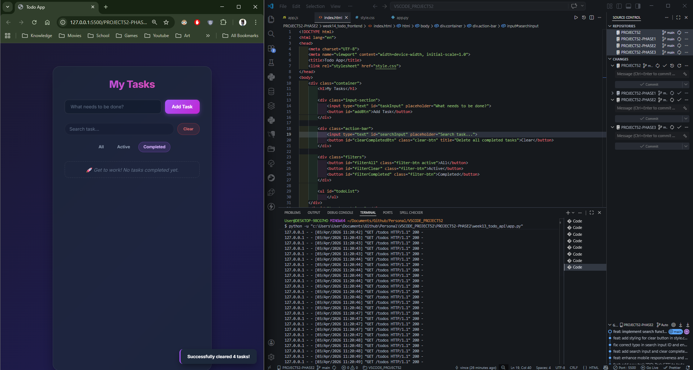
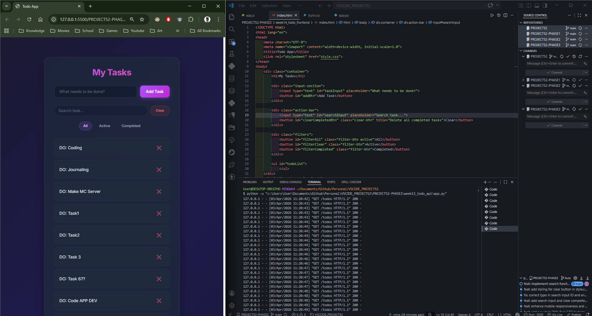
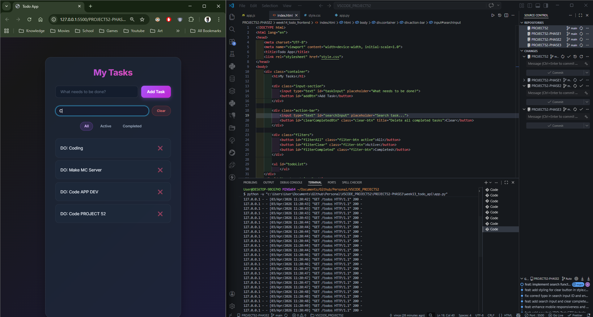
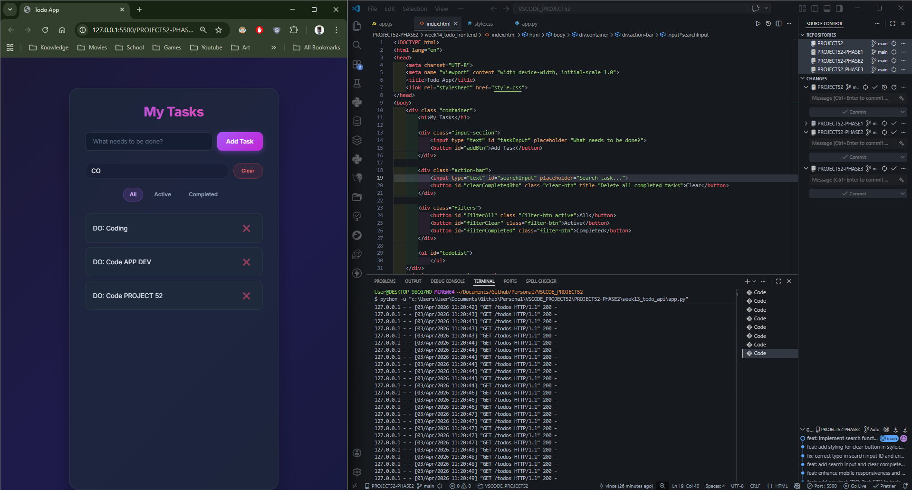
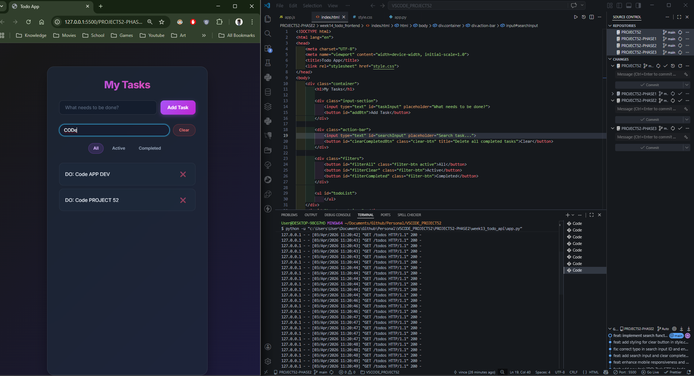
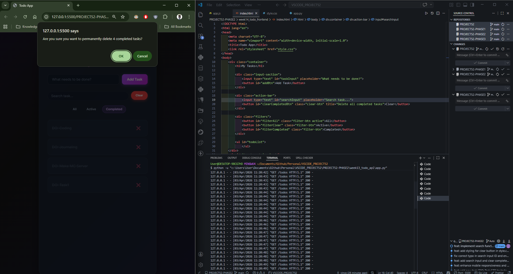

# 📝 DEV LOG: WEEK 14 - DAY 8

**Core Objective:** Elevate the application to production-readiness by implementing pro-tier user features: real-time client-side search filtering and bulk asynchronous data deletion.

## 1. The Initiative & Context

As a database grows, scrolling becomes an anti-pattern for user experience. To solve this, Day 8 focused on building a "Command Center" (Action Bar) to allow users to instantly query their data via a live search input, and manage database bloat via a one-click "Clear Completed" bulk action.

## 2. Architectural Decisions & Concepts

### Concept A: Live Client-Side Search

- Bound an `input` event listener to the search bar to trigger UI redraws on every single keystroke.
- Chained a `.filter()` method to the existing state management logic in `loadTodos()`.
- **Logic:** Evaluates if `todo.task.toLowerCase().includes(searchTerm)`. This provides a highly responsive search experience without needing to hammer the Python backend with a new `GET` request for every letter typed.

### Concept B: Bulk Asynchronous Deletion

- Engineered a bulk action script to completely wipe completed tasks from the backend JSON database.
- **Safety First:** Implemented a native browser `confirm()` dialog to prevent accidental mass-deletion, dynamically injecting the `completedTasks.length` into the warning message.
- **Async Loop:** Utilized a `for...of` loop with `await fetch()` to sequentially send `DELETE` requests to the REST API for each completed task. _Note: `forEach` does not handle async/await properly, necessitating the `for...of` structure._

## 3. The Output & Result

The frontend now boasts advanced data manipulation capabilities. The UI successfully performs complex, multi-layered filtering (Search Term + Completion Status) simultaneously, and safely handles bulk network requests to the backend. Project 52 - Phase 2 is undeniably a triumph.

---
