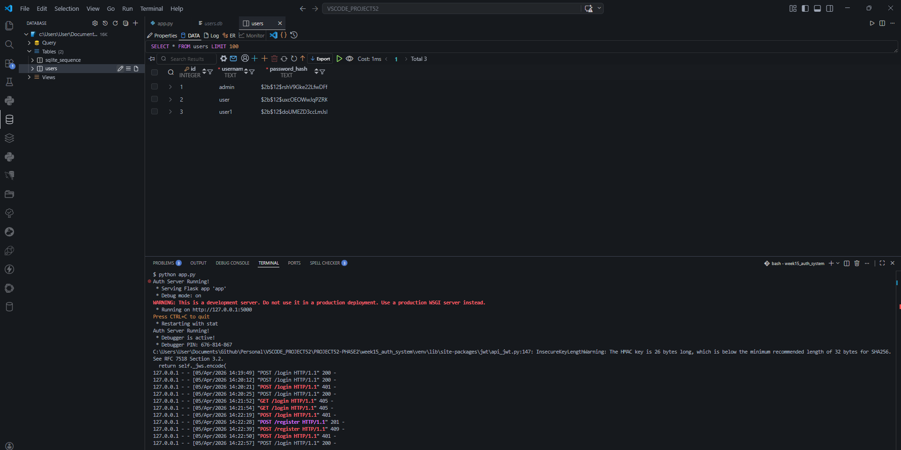
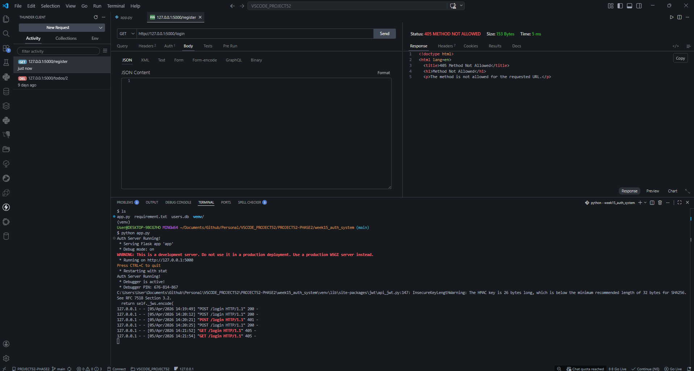
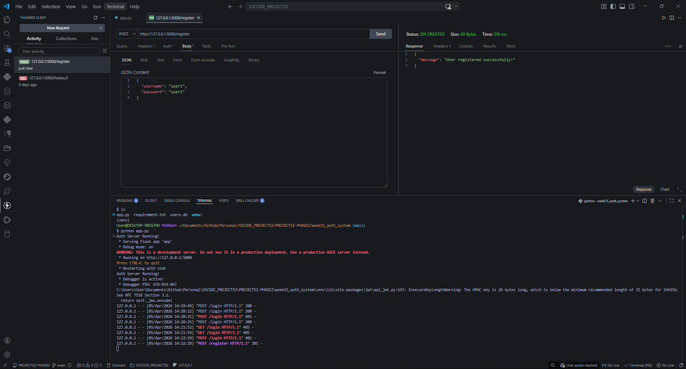
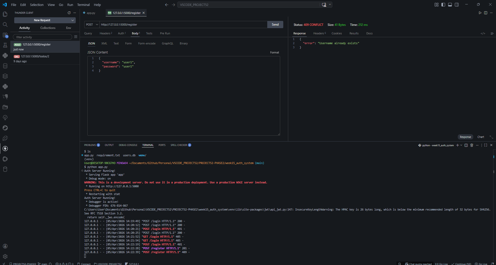
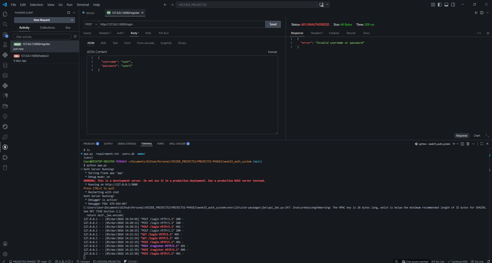
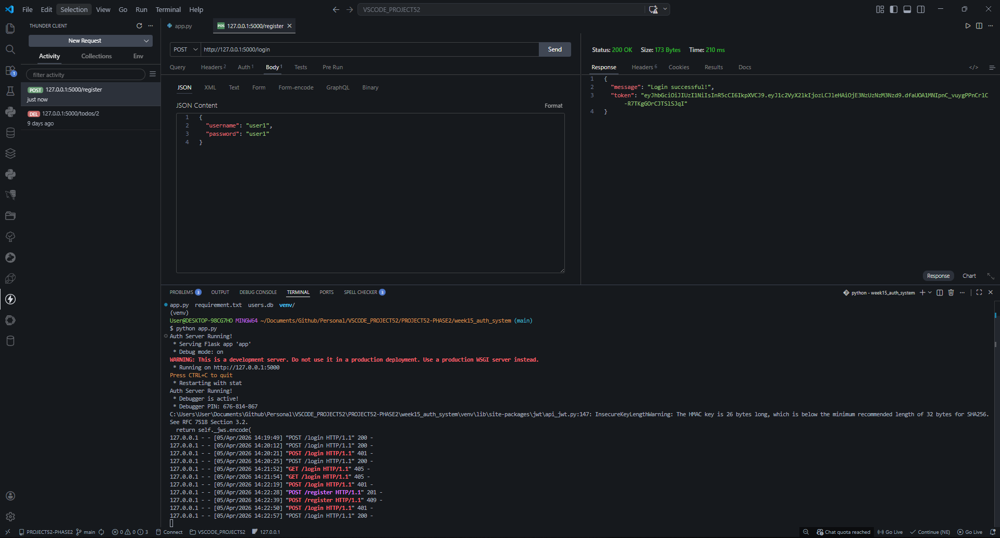

# 📝 DEV LOG: WEEK 15 - DAY 1 

**Core Objective:** Establish a secure, token-based user authentication system from scratch by implementing cryptographic password hashing and issuing stateless JSON Web Tokens (JWTs) via a Python Flask REST API.

## 1. The Initiative & Context
Modern web applications require robust security to verify user identity (Authentication) and manage permissions (Authorization). Legacy methods like Basic Authentication—which sends raw credentials with every single network request—are highly insecure and inefficient. To solve this, Day 1 focused on building a modern Token-Based Authentication architecture. Users authenticate exactly once to receive a secure "VIP Pass" (JWT), which is then used for all subsequent secure communication.

## 2. Database Design & Initialization
User data must be structured strictly. Our database initializes on server startup, creating a `users.db` file with a defined schema.

```sql
CREATE TABLE IF NOT EXISTS users (
	id INTEGER PRIMARY KEY AUTOINCREMENT,
	username TEXT UNIQUE NOT NULL,
	password_hash TEXT NOT NULL
)
````

- **Primary Key:** `id` auto-increments to provide a unique integer identifier for relational mapping later.
- **Unique Constraint:** `username` is forced to be unique at the database level. This prevents duplicate account creation and eliminates the need for complex pre-check logic in the Python layer.
- **Data Sanitization:** We explicitly name the column `password_hash` to remind any future developer looking at the schema that plain-text passwords should never enter this column.

## 3. The Registration Flow (Hashing & Salting)
The `/register` endpoint handles account creation.

**The Cryptographic Process:**

1. The client sends a JSON payload containing `username` and `password`.
2. The server generates a unique **Salt** (a random sequence of bytes) using `bcrypt.gensalt()`.
3. The plain-text password and the salt are combined and hashed mathematically.
4. The resulting string (e.g., `$2b$12$rshV9Gke22LfwDFf...`) is stored in the database.

**Why Salting Matters:** If two users choose the password "password123", their resulting hashes will look completely different in the database because a unique salt is applied to each. This completely neutralizes "Rainbow Table" (pre-computed hash dictionary) attacks.

## 4. The Login Flow & JWT Issuance

The `/login` endpoint authenticates the user and issues a stateless session token.
**The Verification Process:**

1. The server queries the database for the provided `username`.
2. If found, it retrieves the stored `password_hash`.
3. `bcrypt.checkpw()` compares the incoming plain-text password against the stored hash. Because hashing is a one-way function, the server essentially hashes the _incoming_ password and checks if the outputs match.
4. If successful, a JSON Web Token (JWT) is generated.

**Anatomy of our JWT:**

- **Header:** Defines the algorithm (`HS256`).
- **Payload:** Contains the user's `user_id` (so we know who they are on future requests) and an `exp` (Expiration) claim set to 1 hour from issuance.
- **Signature:** Created using our `SECRET_KEY`. If a malicious user tries to alter their token payload to change their `user_id` to an admin's ID, the signature will invalidate, and the server will reject the token.

## 5. API Testing Procedures (Thunder Client)

Testing API endpoints requires strict adherence to HTTP standards.

- **Headers:** Requests must include `Content-Type: application/json`.
- **Payloads:** Data must be formatted as raw JSON.
- **Status Codes Expected:**
    
    - `201 Created`: Successful registration.
    - `200 OK`: Successful login (returns JWT).
    - `400 Bad Request`: Missing credentials.
    - `401 Unauthorized`: Invalid password or non-existent username.
    - `409 Conflict`: Attempting to register an already taken username.

# 6. Output











