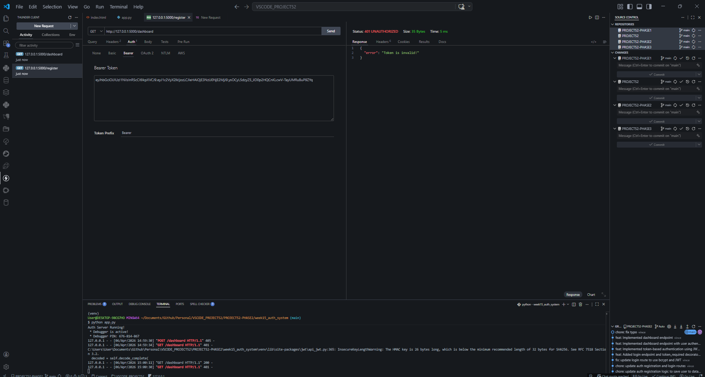
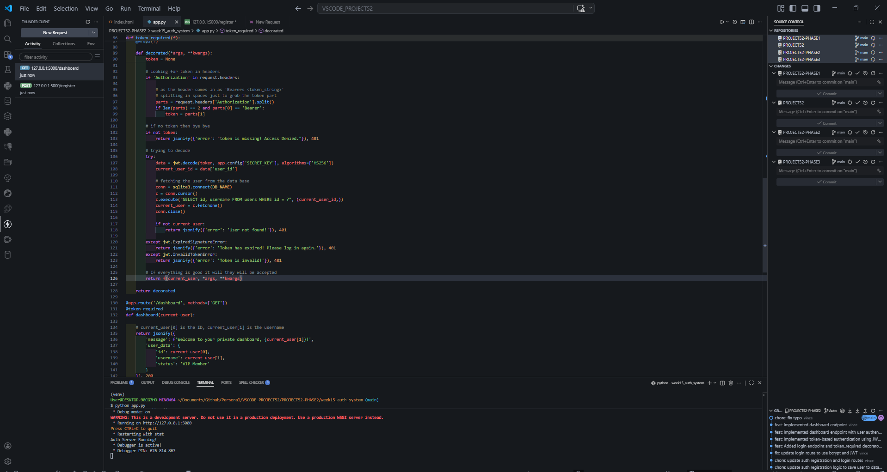
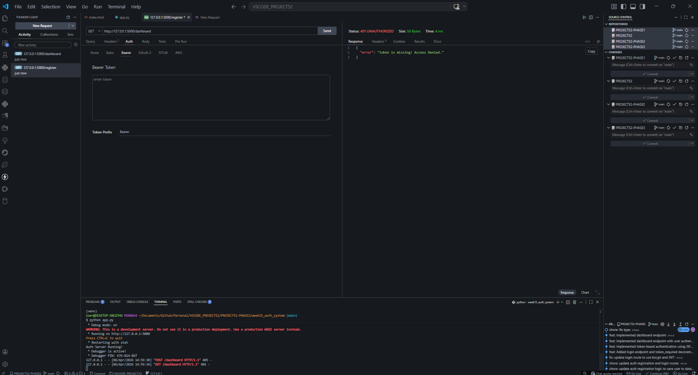
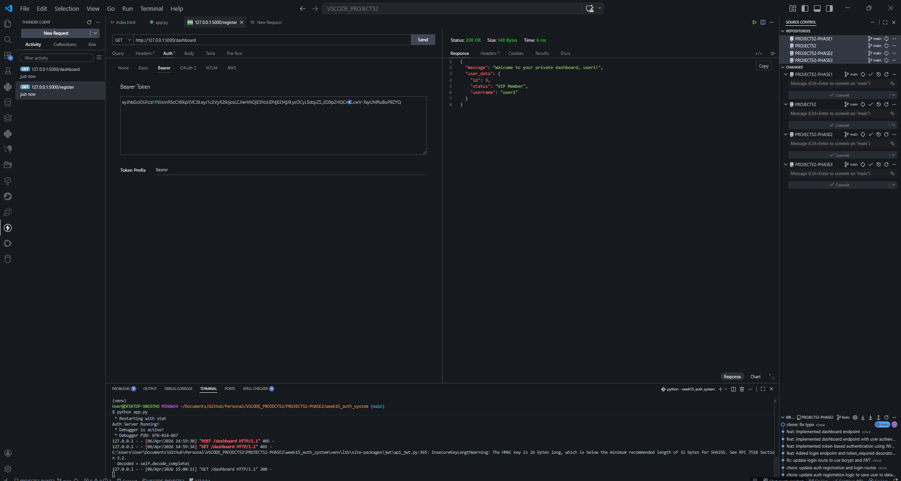

# 📝 DEV LOG: WEEK 15 - DAY 2

**Core Objective:** Secure application endpoints by engineering custom Flask middleware to intercept, extract, decode, and cryptographically verify JSON Web Tokens (JWT) before granting access to protected routes.

## 1. The Initiative & Context

With the ability to generate secure JWTs established on Day 1, the system required an enforcement mechanism. Without a "digital bouncer," the REST API routes remain completely open to the public. Day 2 focused on building a reusable authorization layer (Middleware) that can be easily applied to any future route, ensuring that only users presenting a valid, untampered token can access sensitive data.

## 2. Middleware Engineering (The Decorator Pattern)

Instead of hardcoding token-checking logic inside every single route, we utilized Python's `@wraps` from the `functools` library to create a custom `@token_required` decorator. This intercepts the HTTP request _before_ it reaches the route.

```python
def token_required(f):
    @wraps(f)
    def decorated(*args, **kwargs):
        token = None
        if 'Authorization' in request.headers:
            parts = request.headers['Authorization'].split()
            if len(parts) == 2 and parts[0] == 'Bearer':
                token = parts[1]

        if not token:
            return jsonify({'error': 'Token is missing!'}), 401

        try:
            data = jwt.decode(token, app.config['SECRET_KEY'], algorithms=['HS256'])
            # ... database verification logic here ...
```

## 3. Token Extraction & Verification Flow

When a request hits a protected route, the middleware executes a strict validation sequence:

1. **Header Extraction:** The server checks the HTTP Headers specifically for the `Authorization` key.
2. **String Parsing:** It expects the industry-standard format `Bearer <token_string>`. It splits the string by the space and extracts only the raw token.
3. **Cryptographic Decoding:** `jwt.decode()` attempts to read the token using our `SECRET_KEY`. If the token's signature was altered by a malicious user, this step fails instantly.
4. **Database Sync (The Secondary Check):** If the token is cryptographically valid, the server reads the `user_id` from the payload and queries the database (`SELECT id, username FROM users WHERE id = ?`). This ensures that if a user was deleted or banned from the database, their unexpired token cannot be used to retain access.

## 4. Protected Route Implementation

With the middleware built, securing an endpoint requires only a single line of code.

```Python
@app.route('/dashboard', methods=['GET'])
@token_required
def dashboard(current_user):
    """A protected route that requires a valid JWT to access."""
    return jsonify({
        'message': f'Welcome to your private dashboard, {current_user[1]}!',
        'user_data': {
            'id': current_user[0],
            'username': current_user[1]
        }
    }), 200
```

- **Dependency Injection:** Because the middleware successfully queried the database, it passes the `current_user` object directly into the `dashboard` function, allowing the route to personalize the JSON response.

## 5. API Testing Procedures (Thunder Client)

Testing protected routes requires configuring HTTP headers rather than just the JSON body.

- **Headers:** Requests must include `Authorization: Bearer <your_jwt_token>`.
- **Graceful Error Handling (Expected Status Codes):**
  - `200 OK`: Token is valid, signature matches, user exists. (Access Granted).
  - `401 Unauthorized (Token Missing)`: No Authorization header provided.
  - `401 Unauthorized (Invalid Token)`: The token string was altered, breaking the `HS256` signature.
  - `401 Unauthorized (Expired)`: The token's 1-hour lifespan (`exp` claim) has passed.

## 6. Output








