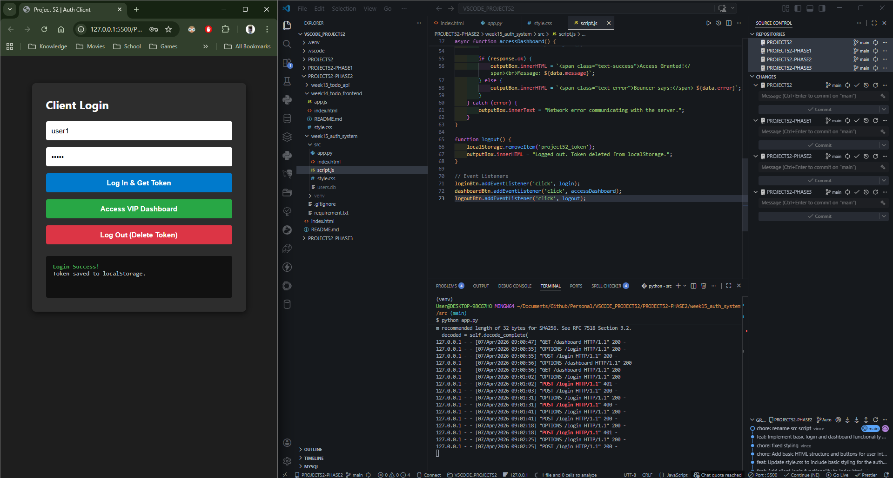
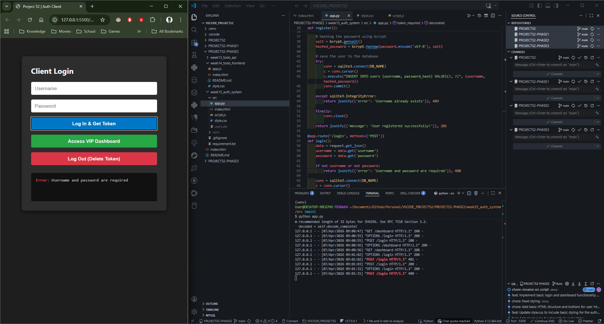
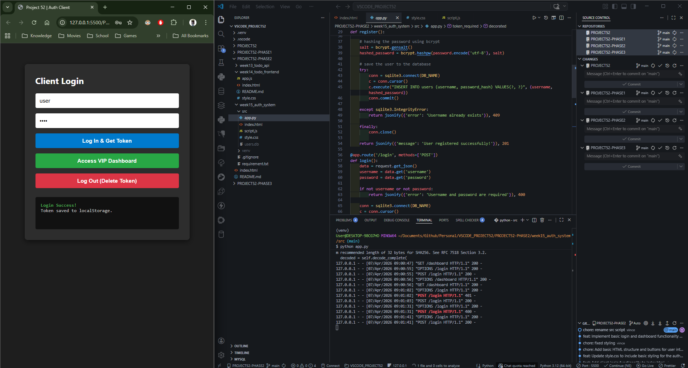

# 📝 DEV LOG: WEEK 15 - DAY 3

**Core Objective:** Engineer a decoupled frontend HTML/JS client to interface directly with the Python REST API, handling asynchronous login requests, JWT storage, and protected route access via dynamic HTTP headers.

## 1. The Initiative & Context

After securing the backend via Python middleware and SQLite databases (Days 1 & 2), the system required a real-world client interface. The objective for Day 3 was to replace Thunder Client with a standard web browser, establishing a secure bridge where JavaScript acts as the intermediary—fetching, storing, and presenting the JSON Web Token (JWT) seamlessly to the user.

## 2. Architectural Decisions & Concepts

### Concept A: Strict Separation of Concerns (SoC)

- Migrated the application to a professional `src/` folder architecture, isolating environment configurations (`venv`, `.gitignore`, `requirements.txt`) from the executable codebase.
- Enforced strict UI separation: `index.html` (DOM Structure), `style.css` (Visual Presentation), and `app.js` (Asynchronous Logic). No inline styles or scripts were permitted.

### Concept B: The Browser Wallet (`localStorage`)

- Because HTTP is stateless, the browser must "remember" the user is logged in.
- Implemented `localStorage.setItem('project52_token', data.token)` to save the JWT to the browser's persistent memory. This acts as the user's digital wallet, ensuring they remain authenticated even if the page is refreshed.
- Logging out is handled securely by invoking `localStorage.removeItem()`, effectively destroying the VIP pass on the client side.

### Concept C: Dynamic Header Injection

- To access protected routes, the frontend cannot simply request the URL. It must manually construct an HTTP request that includes the `Authorization` header.
- Utilized the `fetch()` API's options object to dynamically inject the Bearer token into the GET request, satisfying the backend's `@token_required` middleware.

## 3. Core Implementation Logic (The Fetch API)

**The Login & Storage Flow:**

```javascript
// 1. Send credentials to the backend
const response = await fetch(`${API_URL}/login`, {
  method: "POST",
  headers: { "Content-Type": "application/json" },
  body: JSON.stringify({ username: user, password: pass }),
});

const data = await response.json();

// 2. If successful, lock the token in the browser's vault
if (response.ok) {
  localStorage.setItem("project52_token", data.token);
}
```

**The Protected Route (Header Injection) Flow:**

```JavaScript

// 1. Retrieve the token from the vault
const token = localStorage.getItem('project52_token');

// 2. Inject it into the Authorization header
const response = await fetch(`${API_URL}/dashboard`, {
    method: 'GET',
    headers: { 'Authorization': `Bearer ${token}` }
});
```

## 4. The Output & Result

The full-stack authentication bridge is complete and rigorously tested.

- **Validation Testing:** The UI successfully intercepts and displays `400 Bad Request` (missing data) and `401 Unauthorized` (invalid credentials) without crashing.
- **Authentication Success:** Valid credentials correctly return a `200 OK`, saving the JWT to the browser.
- **Authorization Success:** The `accessDashboard()` function successfully reads the token, formats the Bearer header, and penetrates the backend middleware to retrieve protected user data.








