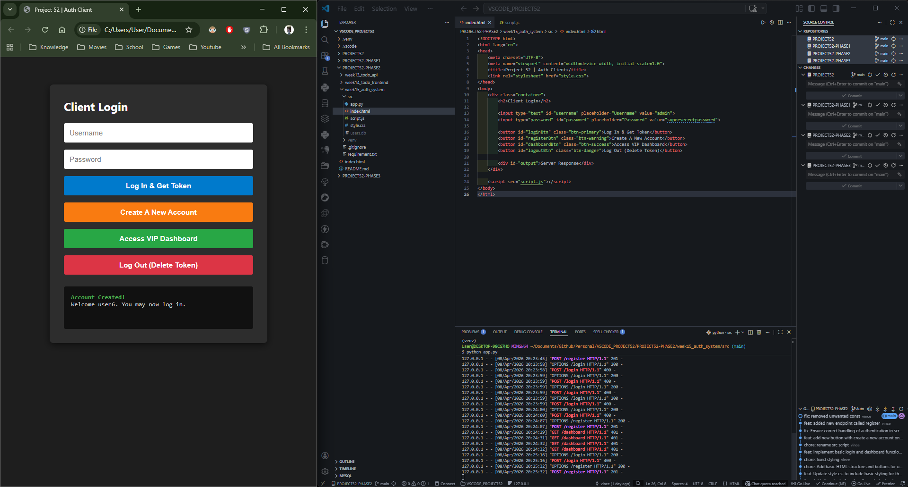
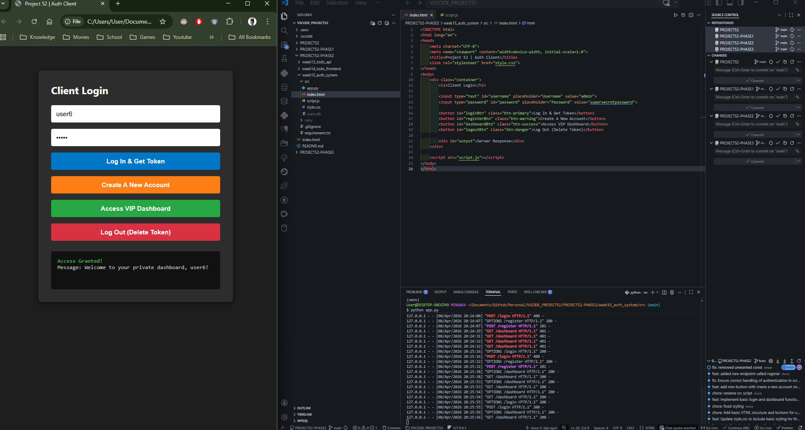
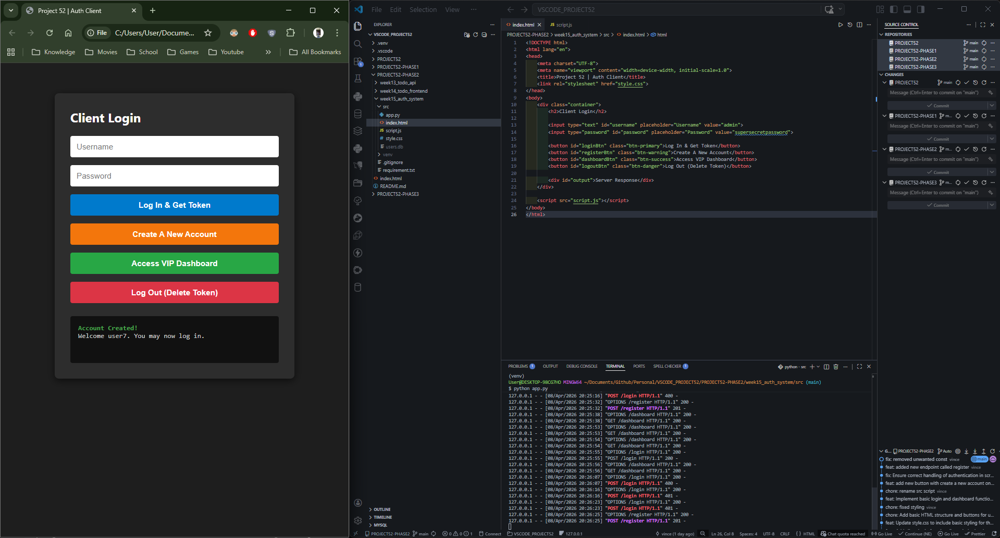

# 📝 DEV LOG: WEEK 15 - DAY 4 

**Core Objective:** Complete the user lifecycle by implementing a frontend registration flow, allowing new clients to securely create accounts in the SQLite database directly from the web UI.

## 1. The Initiative & Context
While the system successfully handled token issuance and validation for existing users, it lacked a client-facing onboarding process. Day 4 focused on hooking up the frontend UI to the backend `/register` endpoint built on Day 1, establishing a complete, decoupled Full-Stack loop: Registration -> Login -> Authorization -> Logout.

## 2. Architectural Decisions & UI Updates
* **UI Expansion:** Injected a new "Create New Account" button into the DOM.
* **Visual Hierarchy:** Applied a distinct `.btn-warning` (orange) CSS class to visually separate the registration action from the primary login action.
* **State Resetting:** Engineered the JavaScript logic to automatically clear the input fields (`usernameInput.value = ''`) upon a successful registration, improving UX and preparing the UI for the subsequent login attempt.

## 3. Core Implementation Logic (The Fetch API)
The frontend asynchronously captures user input and sends a `POST` request to the backend. Crucially, the logic relies on strictly evaluating HTTP status codes to determine the UI state.

```javascript
async function register() {
    const user = usernameInput.value.trim();
    const pass = passwordInput.value.trim();

    // ... validation logic ...

    const response = await fetch(`${API_URL}/register`, {
        method: 'POST',
        headers: { 'Content-Type': 'application/json' },
        body: JSON.stringify({ username: user, password: pass })
    });

    const data = await response.json();

    // 201 Created: Successful insertion into SQLite
    if (response.status === 201) {
        outputBox.innerHTML = `<span class="text-success">Account Created!</span><br>Welcome ${user}. You may now log in.`;
        usernameInput.value = '';
        passwordInput.value = '';
    } else {
        // 409 Conflict: Catches the SQLite IntegrityError if username is taken
        outputBox.innerHTML = `<span class="text-error">Registration Failed:</span> ${data.error}`;
    }
}
````

## 4. Environment Troubleshooting: The Live Server Quirk
During testing, an environment anomaly was encountered: successful account creation immediately triggered a full page reload, wiping the DOM state.

- **Root Cause Analysis:** VS Code's Live Server actively watches the directory for file changes. When the Python backend inserted a new user, `users.db` was modified. Live Server detected this file change and assumed the application code had been updated, forcing a browser refresh.
    
- **The Resolution:** Because the frontend is decoupled and utilizes cross-origin `fetch()` requests to a separate WSGI server, Live Server is not strictly required to serve the HTML. Serving the `index.html` file directly via the local file system (`file:///`) successfully bypassed the aggressive reloading while maintaining full API functionality.
    

## 5. The Output & Result

A new user can register via the frontend, the backend securely hashes and stores their credentials, and the user can immediately log in to receive a valid JSON Web Token.









---
