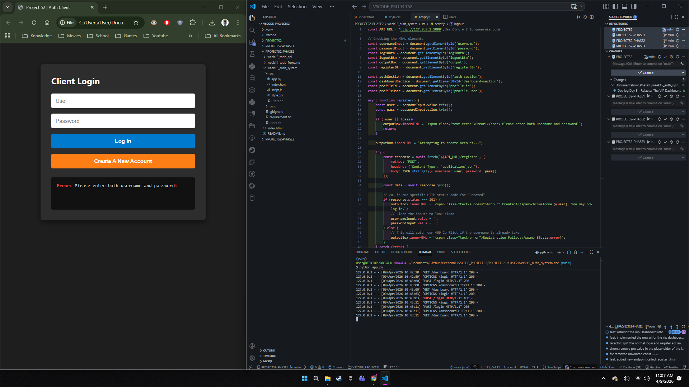
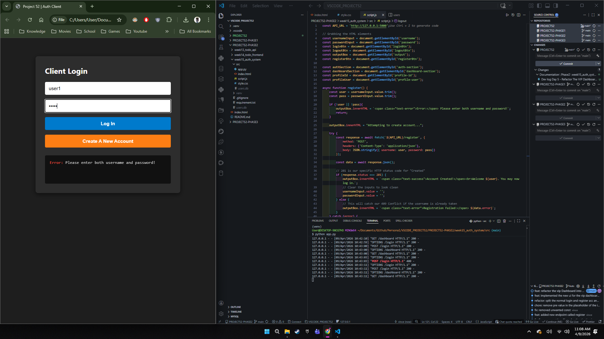
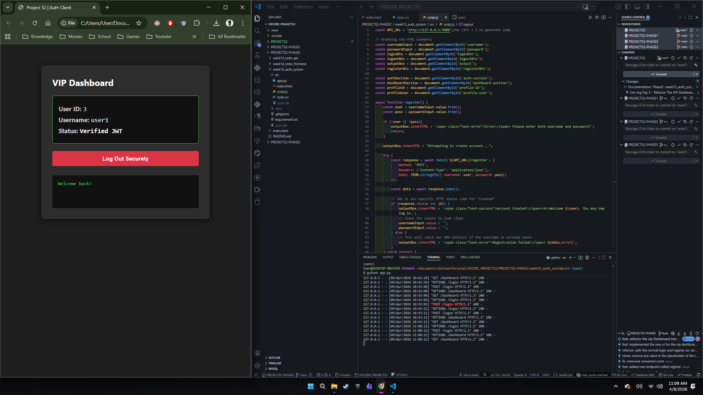
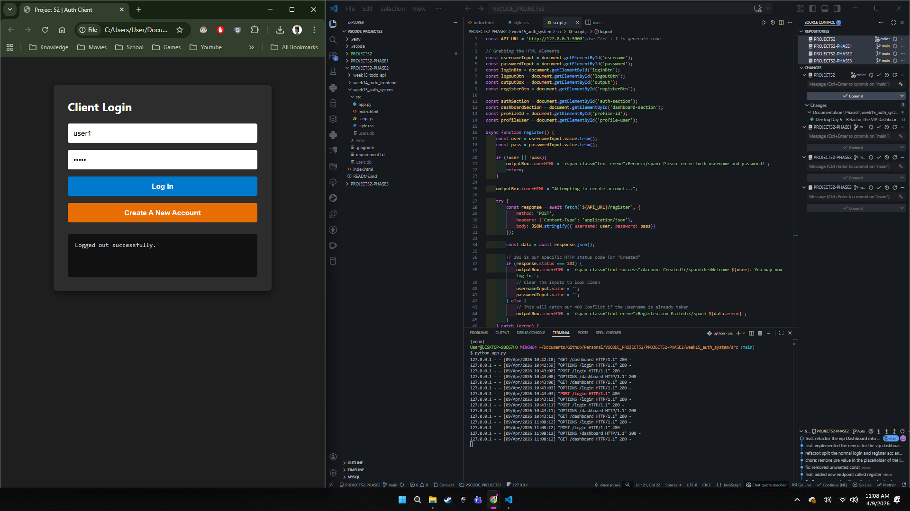
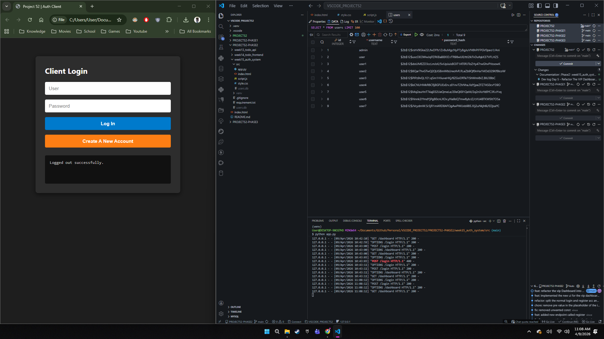

# 📝 DEV LOG: WEEK 15 - DAY 5 

**Core Objective:** Implement client-side state management to dynamically toggle between unauthenticated and authenticated UI views, and populate the DOM with secure user data fetched from the backend.

## 1. The Initiative & Context
While the authentication bridge was fully functional (Day 4), the UI was static and cluttered, displaying all forms and buttons simultaneously regardless of the user's login status. Day 5 focused on engineering a Single Page Application (SPA) feel using Vanilla JavaScript to check the authentication state and conditionally render UI components based on the presence and validity of a JSON Web Token (JWT).

## 2. Architectural Decisions & UI Refactoring

### Concept A: DOM Sectioning & The `.hidden` Class
* The `index.html` was refactored into two distinct, mutually exclusive wrappers: `#auth-section` and `#dashboard-section`.
* Engineered a highly reusable CSS utility class (`.hidden { display: none !important; }`). Instead of writing complex JavaScript to manually hide individual elements, the logic simply toggles this class on the parent containers to instantly swap views.

### Concept B: The State Manager (`checkAuthState`)
* Created a master lifecycle function that acts as the source of truth for the UI.
* **Execution Timing:** This function is invoked globally at the bottom of `app.js` so it runs the exact millisecond the script loads, preventing a "flash of unauthenticated content" (FOUC). It is also called immediately after a successful login or logout to trigger a seamless UI transition.

## 3. Core Implementation Logic (Conditional Rendering)
The state manager checks `localStorage` and dictates the flow:

```javascript
async function checkAuthState() {
    const token = localStorage.getItem('project52_token');

    // STATE 1: Unauthenticated
    if (!token) {
        authSection.classList.remove('hidden');
        dashboardSection.classList.add('hidden');
        return;
    }

    // STATE 2: Authenticated (Verifying Token)
    try {
        const response = await fetch(`${API_URL}/dashboard`, {
            method: 'GET',
            headers: { 'Authorization': `Bearer ${token}` }
        });

        const data = await response.json();

        if (response.ok) {
            // Token is valid: Render Dashboard
            authSection.classList.add('hidden');
            dashboardSection.classList.remove('hidden');
            
            // Inject secure database info into the DOM
            profileId.innerText = data.user_data.id;
            profileUser.innerText = data.user_data.username;
        } else {
            // Token expired/invalid: Force Logout
            logout();
        }
    } catch (error) {
        // Handle network failure
    }
}
````

## 4. Troubleshooting: The Silent DOM Crash
During implementation, a JavaScript execution halt occurred.

- **Root Cause:** A deprecated DOM element (`#dashboardBtn`) was removed from the HTML, but `getElementById` and `addEventListener` were still attempting to bind to it. In Vanilla JS, attempting to bind an event to `null` causes a fatal `TypeError`, halting all subsequent script execution (including the vital `checkAuthState` call).
    
- **Resolution:** Removed the orphaned element bindings. This reinforced the importance of keeping DOM queries strictly synchronized with the HTML structure.
    

## 5. The Output & Result
The application now behaves like a modern SPA. Logging in seamlessly transitions the user to a personalized dashboard populated with data securely fetched from the backend SQLite database. Logging out instantly destroys the token and returns the UI to the clean login state.












---

