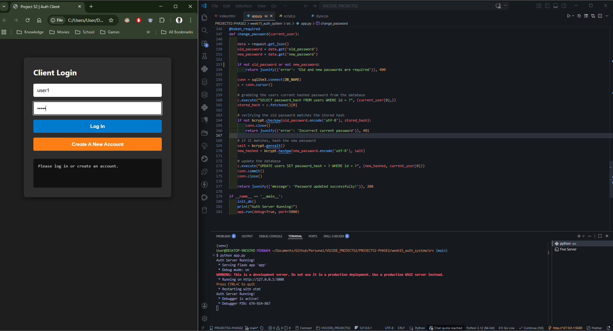
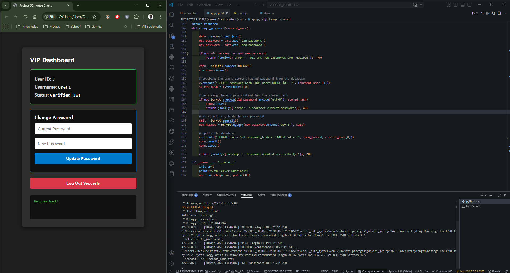
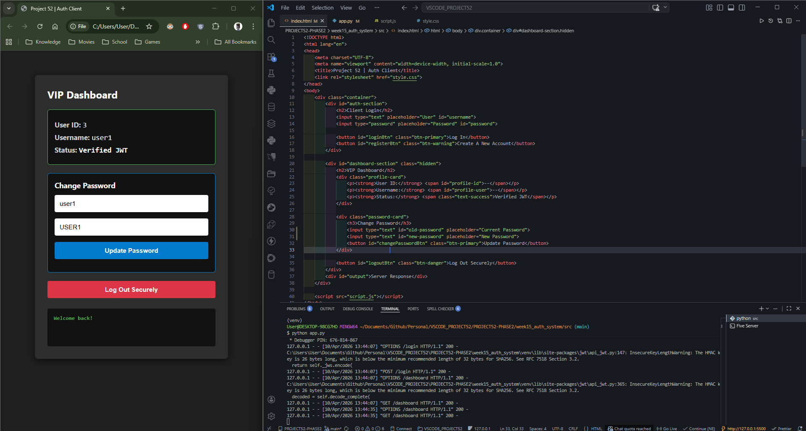
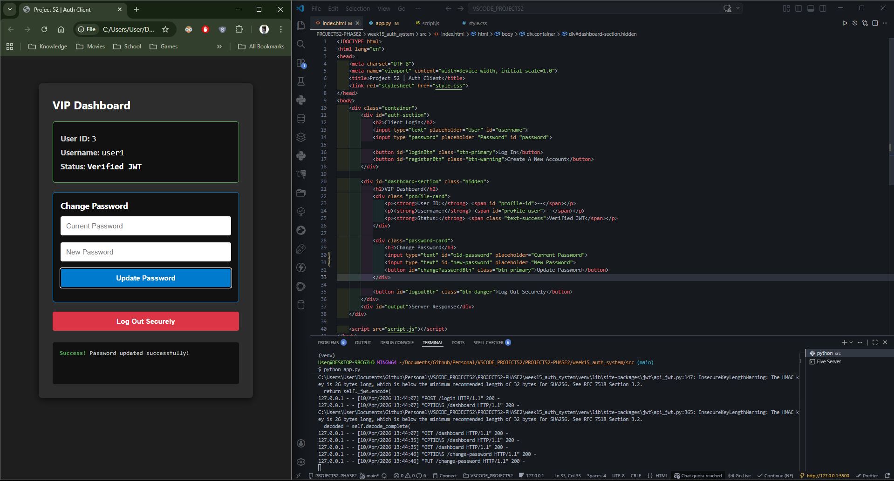
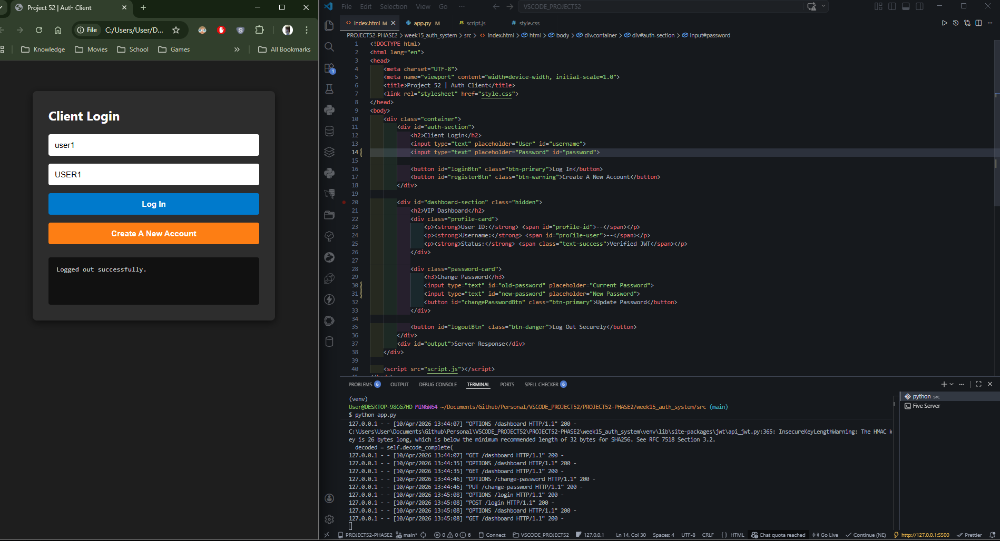
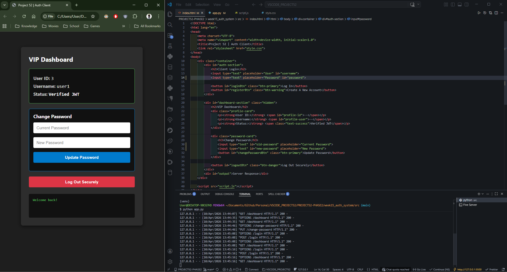

# 📝 DEV LOG: WEEK 15 - DAY 6

**Core Objective:** Engineer a secure, authenticated endpoint allowing verified users to update their credentials. This requires a multi-step cryptographic verification process, DOM expansion for the client UI, and strict validation logic to prevent unauthorized account modification.

## 1. The Initiative & Context

A complete authentication system must account for credential lifecycle management. Users need the ability to update compromised or outdated passwords. However, this is a highly sensitive operation. If a malicious actor gains temporary access to an unlocked device, they could lock the original user out. To mitigate this, Day 6 implemented a strict "Identity Verification" flow: the user must prove they know the _current_ password before the system will accept a _new_ one, even if they are already authenticated with a valid JWT.

## 2. Backend Cryptographic Workflow (`/change-password`)

The backend logic was expanded to handle the credential swap using the `bcrypt` library. The workflow follows a strict, secure pipeline:

1. **Authentication Guard:** The route is protected by the `@token_required` middleware, ensuring only users with a valid JWT can initiate the request.
2. **Current Hash Retrieval:** The system queries the SQLite database (`SELECT password_hash FROM users WHERE id = ?`) to retrieve the user's existing, salted hash.
3. **Cryptographic Verification:** `bcrypt.checkpw()` evaluates the provided `old_password` against the stored hash. If this fails, the server aborts the operation and returns a `401 Unauthorized` status.
4. **Re-Salting & Hashing:** If verification succeeds, the system generates a brand new cryptographic salt (`bcrypt.gensalt()`) and hashes the `new_password`. Re-salting is critical to ensure that even if the new password is the same as another user's, the resulting hash remains unique.
5. **Database Commit:** The new hash overwrites the old record via a SQL `UPDATE` statement.

## 3. API Design Methodology: The `PUT` Method

For this endpoint, the HTTP `PUT` method was explicitly chosen over `POST`.

- **Why PUT?** In RESTful API design, `POST` is used for _creating_ new resources (e.g., `/register`), while `PUT` is used for _updating_ or replacing existing resources. Since we are replacing the existing password hash with a new one, `PUT` is the semantically correct HTTP verb.

## 4. Frontend Integration & DOM Expansion

The Client UI was updated to accommodate the new feature within the protected state:

- **DOM Injection:** A new `.password-card` module was added exclusively inside the `#dashboard-section`. This ensures the form is physically impossible to interact with unless the user has successfully bypassed the login screen.
- **Token Attachment:** The `changePassword()` asynchronous function utilizes the Fetch API. Crucially, it must retrieve the `project52_token` from `localStorage` and inject it into the `Authorization: Bearer <token>` header, otherwise the backend bouncer will reject the `PUT` request.

## 5. Troubleshooting: Boolean Logic & Truthiness

During initial testing, a logical bug was encountered in the validation block:

```python
# The Buggy Code:
if not old_password or new_password:
    return jsonify({'error': 'Old and new passwords are required'}), 400
```

- **Root Cause Analysis:** In Python, this statement evaluates as: "If `old_password` is empty/falsy, OR if `new_password` has _any_ value/truthy." Because a new password was provided, the second half of the `or` statement evaluated to `True`, triggering the error incorrectly.
- **The Resolution:** python

# The Fixed Code:

```python
if not old_password or not new_password:
```

By adding the second `not`, the logic correctly asserts: "If _either_ field is empty, throw the error." This reinforced the importance of strict logical operators when evaluating multiple input states.

## 6. The Output & Result

The password management lifecycle is fully operational. The system successfully validates the JWT, verifies the legacy credentials cryptographically, salts and hashes the new credentials, updates the database, and provides dynamic success/error UI feedback to the client without page reloads.













