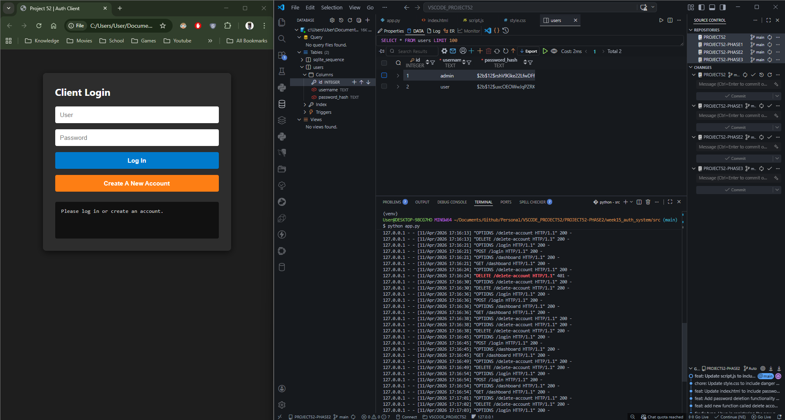
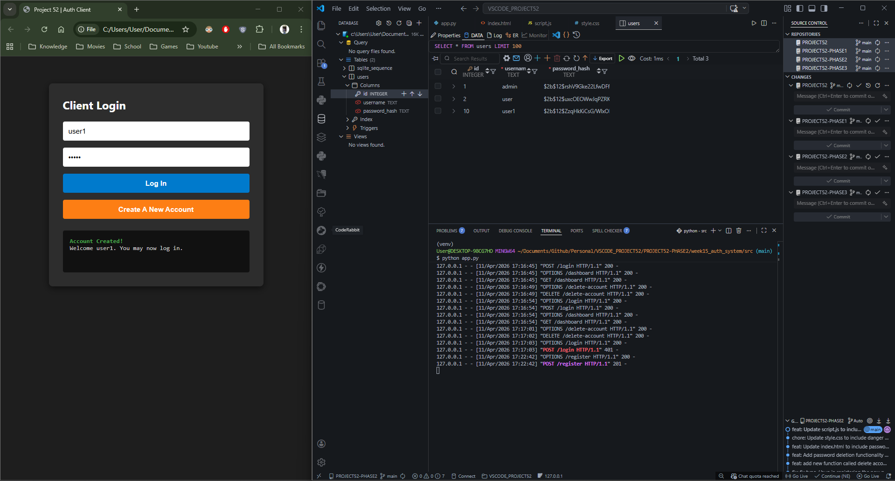
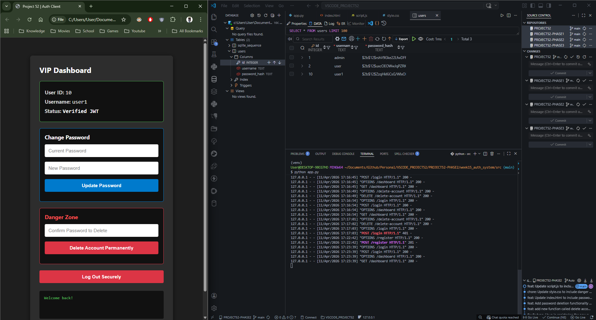
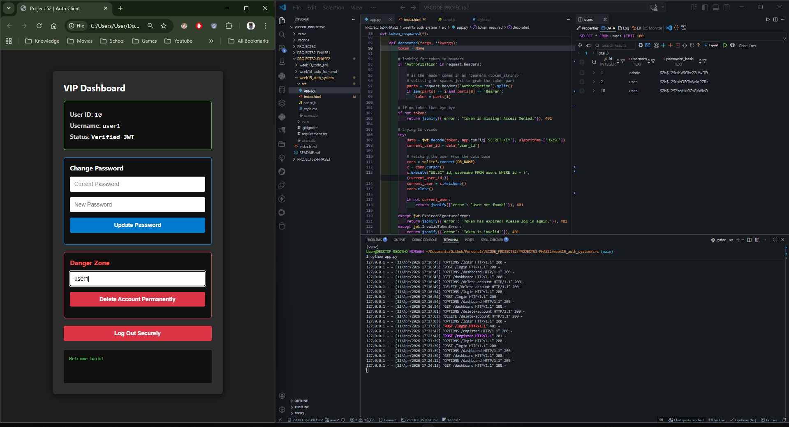
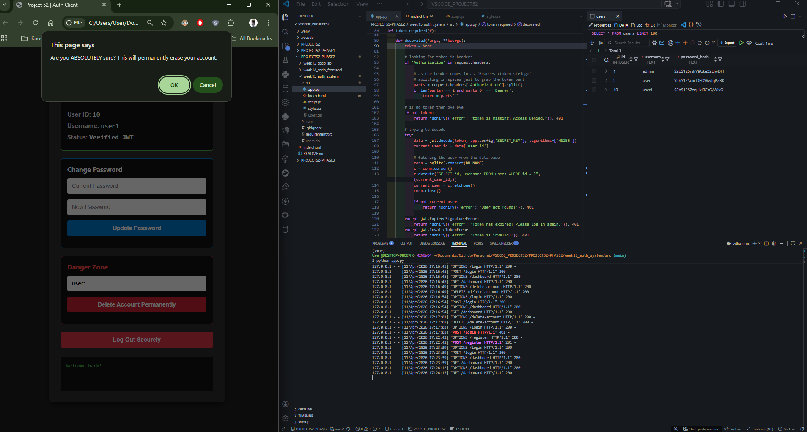
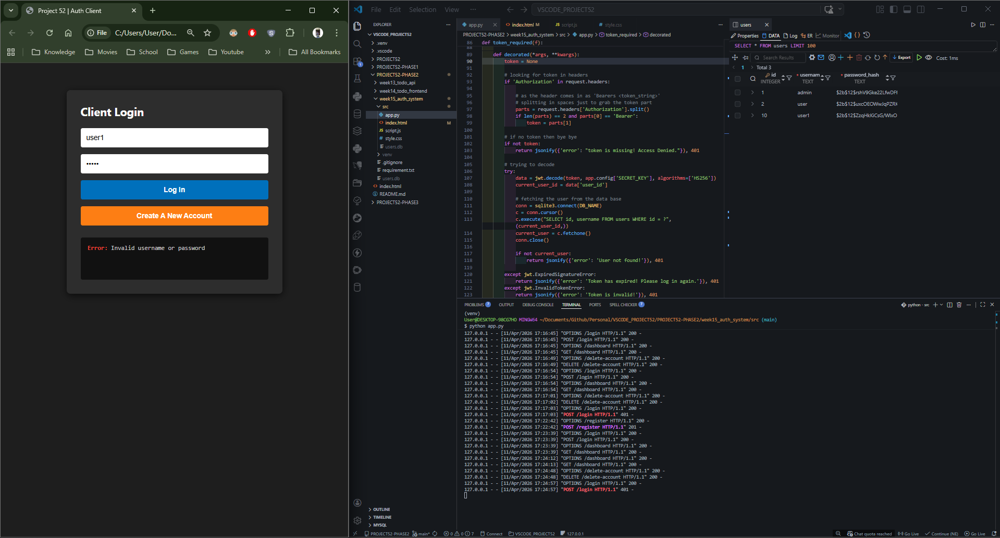
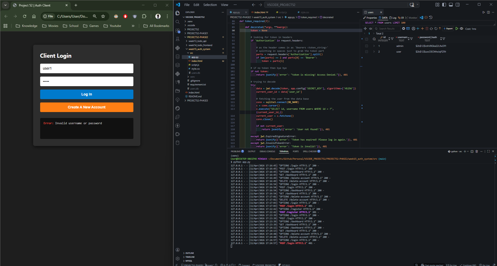

# 📝 DEV LOG: WEEK 15 - DAY 7 (FINALE)

**Core Objective:** Implement a secure, user-initiated account deletion sequence ("Hard Delete") that strictly adheres to data privacy principles. This requires a multi-layered verification process bridging the DOM, the browser's native API, the Flask middleware, the cryptographic engine, and the SQLite database.

## 1. The Initiative & Context: The Right to be Forgotten

A modern web application is legally and ethically required to provide users with the ability to permanently erase their data (e.g., GDPR compliance). In database architecture, there are two approaches to deletion:

- **Soft Delete:** Flagging a user as `is_deleted = True` but keeping their data on the server.
- **Hard Delete:** Executing a `DELETE FROM` SQL command to permanently scrub the record from the physical storage.
  For Phase 2, we engineered a strict **Hard Delete**. Because this action is irreversible, the architectural focus was heavily weighted toward preventing accidental or malicious execution.

## 2. Security Architecture: The "Double-Lock" Mechanism

To prevent a scenario where a hijacked session (e.g., a user leaving their laptop open at a coffee shop) results in a deleted account, the system enforces a strict "Double-Lock":

1.  **Lock 1 (The Token):** The route (`/delete-account`) is guarded by the `@token_required` middleware. The request MUST contain a valid JWT Bearer token to identify the target user.
2.  **Lock 2 (The Password):** Even with a valid token, the user must manually input their raw password. The backend queries the database for the current hash (`SELECT password_hash FROM users WHERE id = ?`) and utilizes `bcrypt.checkpw()` to verify the identity in real-time before proceeding.

## 3. API Design: The `DELETE` HTTP Verb

RESTful API conventions dictate strict usage of HTTP verbs. While a `POST` request could theoretically perform the database drop, semantic correctness requires the `DELETE` verb.

```python
@app.route('/delete-account', methods=['DELETE'])
@token_required
def delete_account(current_user):
    # Extracts password from JSON body
    # Cryptographically verifies against stored hash
    # Executes: DELETE FROM users WHERE id = ?
    # Returns 200 OK
```

## 4. Client-Side UX & State Destruction

The frontend integration required careful handling of both user experience and local session state.

- **The Danger Zone UI:** The deletion module was isolated within a `.danger-zone-card` styled with distinct red `#dc3545` borders to visually communicate the severity of the action, separating it from standard profile settings.
- **The Native Intercept:** Before the JavaScript `fetch()` API is even invoked, the script triggers the browser's native `confirm()` method. This halts the main thread and forces the user to explicitly acknowledge a popup, preventing misclicks.
- **State Purge:** A successful 200 OK response from the server means the backend record is gone. However, the client's browser still holds the JWT in memory. The logic immediately executes `localStorage.removeItem('project52_token')` and calls the `checkAuthState()` manager. This instantly drops the UI state back to unauthenticated, forcing the login screen to render.

## 5. Verification & Testing Protocol

The system underwent rigorous manual end-to-end testing:

1. **Rejection Test:** Attempted deletion with an invalid password correctly resulted in a `401 Unauthorized` block at the backend cryptographic layer, preserving the database row.
2. **Execution Test:** A valid request successfully scrubbed the user from the SQLite `users.db` file.
3. **Persistence Test:** Subsequent attempts to log in with the deleted credentials returned a `401 Invalid username or password`, proving the row was permanently dropped and the hash no longer existed for comparison.
















