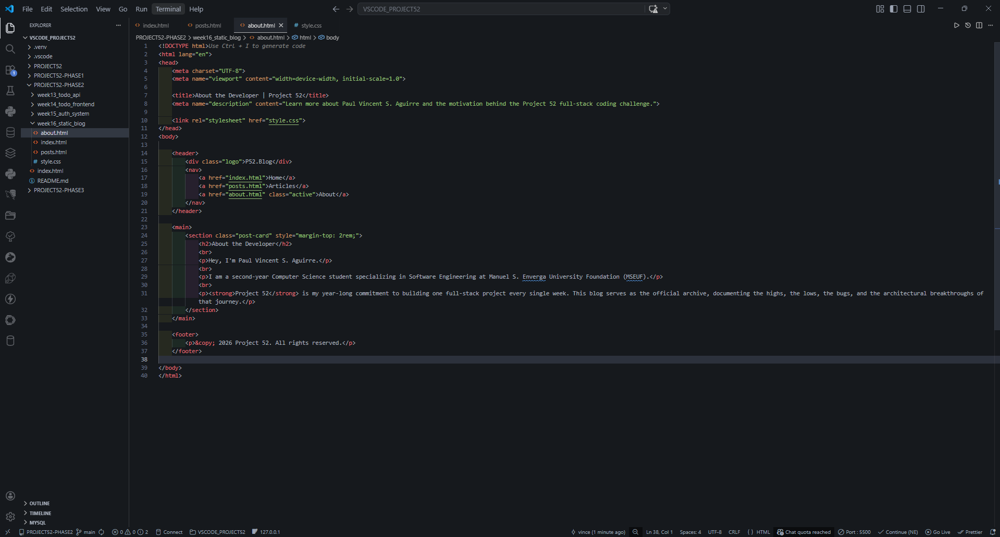
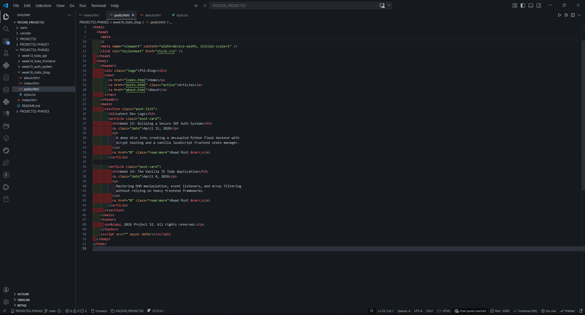
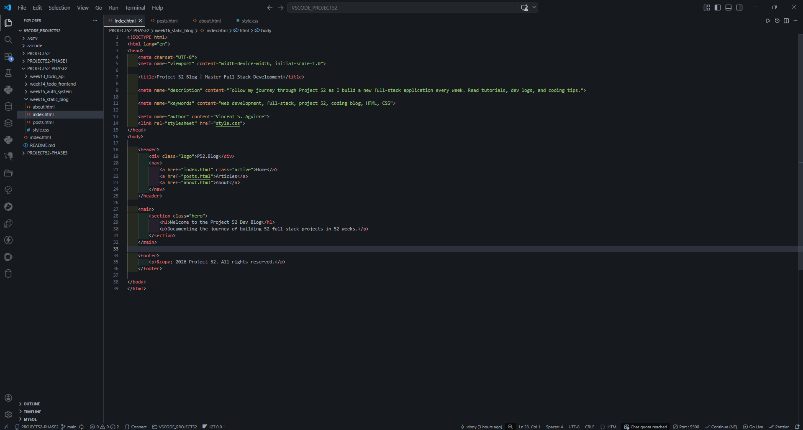
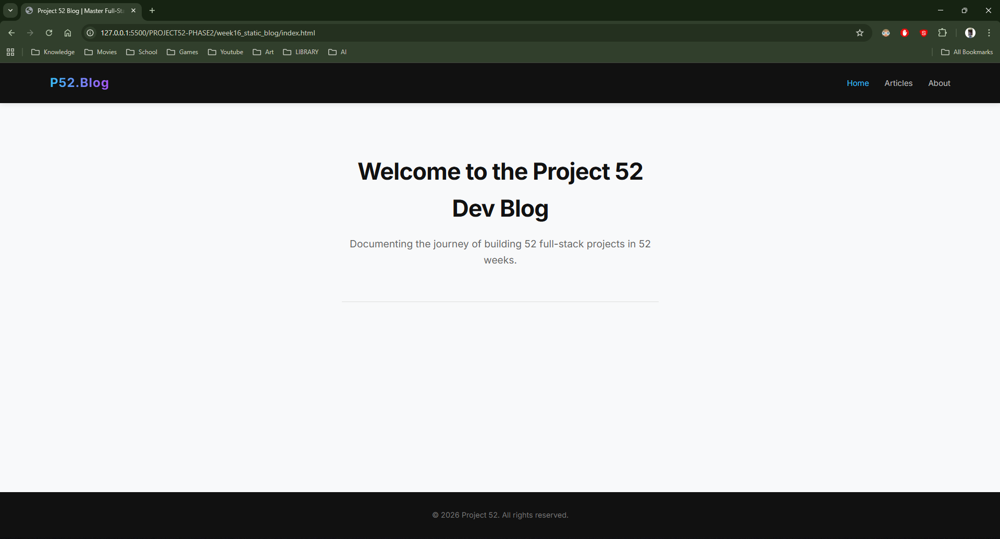
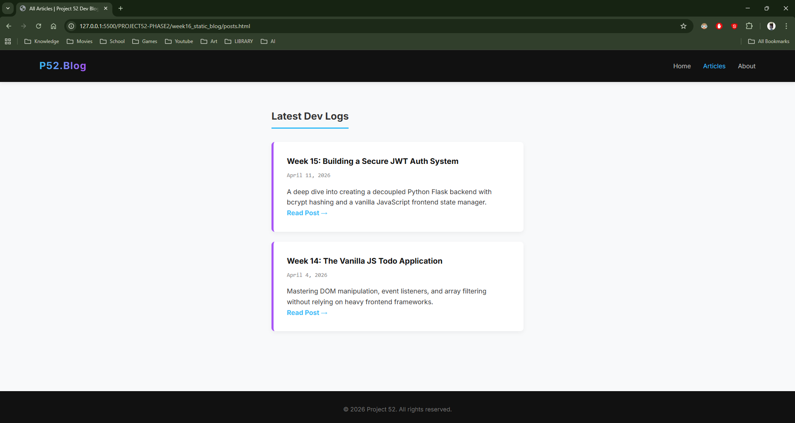
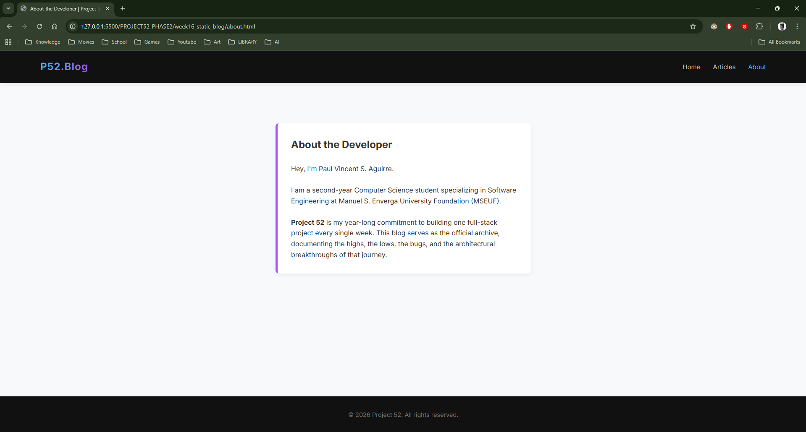

# 📝 DEV LOG: WEEK 16 - DAY 1 

**Core Objective:** Establish the foundation for a Static Multi-Page Application (MPA) serving as a developer blog. Prioritize Technical SEO, Semantic HTML5 structure, and a globally shared CSS architecture.

## 1. The Initiative & Context
Unlike Single Page Applications (SPAs) where JavaScript dynamically rewrites the DOM, Multi-Page Applications consist of distinct, physical HTML files (e.g., `index.html`, `posts.html`, `about.html`). The primary advantage of an MPA is Search Engine Optimization (SEO). Because each page has its own unique URL and metadata, web crawlers (like Googlebot) can easily index the specific content of every individual page.

## 2. Technical SEO & Meta Tags
Before any UI was designed, the `<head>` of every document was optimized to communicate directly with search engines:
* **`<title>`:** Kept concise and keyword-rich. Uniquely tailored for each page (e.g., "All Articles | Project 52 Dev Blog" vs "About the Developer").
* **`<meta name="description">`:** Acts as the "sales pitch" snippet that appears on the Google Search Engine Results Page (SERP).
* **`<meta name="viewport">`:** Ensures mobile responsiveness by instructing the browser to match the screen's width and scale.

## 3. Semantic HTML5 Architecture
Div-soup (`
`) was avoided in favor of modern Semantic tags. 
* `<header>`, `<nav>`, `<main>`, `<section>`, `<article>`, and `<footer>` were utilized.
* **Why it matters:** Semantic tags provide accessibility for screen readers and give search engines structural context, clearly differentiating the primary content (`<main>`) from boilerplate navigation (`<nav>`).

## 4. Global CSS & The DRY Principle
To adhere to the DRY (Don't Repeat Yourself) principle, a single `style.css` file was created and linked to every HTML page via `<link rel="stylesheet" href="style.css">`.
* **The Benefit:** A single source of truth for the application's design system. Modifying the `.post-card` class updates the visual styling across the entire site simultaneously.
* **Navigation State:** Because there is no JavaScript router, the current page state is managed manually by moving the `.active` CSS class to the corresponding `<a href>` tag in each file's navigation bar.

## 5. Output
A clean, 3-page static website interconnected via native HTML anchors, fully styled with a responsive Flexbox layout, and structurally optimized for web crawler indexing.

