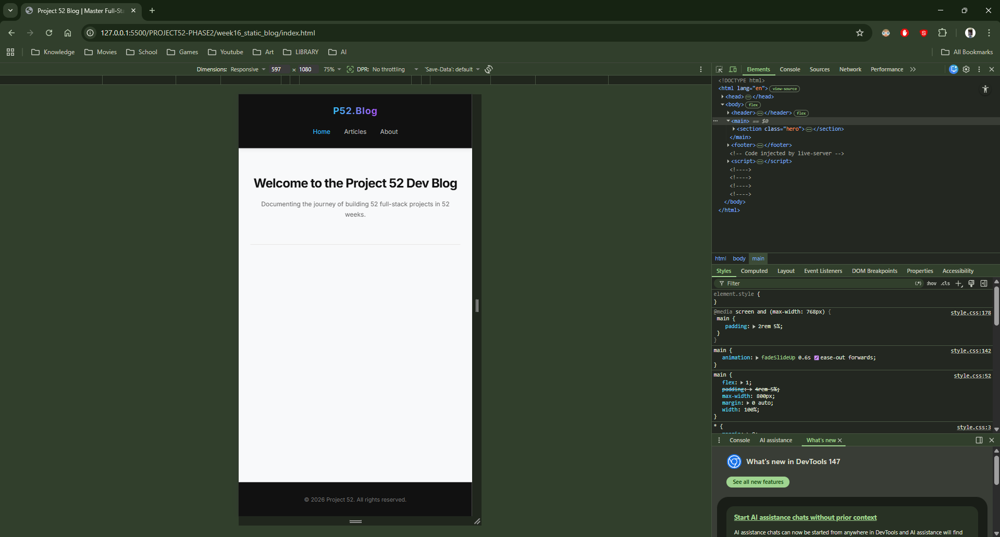
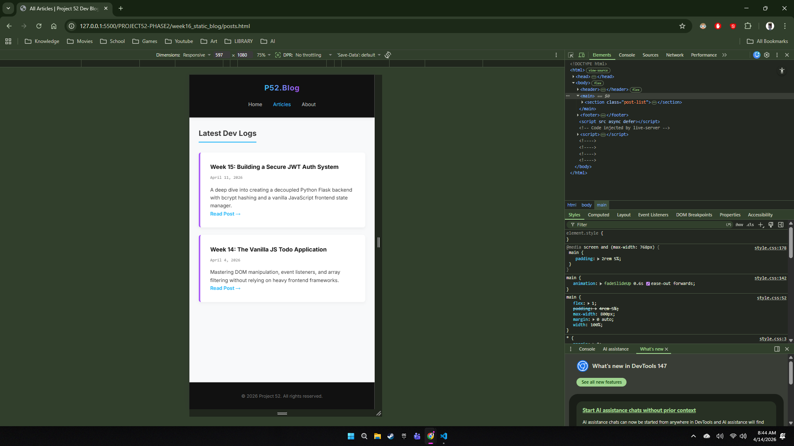
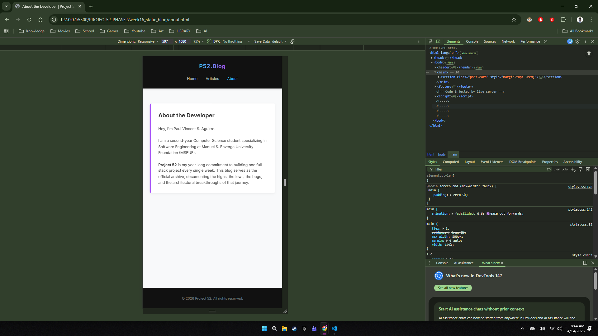

# 📝 DEV LOG: WEEK 16 - DAY 2 

**Core Objective:** Enhance the Static Multi-Page Application (MPA) by implementing smooth, JavaScript-free CSS animations and establishing a mobile-first responsive design using Media Queries.

## 1. The Initiative & Context
A modern web application must adapt flawlessly to any screen size and feel premium during navigation. Because static MPAs inherently require a full page load when navigating between HTML files, CSS animations were introduced to mask the loading transition and make the site feel like a fluid Single Page Application (SPA). Additionally, strict viewport rules were applied to guarantee readability on mobile devices.

## 2. CSS Animation Engine (`@keyframes`)
Animations were handled entirely via the CSS engine to ensure hardware acceleration and zero JavaScript overhead.
* **The `fadeSlideUp` Keyframe:** Created a custom animation that transitions elements from `opacity: 0` and `translateY(20px)` to their native state.
* **Implementation:** Applied globally to the `<main>` tag (`animation: fadeSlideUp 0.6s ease-out forwards;`). Every time a new HTML page loads, the content smoothly glides into place.
* **Staggered Loading:** Added a `0.2s` delay specifically to `.post-card` elements to create a cascading, staggered entrance effect.

## 3. Responsive Design Architecture (Media Queries)
To ensure the layout doesn't break on mobile devices, a breakpoint was established at `768px` (standard tablet/mobile threshold).
* **Header Restructuring:** The flexbox container for the `<header>` was switched from `flex-direction: row` to `column`, stacking the logo and navigation vertically to prevent horizontal overflow.
* **Touch Target Optimization:** Navigation links (`<nav a>`) were given expanded margins and centered to accommodate touch interactions ("fat fingers") rather than precise mouse clicks.
* **Fluid Typography:** Hardcoded desktop font sizes in the `.hero` section were scaled down within the media query to maintain visual hierarchy without triggering horizontal scrollbars.

## 4. The Output & Result
The blog is now 100% responsive and visually dynamic. By leveraging the DRY (Don't Repeat Yourself) global `style.css` file, the media queries and animations instantly propagated across `index.html`, `posts.html`, and `about.html`, resulting in a highly polished, production-ready static interface.

