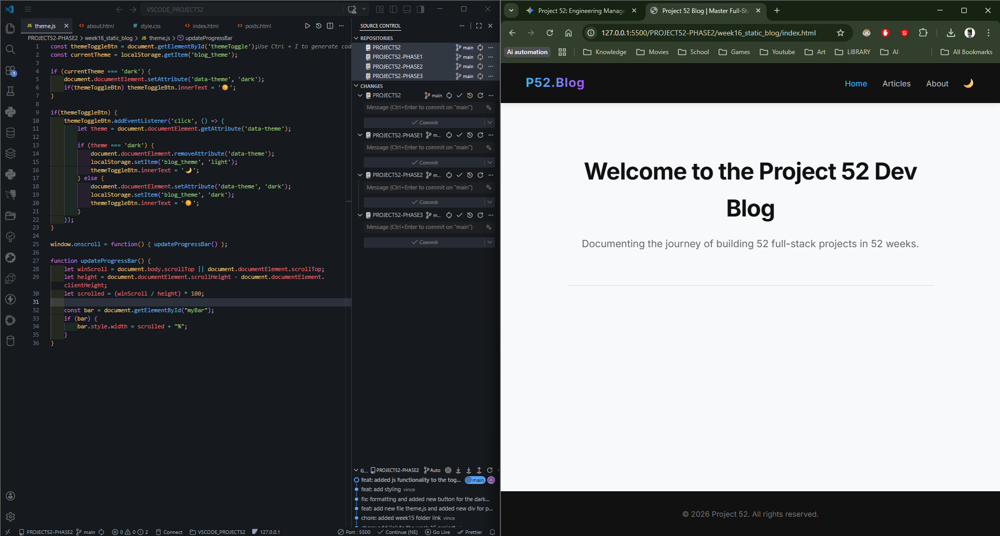
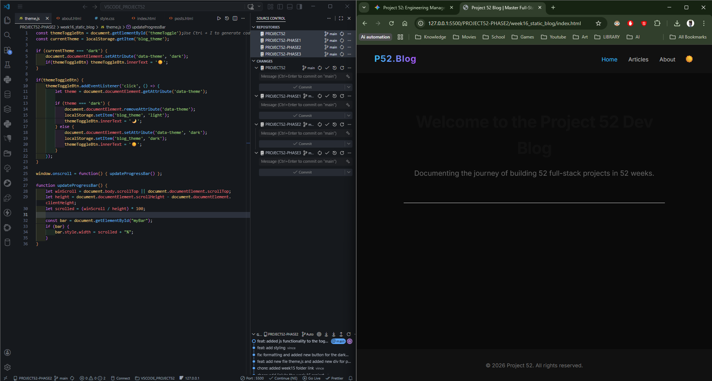
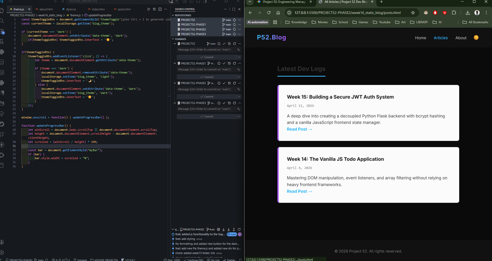
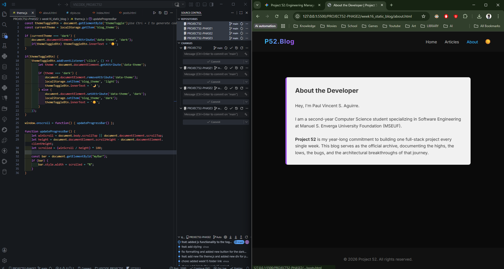

# 📝 DEV LOG: WEEK 16 - DAY 4 (IN PROGRESS)

**Core Objective:** Elevate the UI/UX of the Static Blog by implementing a user-toggled Dark Mode and Reading Progress Bar.

## 1. CSS Architecture: Custom Properties (Variables)

Hardcoded hex colors were stripped from the stylesheet and replaced with CSS Custom Properties (`var(--variable-name)`).

- **Light Mode (Default):** Variables established inside the `:root` pseudo-class.
- **Dark Mode (Override):** A secondary attribute selector `[data-theme="dark"]` overrides `:root` variables when active, recalculating the layout's colors dynamically.

## 2. State Management in an MPA (`localStorage`)

- **The Logic:** When the user toggles Dark Mode, `localStorage.setItem('blog_theme', 'dark')` saves the preference directly to the browser. When the user navigates between HTML files, the script instantly runs `localStorage.getItem('blog_theme')` and reapplies the state to maintain consistency across the Multi-Page Application.

## 3. Dynamic UI: Reading Progress Bar

- **Math/Logic:** The script listens to the `window.onscroll` event, calculating the user's absolute scroll depth (`scrollTop`) divided by the total scrollable height of the document.
- **DOM Manipulation:** This ratio is converted to a percentage and dynamically injected into the `.progress-bar` inline CSS width (`bar.style.width = scrolled + "%"`).

## 4. Pending Action Items (Next Session)

- The current UI output requires improvement before deployment.
- **Next Steps:** Execute a comprehensive UI aesthetic overhaul, refine the overall layout, and integrate additional frontend features before officially closing the module.

