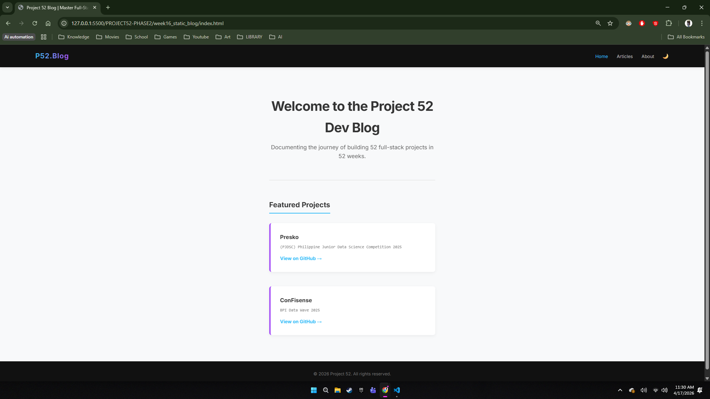
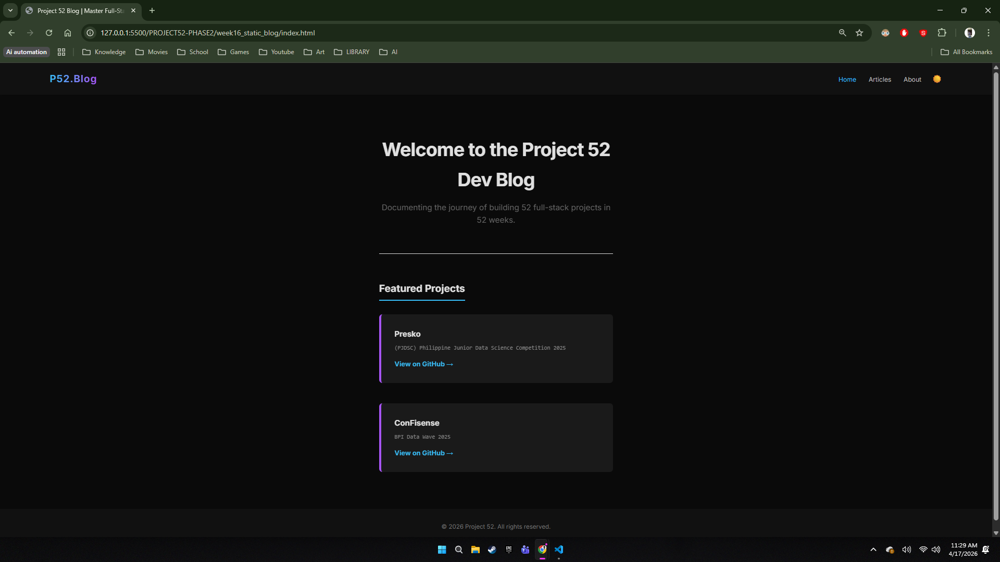
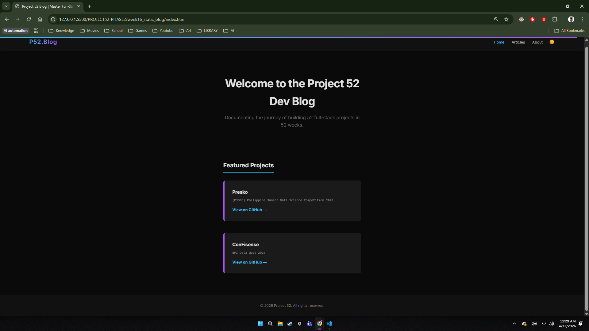
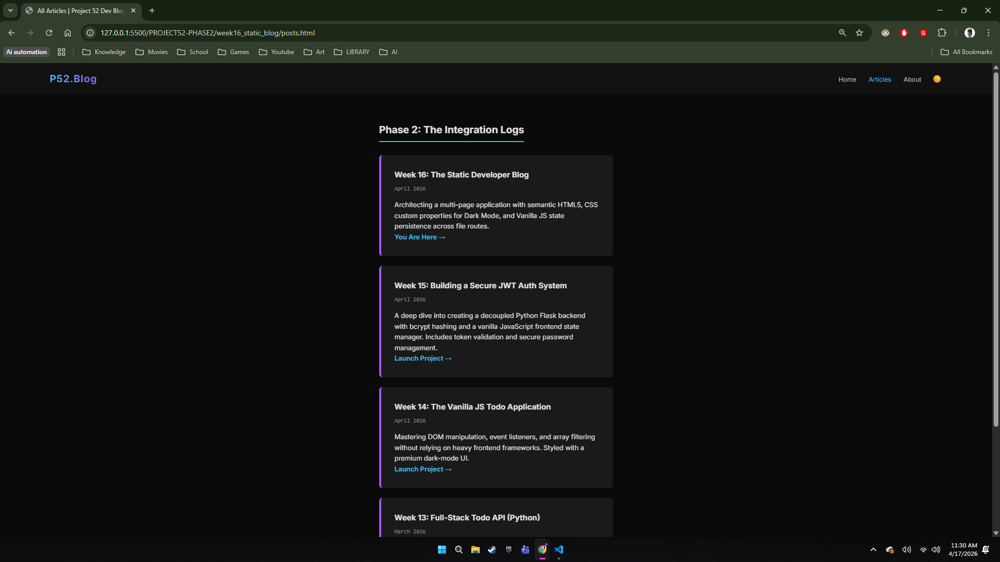
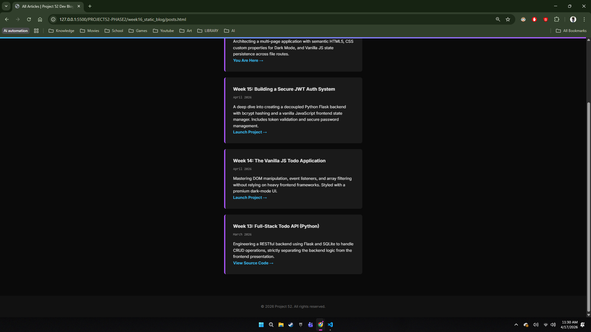
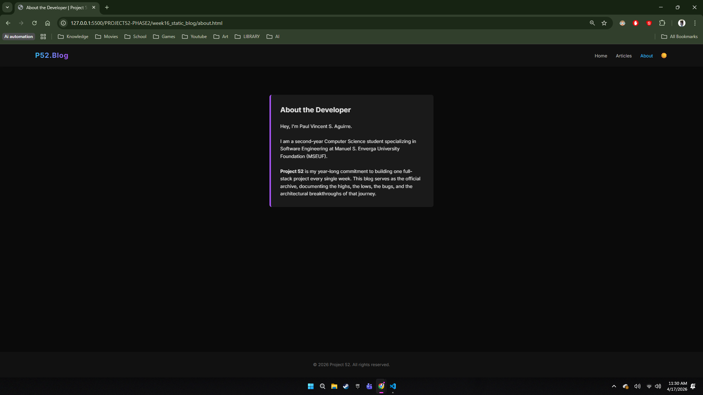
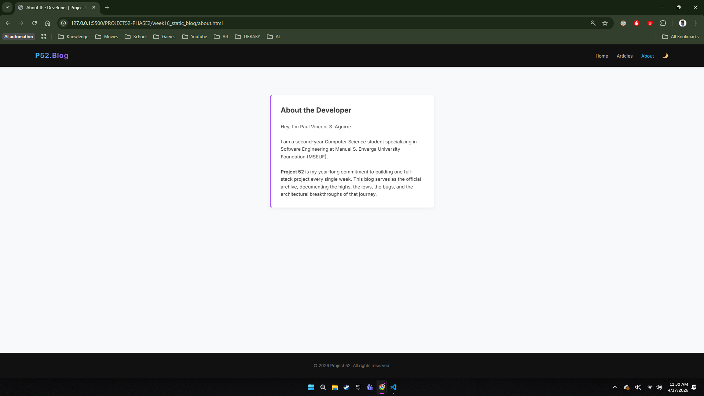
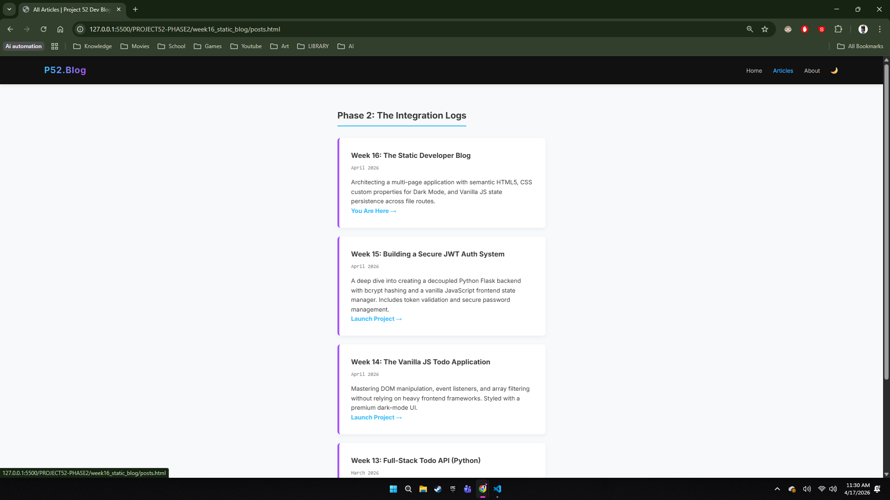
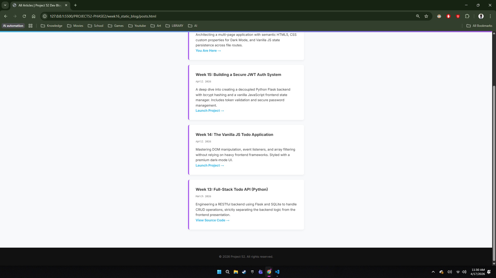

# 📝 DEV LOG: WEEK 16 - ARCHITECTURE & UI OVERHAUL

**Core Objective:** Elevate the UI/UX of the Static Blog by implementing a user-toggled Dark Mode, a Reading Progress Bar, and integrating live, production-grade GitHub repositories into a responsive portfolio grid.

## 1. CSS Architecture: Custom Properties (Variables)

Hardcoded hex colors were completely stripped from the global stylesheet elements (body, cards, typography) and replaced with CSS Custom Properties (`var(--variable-name)`).

- **Light Mode (Default):** Variables established inside the `:root` pseudo-class.
- **Dark Mode (Override):** A secondary attribute selector `[data-theme="dark"]` overrides `:root` variables when active, dynamically recalculating the layout's colors and triggering a smooth `0.3s ease` transition.

## 2. State Management in an MPA (`localStorage`)

To solve the issue of the browser "forgetting" the UI state across a Multi-Page Application (MPA):

- **The Logic:** When the user toggles Dark Mode, `localStorage.setItem('blog_theme', 'dark')` saves the preference directly to the browser.
- **Persistence:** Upon navigating between HTML routes (`index.html` -> `posts.html`), `theme.js` intercepts the render, retrieves the `blog_theme` payload, and reapplies the `data-theme` attribute natively to maintain visual consistency.

## 3. Dynamic UI: Reading Progress Bar

- **Math/Logic:** The script tracks the `window.onscroll` event, calculating the user's absolute scroll depth (`scrollTop`) divided by the total scrollable height of the document.
- **DOM Manipulation:** This ratio is converted to a percentage and dynamically injected into the `.progress-bar` inline CSS width (`bar.style.width = scrolled + "%"`).

## 4. Content Architecture: Portfolio Integration

The static boilerplate was updated to reflect real-world engineering output.

- **CSS Grid:** A fully responsive `grid-template-columns: repeat(auto-fit, minmax(300px, 1fr))` layout was implemented to dynamically stack project cards on mobile viewports while maintaining side-by-side structures on desktop screens.
- **Live Linkage:** High-level projects, including "KlimaTech" (PJDSC 2025) and "ConFisense" (BPI Data Wave), were securely linked (`target="_blank"`) directly to their respective GitHub source repositories to act as a functional developer portfolio.

---

