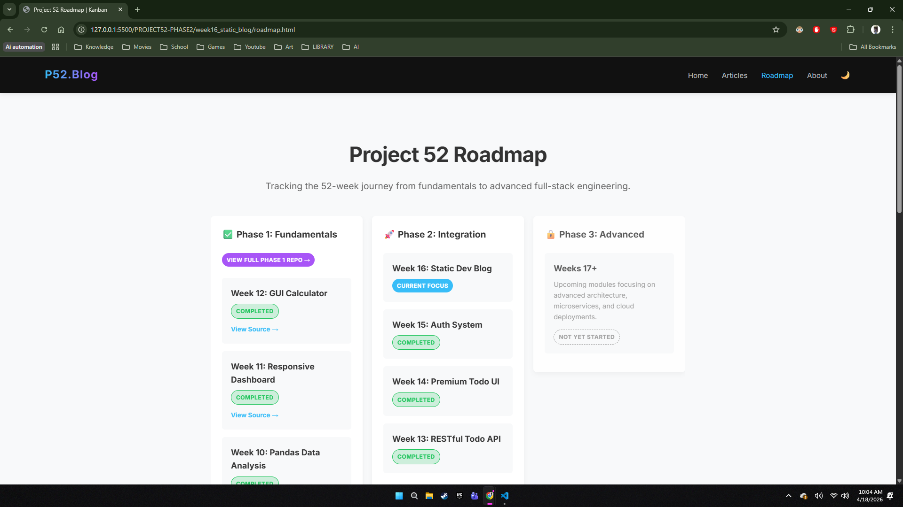
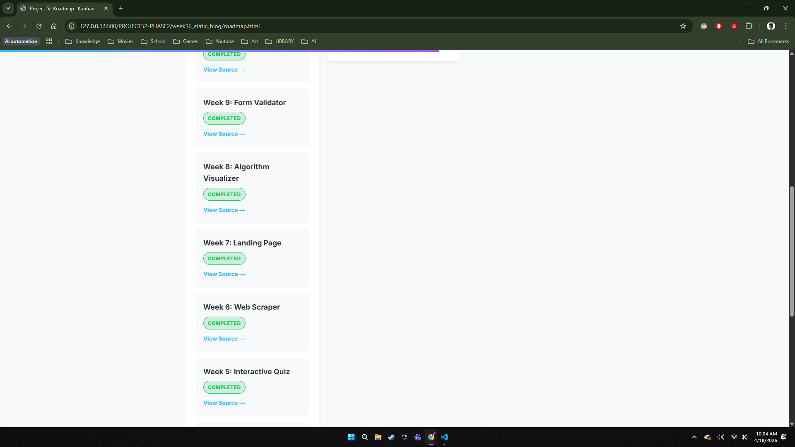
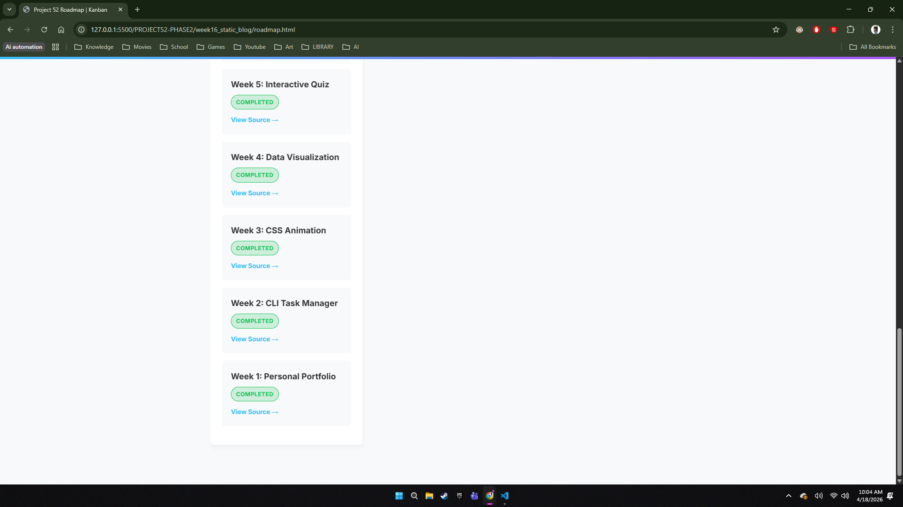
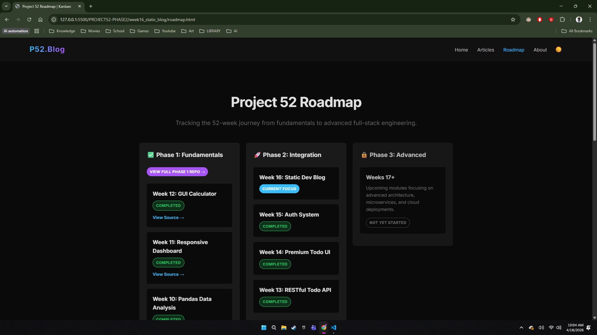
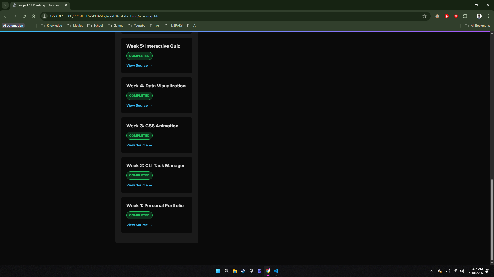

# DEV LOG: WEEK 16

## 1. Executive Summary
The objective was to construct a production-ready Static Developer Blog that doubles as a centralized "Command Center" (Hub). This Hub successfully integrates all prior isolated modules (Todo API, Premium Todo UI, JWT Auth System) alongside a newly developed interactive Phase 1 Roadmap.

## 2. Architectural Decisions
### 2.1 Multi-Page Application (MPA) vs. SPA
Instead of utilizing a heavy JavaScript framework (like React or Vue) for a Single Page Application, a strict **Multi-Page Application (MPA)** architecture was chosen.
* **Why?** Superior out-of-the-box Technical SEO. By having distinct, physical HTML files (`index.html`, `about.html`, `posts.html`, `roadmap.html`), web crawlers can index unique `<title>` and `<meta description>` tags for every route.
* **Trade-off Mitigation:** The inherent "clunkiness" of MPA page reloads was mitigated using hardware-accelerated CSS keyframe animations (`@keyframes fadeSlideUp`), creating the illusion of a fluid SPA experience.

### 2.2 The Monorepo Strategy
The project was structured as a local **Monorepo** within the overarching `PROJECT52-PHASE2` directory. 
* **Why?** This ensures strict local file routing (`href="../week15_auth_system/src/index.html"`). A recruiter or collaborator can clone the single Phase 2 repository and have immediate, decoupled access to the frontends and backends without configuring multiple git remotes.

## 3. Frontend Engineering & UI/UX
### 3.1 CSS Custom Properties & Theming Engine
Hardcoded colors were entirely eradicated. The layout utilizes a dynamic theming engine powered by CSS Variables.
```css
:root { /* Light Mode Defaults */
    --bg-main: #f8f9fa;
    --card-bg: #fff;
}
[data-theme="dark"] { /* Dark Mode Overrides */
    --bg-main: #0a0a0a;
    --card-bg: #1a1a1a;
}
````

- **Performance:** Relying on the native CSS engine via the `[data-theme="dark"]` attribute selector prevents the need to write duplicate `.dark-mode` classes for every UI component.

### 3.2 State Persistence Across Routes (Vanilla JS)
Because MPAs destroy their JavaScript state upon every page load, a custom persistence layer was engineered using the Web Storage API.

- **The Mechanism:** `theme.js` intercepts the DOM lifecycle. Upon initialization, it reads `localStorage.getItem('blog_theme')`. If 'dark' is detected, it natively reapplies the `data-theme` attribute to the `<html>` root before the First Contentful Paint (FCP), preventing the "white flash" commonly seen in poorly optimized dark modes.
    

## 4. Advanced Component: The Kanban Roadmap
To visualize the 52-week trajectory, `roadmap.html` was introduced, featuring a highly interactive Kanban board.

- **Layout Engine:** CSS Flexbox was utilized (`display: flex; overflow-x: auto;`) to create a horizontal, side-scrolling experience that remains natively responsive on mobile devices without shrinking columns below functional readability (`min-width: 320px`).
    
- **Visual Hierarchy:** `completed` (Green top-border)
    
    - `in-progress` (Blue top-border)
    - `planned` (Faded/Gray top-border)

- **Deep Routing:** Instead of linking to the root repository, the Kanban cards act as deep-links. The Phase 1 column features 12 individual cards, each with a `<a class="kanban-link">` routing directly to that specific week's sub-folder within the GitHub repository, drastically reducing friction for code reviews.











