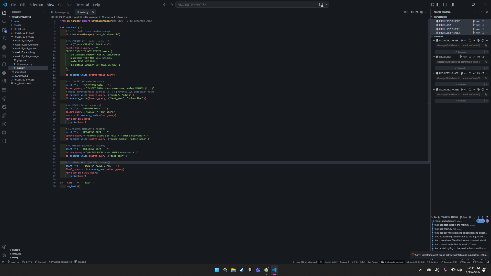
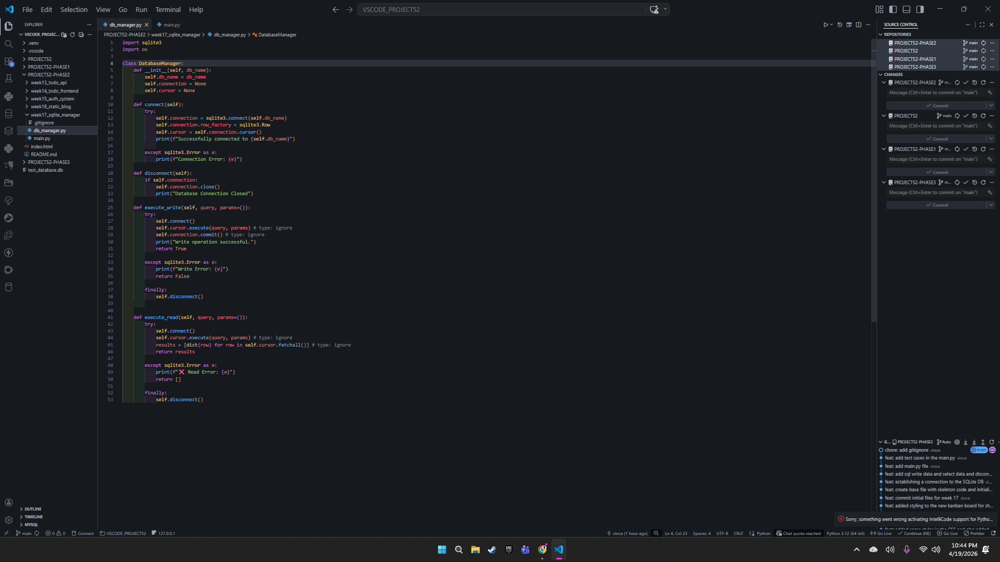
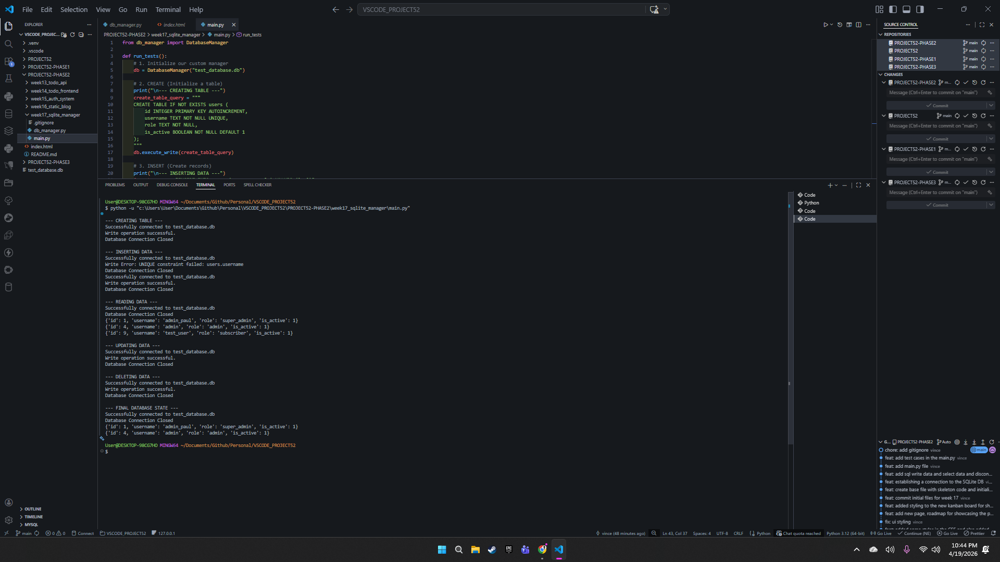

# 📝 DEV LOG: WEEK 17 - DAY 1

**Core Objective:** Engineer a reusable, modular SQLite database manager using Python to serve as the foundational data layer for all upcoming Phase 2 backend applications.

## 1. Architectural Approach: Object-Oriented Design (OOP)
Rather than writing procedural, repetitive database connection strings across multiple files, a centralized `DatabaseManager` class was constructed. 
* **Modularity:** This class abstracts the complexities of the `sqlite3` library. It can be imported and instantiated (`db = DatabaseManager()`) into any future Python project, instantly granting that project full database capabilities.
* **Data Formatting:** The `row_factory` was configured to use `sqlite3.Row`, ensuring that all read operations return data as accessible Python dictionaries rather than rigid tuples.

## 2. Abstraction of CRUD Operations
To adhere to the DRY (Don't Repeat Yourself) principle, the standard CRUD lifecycle was abstracted into two primary methods:
* **`execute_write()`:** Handles `CREATE`, `INSERT`, `UPDATE`, and `DELETE` commands. It automatically manages connection opening, transaction commits, and connection closures.
* **`execute_read()`:** Handles `SELECT` statements, returning a formatted list of dictionaries.

## 3. Security & Error Handling Implementation
Building a production-grade engine requires anticipating failure states and malicious inputs.
* **SQL Injection Prevention:** String formatting (f-strings) was strictly avoided in SQL queries. Instead, parameterized queries (`execute_write(query, params)`) were implemented to sanitize all data inputs at the database level.
* **Graceful Degradation:** Comprehensive `try/except` blocks catch `sqlite3.Error` exceptions natively. 
    * *Evidence:* During testing, an attempt to insert a duplicate username successfully triggered a `UNIQUE constraint failed` error. The engine caught the exception, logged the failure securely to the terminal, and allowed the script to continue executing without crashing the application.

## 4. Output & Next Steps
The core SQLite engine is fully operational. It successfully executed a complete CRUD lifecycle test via `main.py`, proving its readiness for production use. 

