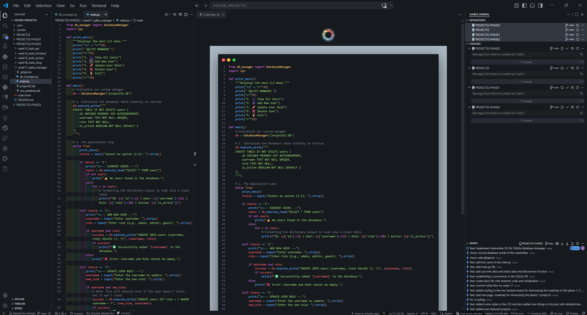
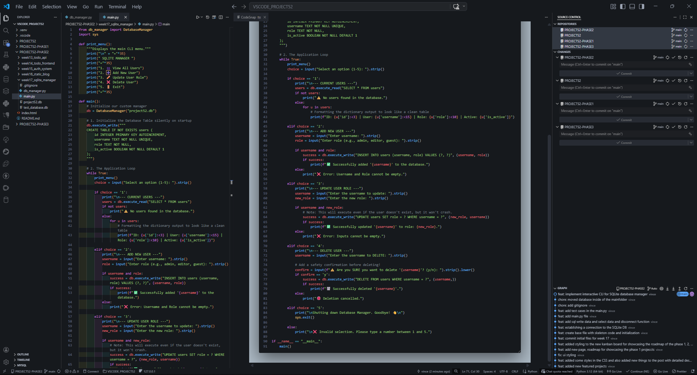
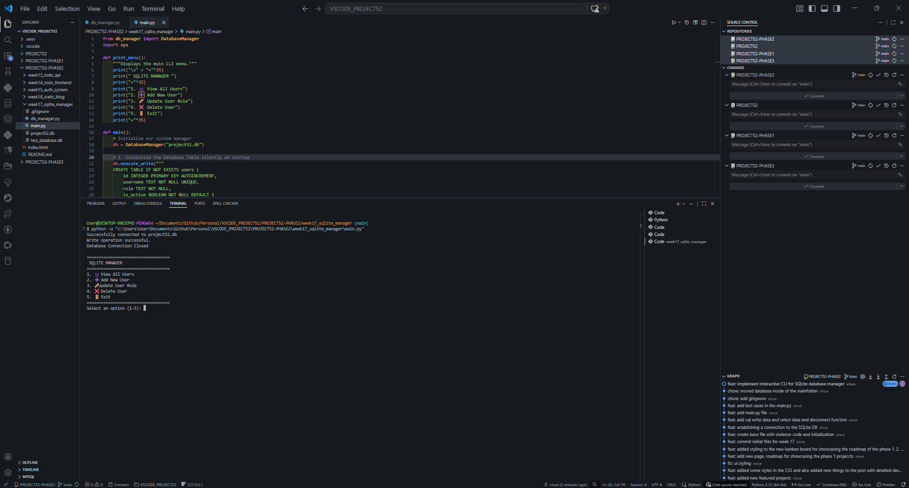
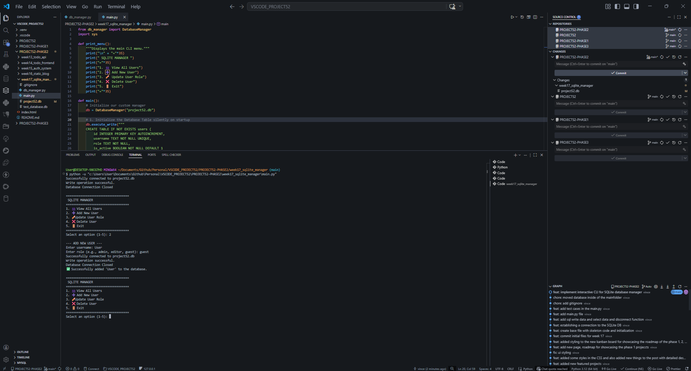
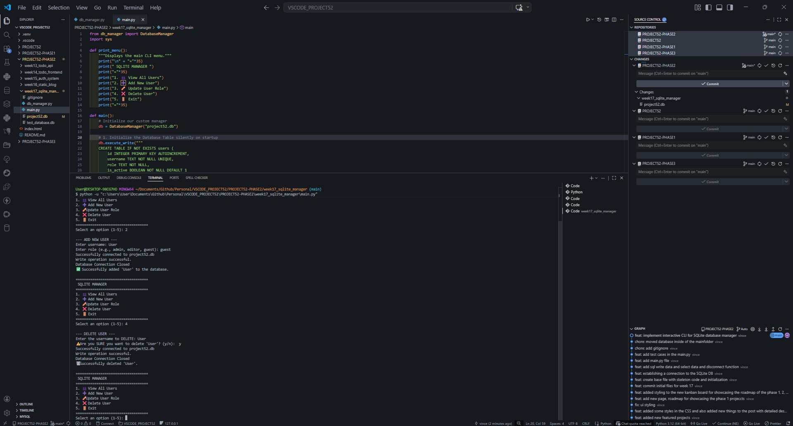
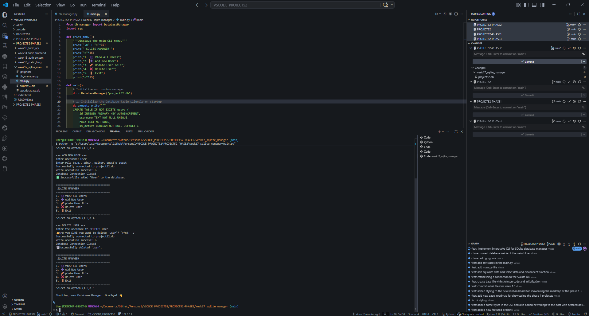

# 📝 DEV LOG: WEEK 17 - DAY 2

**Core Objective:** Wrap the modular SQLite `DatabaseManager` engine in an interactive Command Line Interface (CLI) to allow real-time, dynamic CRUD operations without hardcoding queries.

## 1. Application Architecture: The Continuous Loop
To prevent the Python script from executing top-to-bottom and terminating, the application was wrapped in a `while True:` loop. 
* **State Management:** The application state remains active, continuously prompting the user with a standardized menu until the explicit exit command (`sys.exit()`) is invoked.
* **Separation of Concerns:** The `main.py` file handles purely standard input/output (I/O) and routing, delegating all actual database transactions to the instantiated `DatabaseManager` class.

## 2. Dynamic CRUD Implementation
The hardcoded test queries were replaced with dynamic user inputs.
* **Input Sanitization:** User inputs were captured using `input().strip()` to prevent accidental whitespace errors before being passed to the database engine.
* **Read Formatting:** When viewing users (Option 1), the resulting dictionary list was formatted using Python f-string alignment (`{u['username']:<15}`) to create a clean, readable tabular output in the terminal.

## 3. UX and Safety Measures
* **Empty States:** The system proactively checks if the database is empty (`if not users:`) and displays a user-friendly warning rather than failing silently.
* **Destructive Action Gates:** Before executing a `DELETE` operation, a safety prompt (`Are you SURE you want to delete...`) was implemented to prevent accidental data loss.

## 4. Output
The project has successfully evolved from a static engine into a fully interactive local database management tool. It handles table initialization, data ingestion, retrieval, modification, and deletion in real-time.

