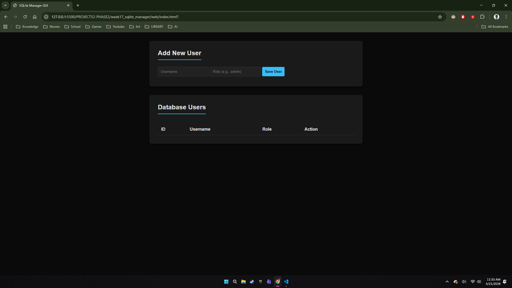
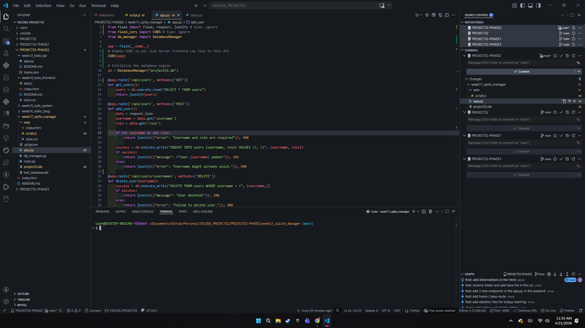
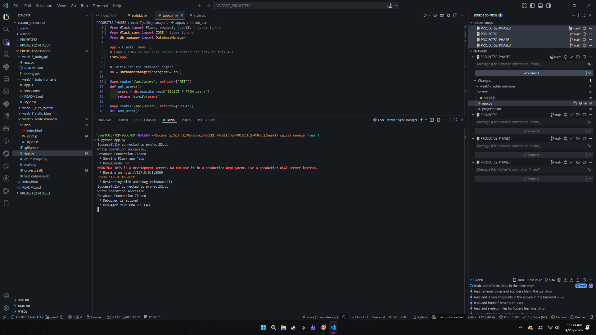
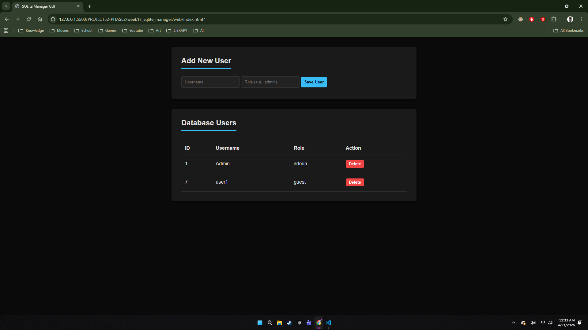
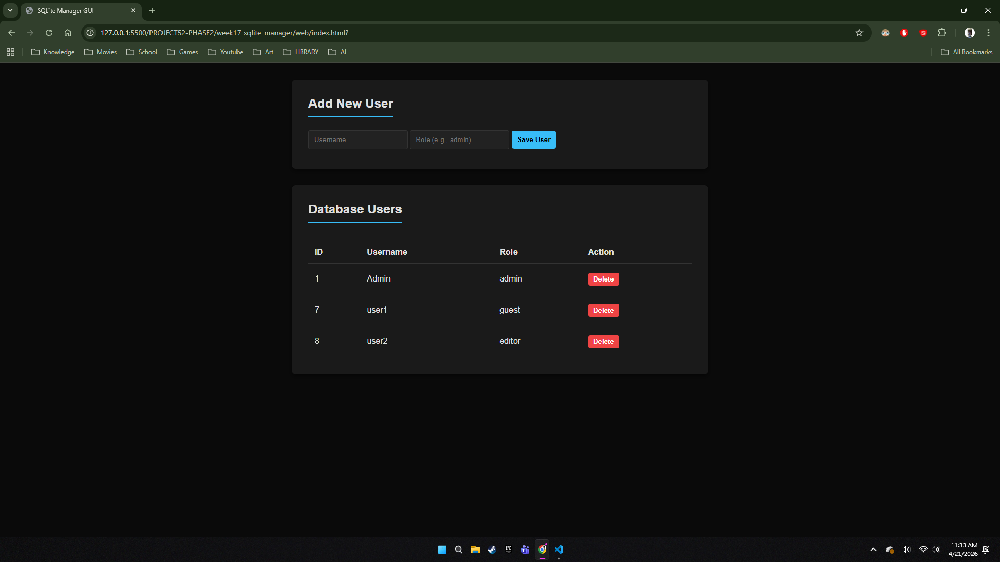
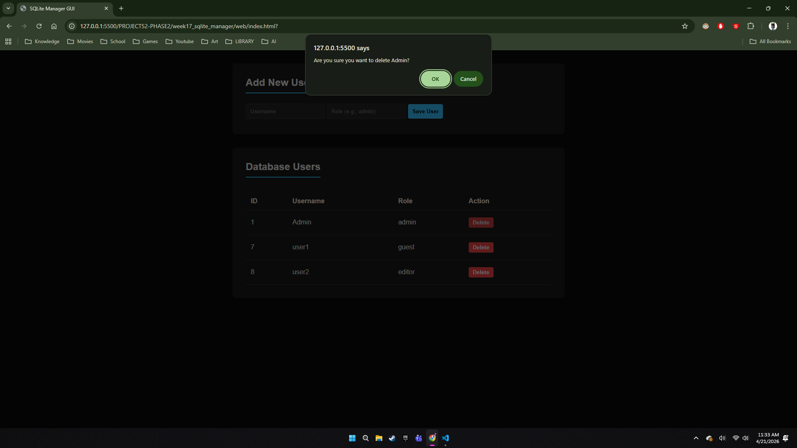
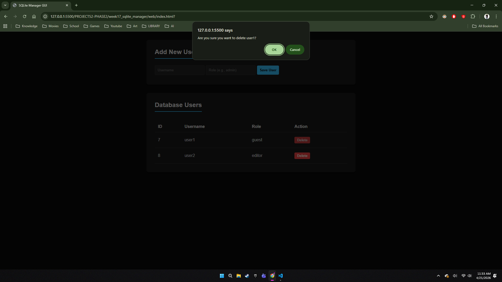

# 🚀 DEV LOG: WEEK 17 

## 1. Executive Summary
Week 17 evolved from a pure Python script into a fully decoupled, full-stack database management dashboard. The core objective was to abstract SQLite operations into a reusable OOP engine and expose those operations via a RESTful API, consumed by an independent frontend client.

## 2. Backend Architecture: The Stateless API
Instead of relying on Flask's integrated `render_template` (Server-Side Rendering), a strict **Decoupled Architecture** was chosen.
* **CORS Integration:** `flask-cors` was implemented to allow cross-origin requests, enabling the HTML frontend (running on a separate live server port) to communicate securely with the Python API on Port 5000.
* **Stateless Connections:** The `DatabaseManager` engine was intentionally designed to open and close the `.db` file connection on *every single request*. This prevents SQLite file-locking issues, ensures thread safety, and keeps the server memory unburdened—a crucial pattern for scaling APIs.

## 3. Frontend Architecture: Enterprise JavaScript Patterns
The frontend `script.js` was heavily refactored from a procedural script into a modular, object-oriented controller system.
* **The Configuration Pattern:** All "magic strings" (API URLs, DOM IDs, CSS classes) were centralized into a single `CONFIG` object at the top of the file. This creates a single source of truth for maintainability.
* **Separation of Concerns:** * `ApiService`: Exclusively handles asynchronous `fetch` requests and network error throwing.
    * `UIController`: Exclusively handles DOM manipulation and event listeners.
* **Performance Optimization:** Instead of forcing the browser to repaint the DOM for every single user row, a `DocumentFragment` was utilized to build the table in memory and inject it into the live DOM in a single, highly efficient operation.
* **Event Delegation:** Rather than attaching inline `onclick` handlers to individual delete buttons, a single event listener was attached to the table body, utilizing `data-username` attributes to safely identify interaction targets.

## 4. Output & Phase 2 Status
The Database Manager is fully operational. It serves as the foundational data layer for the remainder of Phase 2.

