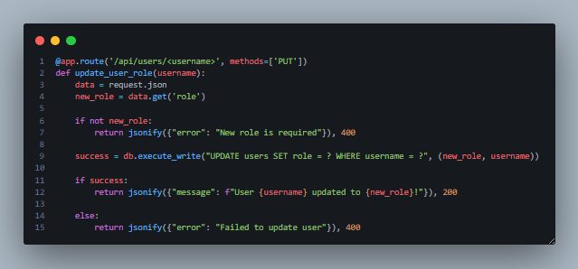
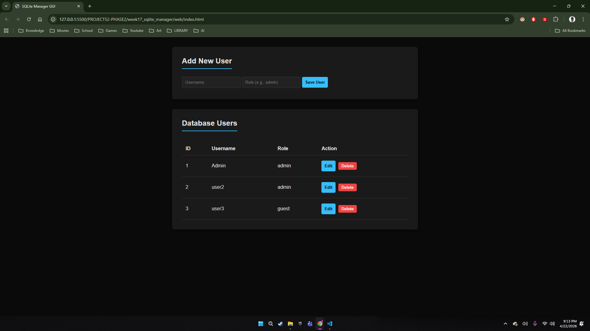
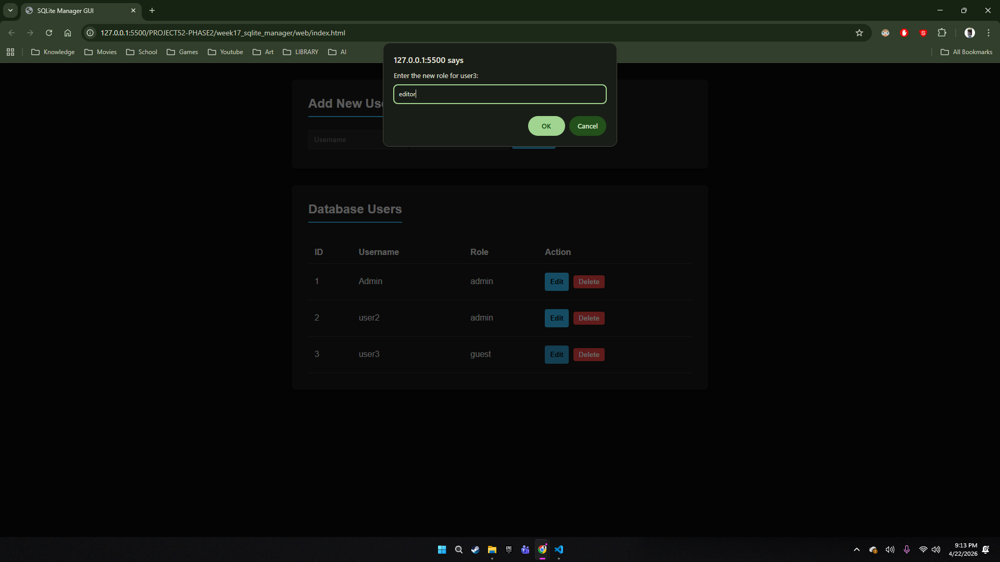
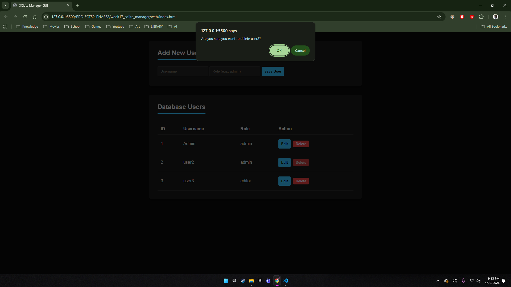

# 🚀 MASTER DEV LOG: WEEK 17

## 1. Executive Summary
Day 4 focused on completing the full CRUD (Create, Read, Update, Delete) cycle by implementing the **Update** functionality. This required building a new `PUT` route on the backend and updating the frontend `UIController` to handle complex event delegation. Additionally, critical environment security protocols regarding CORS and local file execution were diagnosed and resolved.

## 2. Backend Implementation (The `PUT` Route)
To adhere to RESTful API standards, the Update operation was mapped to a `PUT` HTTP method.
* **Endpoint:** `/api/users/<username>`
* **Logic:** The Flask API extracts the JSON payload (`new_role`) and executes a parameterized SQLite `UPDATE` query via the `DatabaseManager`.
* **Security:** Utilizing parameterized tuples `(new_role, username)` prevents SQL injection attacks during the update phase.

## 3. Frontend Architecture (API Service & UI Controller)
The vanilla JavaScript frontend was expanded to handle the new state changes.
* **API Service Expansion:** Added `updateUserRole(username, newRole)` to the `ApiService` object to abstract the `PUT` network request away from the UI logic.
* **Advanced Event Delegation:** Instead of writing separate event listeners for "Edit" and "Delete" buttons, a single `handleTableClick` listener was attached to the table body. 
    * The controller reads the `event.target.classList` to determine which action to fire.
    * Target data is safely extracted using HTML `data-username` attributes.
* **DOM Repainting:** Upon a successful `PUT` request, the controller forces a re-render of the table (`loadAndRenderUsers()`) to reflect the new database state in real-time.

## 4. Debugging & Environment Security Protocols
During deployment testing, a critical failure occurred where the frontend failed to retrieve data from the backend.
* **The Issue:** The HTML file was executed directly from the operating system (`file:///C:/...`) rather than through a web server.
* **The Cause (Origin: Null):** Modern browsers enforce strict Private Network Access (PNA) and CORS policies. A file opened via the `file:///` protocol is assigned an origin of `null`. When it attempts to execute a complex `fetch` request (like `POST` or `PUT`) to a localhost API (`127.0.0.1:5000`), the browser kills the request at the preflight (`OPTIONS`) stage to prevent malicious local script execution.
* **The Resolution:** The frontend must always be served over a valid HTTP protocol (e.g., `http://127.0.0.1:5500` via Live Server). This grants the frontend a valid origin, allowing the Flask CORS configuration to permit the cross-origin resource sharing.

