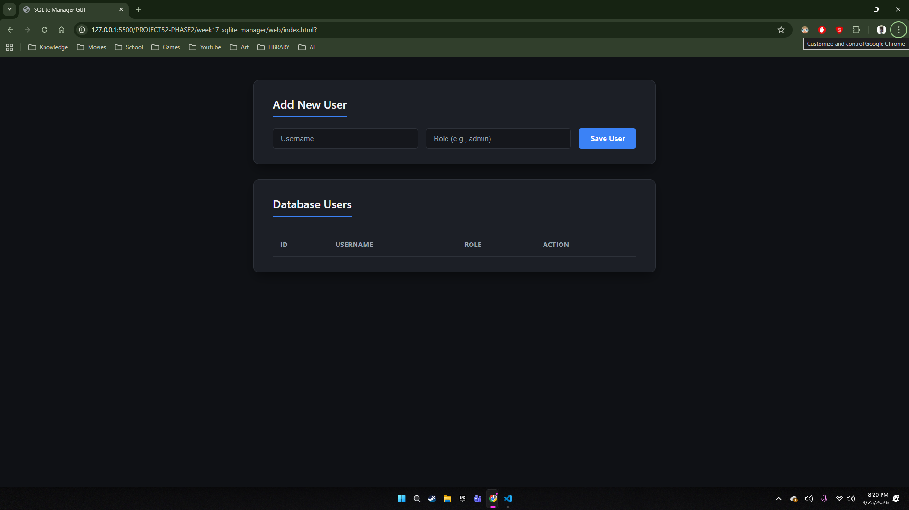
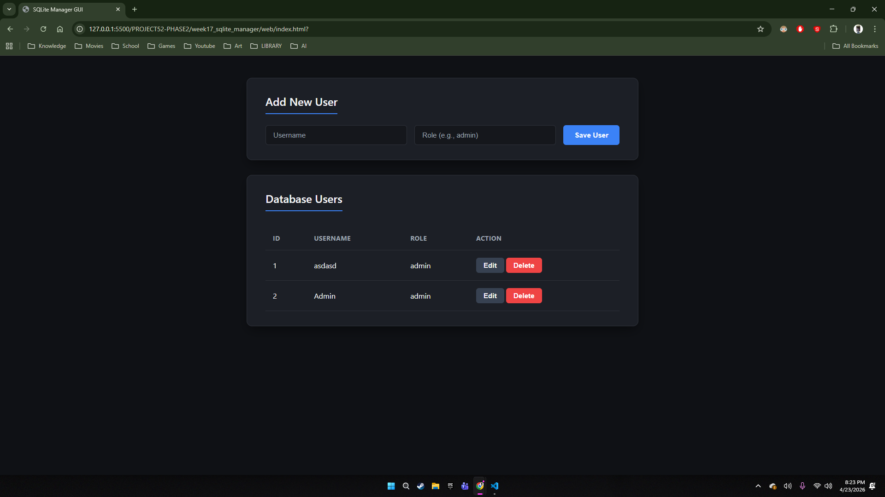
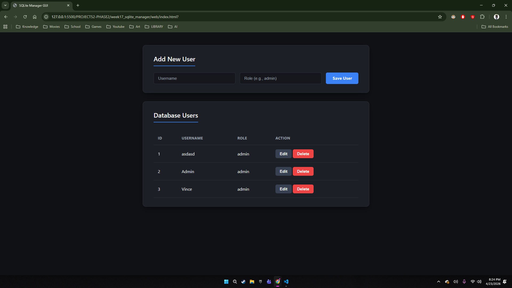

# 🚀 MASTER DEV LOG: WEEK 17, DAY 5

## 1. Executive Summary
The objective was to elevate the application from a "working prototype" to a "production-ready tool." This involved patching a critical frontend vulnerability, overhauling the visual design system, and hardening the backend against execution environment errors.

## 2. Security: Preventing Cross-Site Scripting (XSS)
When rendering dynamic HTML using JavaScript's `innerHTML`, the application is vulnerable to XSS attacks where malicious scripts can be injected into the database and executed by the browser.
* **The Patch:** Implemented a frontend sanitization utility (`Utils.escapeHTML`).
* **Implementation:** Before rendering any user-generated text to the DOM (like usernames or roles), the data is passed through the utility, converting dangerous characters (`<`, `>`, etc.) into safe HTML entities.

## 3. Frontend Architecture: CSS Design System
The UI was upgraded from a basic dark mode to a premium, SaaS-level interface.
* **Design Variables:** Implemented CSS `:root` variables to establish a strict, reusable color palette and maintain consistency across components.
* **Interactive States:** Added subtle CSS transitions and specific `:focus` rings to inputs and buttons to dramatically improve user feedback and accessibility.
* **Separation of Concerns:** Removed all inline HTML styles, moving strict visual control entirely into `style.css`.

## 4. Backend Resilience: The CWD Illusion & Absolute Paths
A critical deployment bug was identified regarding the database file location.
* **The Bug:** SQLite databases rely on the terminal's Current Working Directory (CWD). Running the Flask server from the master project root caused SQLite to generate a blank, "ghost" `project52.db` file in the root directory, making it appear as though data was deleted.
* **The Fix:** Refactored the `app.py` initialization to use absolute pathing via Python's `os` module.
* **The Code:** `BASE_DIR = os.path.dirname(os.path.abspath(__file__))`
  `DB_PATH = os.path.join(BASE_DIR, "project52.db")`
* **Result:** The backend is now completely decoupled from the terminal's location. The server will definitively lock onto the correct `.db` file regardless of how or where the script is executed.

