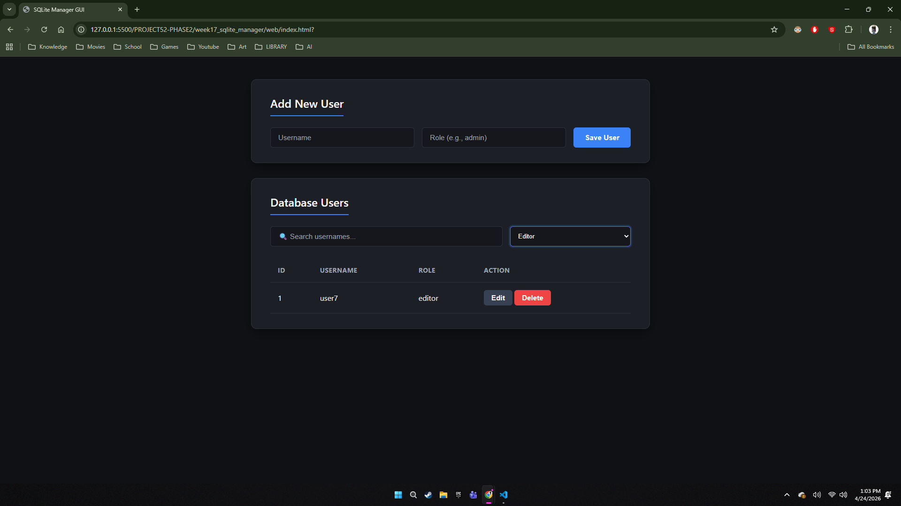
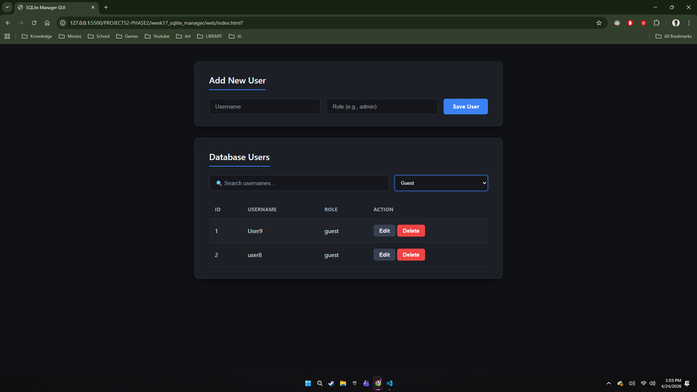

# 🚀 MASTER DEV LOG: WEEK 17, DAY 6 (Weekend Warrior)

## 1. Executive Summary

Day 6 focused on scaling the frontend architecture to handle large datasets efficiently. The objective was to implement real-time search and role filtering without overloading the Flask backend with constant `GET` requests. This was achieved by introducing Application State to the Vanilla JavaScript controller.

## 2. Architecture: Application State (`AppState`)

Instead of fetching data from the API and immediately destroying the array after drawing the HTML table, the data is now cached in browser memory.

- **The Implementation:** Created a global `AppState = { allUsers: [] }` object.
- **The Benefit:** When a user types in the search bar, the application filters the `AppState` array locally in milliseconds, completely bypassing the network and database layers. This drastically reduces server load and provides a zero-latency user experience.

## 3. UI Controller Refactoring (Separation of Concerns)

The monolithic rendering function was split into three distinct, specialized methods to support state management:

1.  **`fetchUsers()`:** Exclusively handles the asynchronous network call to the API and saves the payload to `AppState`.
2.  **`filterAndRender()`:** Reads the current values of the search input and dropdown, applies a compound `.filter()` array method against `AppState.allUsers`, and passes the result to the renderer.
3.  **`renderTable(usersToDraw)`:** Exclusively handles DOM manipulation, accepting an array and building the HTML `DocumentFragment`.

## 4. UI/UX Refinement

- Extracted inline HTML styles from the new filter controls into strict CSS classes (`.filter-container`, `.search-input`, `.role-filter`).
- Applied consistent `:focus` state variables to the dropdown to match the overarching design system.

