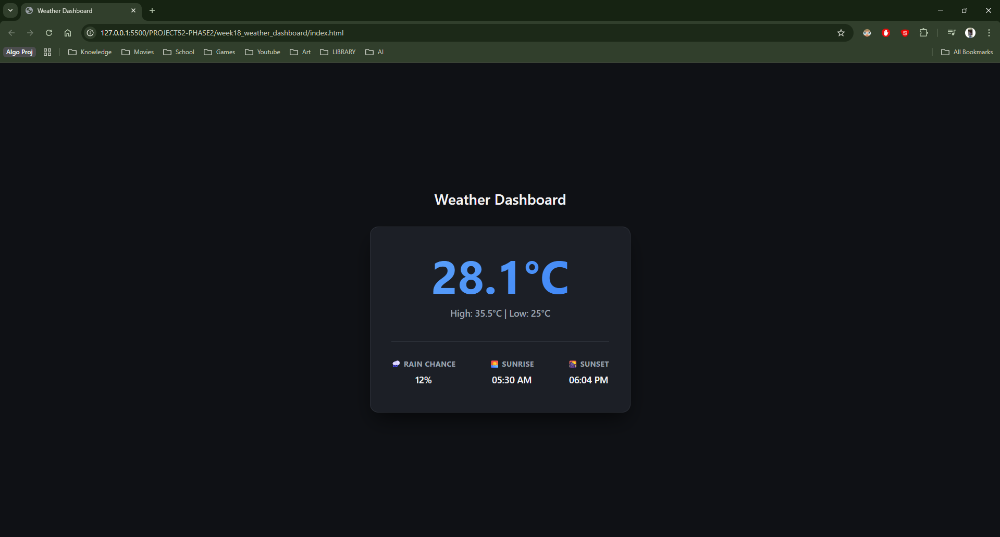
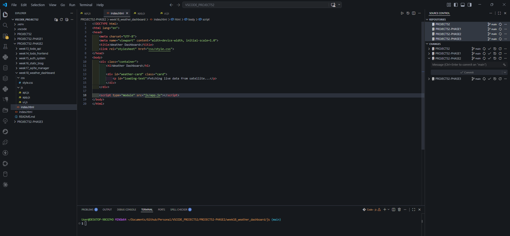

# 🚀 MASTER DEV LOG: WEEK 18, DAY 1

## 1. Executive Summary
Day 1 initiated the Weather Dashboard build. The primary objectives were to establish a strictly modular file architecture, securely connect to a live weather satellite API, and paint the retrieved data to the DOM using a premium CSS design system. All objectives were achieved with zero API key exposure.

## 2. Architecture: Separation of Concerns
The application was scaffolded using ES6 Modules to enforce strict boundaries between network logic, UI rendering, and state orchestration.
* **`js/api.js` (Network):** Exclusively handles `fetch` requests to the external API.
* **`js/ui.js` (Interface):** Exclusively handles DOM manipulation and HTML generation.
* **`js/app.js` (Orchestrator):** The brain. Imports the API and UI modules, tying the data flow together.

## 3. Frontend Security: The API Key Dilemma
A critical security evaluation was conducted regarding API key exposure.
* **The Threat:** In a pure frontend application (HTML/CSS/JS), any hardcoded API key is visible to the public via the browser's Developer Tools. `.env` files cannot protect frontend code.
* **The Pivot:** Instead of building a backend proxy server to hide a WeatherAPI key, the architecture was pivoted to use **Open-Meteo**.
* **The Result:** Open-Meteo provides enterprise-grade weather data without requiring an API key, ensuring the frontend remains 100% secure when pushed to public GitHub repositories.

## 4. API Integration: URL Search Params
Data fetching was implemented for the exact coordinates of Pagbilao (Lat: 13.4088, Lon: 122.5615).
* Utilized the JavaScript `URLSearchParams` object to programmatically and cleanly build the complex API query string.
* Requested highly specific data points including current hour temperatures, daily maximums/minimums, precipitation probabilities, and exact sunrise/sunset times.

## 5. UI/UX: High-Fidelity Design System
The raw JSON data was painted to the screen using a premium, iOS-widget-inspired design.
* **Inline Style Purge:** All inline HTML styles were stripped from the JavaScript controller to maintain pure Separation of Concerns.
* **Visual Elements:** Implemented a dark-mode palette using CSS `:root` variables, flexbox detail grids, and a modern `linear-gradient` text mask for the primary temperature display.

