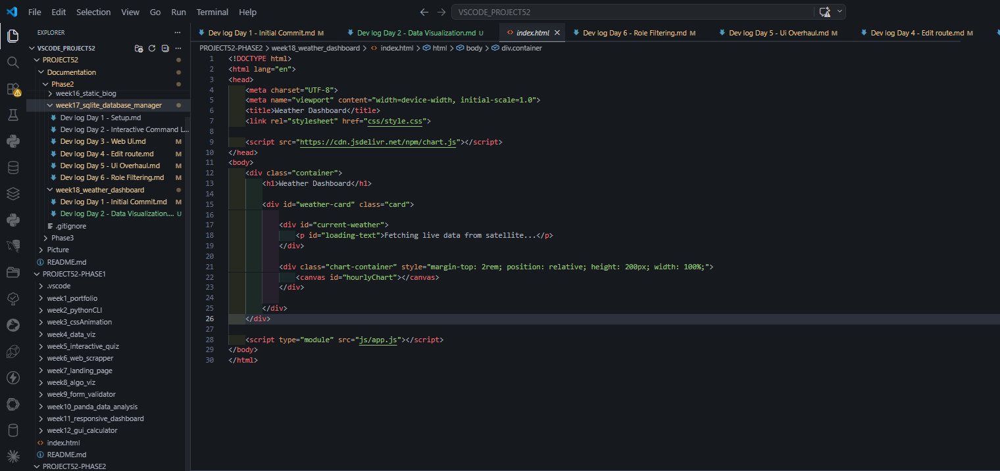
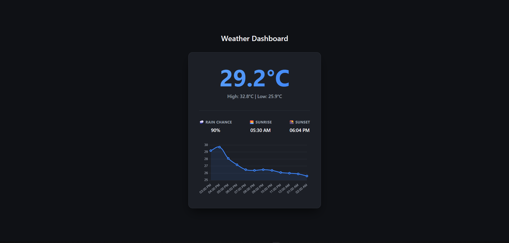

# 🚀DEV LOG: WEEK 18, DAY 2

## 1. Executive Summary
Day 2 focused on expanding the Weather Dashboard from a static data display into an interactive data visualization tool. The primary objective was to render a 12-hour temperature trend using the Open-Meteo hourly forecast data. This required integrating a third-party rendering library (Chart.js) and establishing strict DOM boundaries to prevent rendering conflicts.

## 2. Data Visualization Integration (Chart.js)
Implemented Chart.js via CDN to handle hardware-accelerated canvas drawing.
* **Data Parsing:** Extracted the current hour dynamically (`new Date().getHours()`) to serve as the precise starting index for the data slice. This ensures the chart always starts at the user's current local time and maps exactly 12 hours forward.
* **Data Mapping:** Utilized JavaScript array methods (`.slice()` and `.map()`) to transform the raw ISO time strings from the API into readable, localized 12-hour formats (e.g., "02:00 PM").
* **UI/UX Styling:** Configured the Chart.js instance to inherit the overarching design system. Applied a bezier curve (`tension: 0.4`) for a smooth line, matched the primary accent color (`#3b82f6`), disabled unnecessary grid lines, and removed the legend for a clean, minimalist aesthetic.

## 3. Architecture Bug Fix: The `innerHTML` Wipeout
Encountered and resolved a critical DOM manipulation conflict.
* **The Bug:** The initial UI controller used `card.innerHTML = ...` to paint the current weather statistics. This command completely erased the interior HTML of the card, destroying the `<canvas id="hourlyChart">` element before Chart.js could initialize. This resulted in a `TypeError: Cannot read properties of null (reading 'getContext')`.
* **The Resolution (DOM Boundaries):** Created a dedicated `
` wrapper inside the main card. By retargeting the UI controller to specifically update *only* this new wrapper, a strict rendering boundary was established. The canvas element remained protected and isolated, allowing Chart.js to execute flawlessly.

