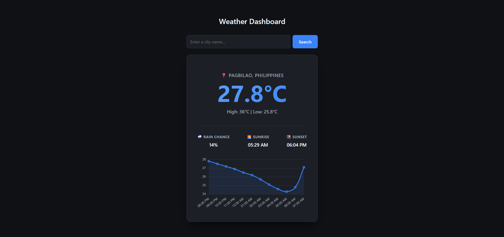
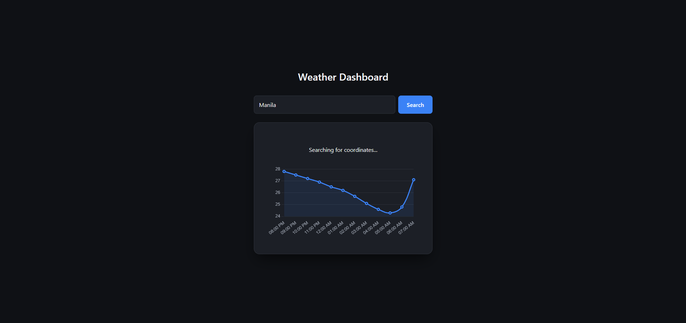
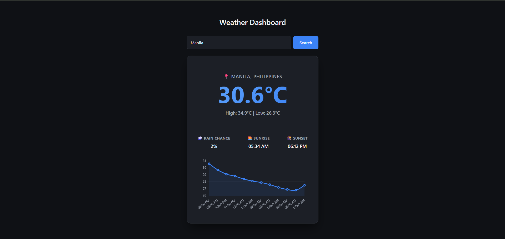
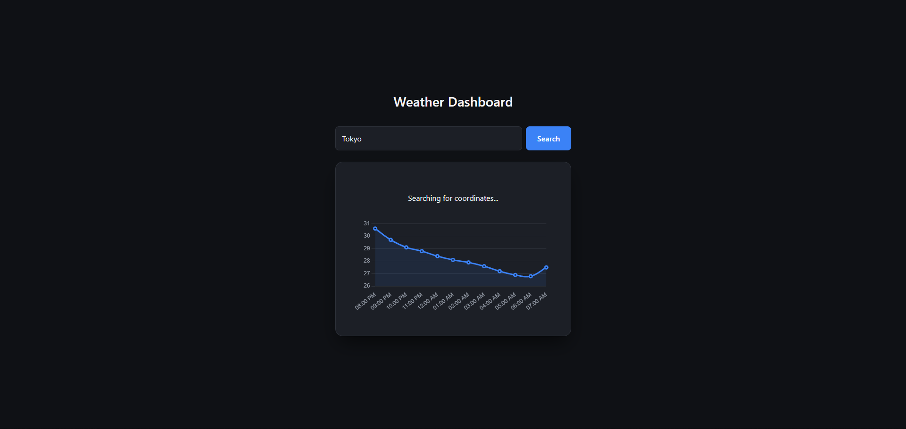
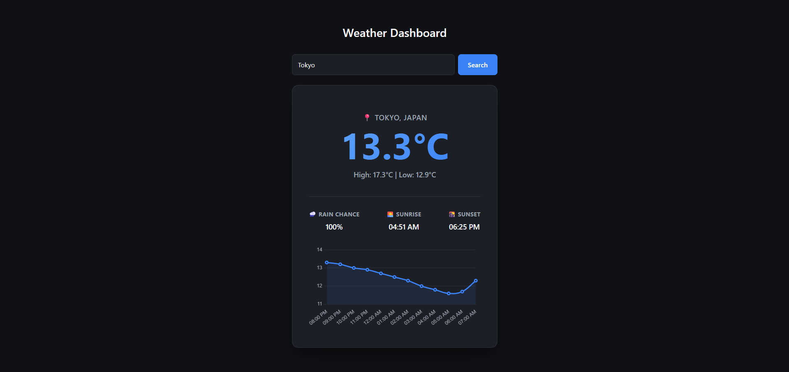

# DEV LOG: WEEK 18, DAY 3

## 1. Executive Summary & Architectural Shift

This required designing a multi-step asynchronous pipeline. Because the primary Open-Meteo forecasting API strictly requires latitude and longitude coordinates, a secondary "Geocoding Engine" was implemented to act as a translation layer between human-readable text (city names) and machine-readable data (coordinates).

## 2. The Network Layer: API Chaining (`api.js`)

We established a sequential, two-part network request protocol.

- **Phase A: The Geocoding Engine (`fetchCoordinates`)**
  - **Implementation:** Integrated the Open-Meteo Geocoding API. This endpoint takes a string payload (`city`) and queries a global database.
  - **Data Extraction:** The raw JSON response contains an array of results. We specifically targeted `data.results[0]` to extract the highest-confidence match, returning a localized object containing `lat`, `lon`, `name`, and `country`.
  - **Error Handling:** Implemented defensive programming. If a user inputs a fictional city (e.g., "Atlantis"), the API returns an empty array. The function safely catches this (`if (!data.results)`) and returns `null`, preventing the application from crashing further down the pipeline.

- **Phase B: Dynamic Forecasting (`fetchWeather`)**
  - **Refactoring:** Stripped the hardcoded coordinates from the `URLSearchParams` constructor.
  - **Parameterization:** The function now strictly requires `lat` and `lon` as arguments. By passing the output of Phase A directly into the inputs of Phase B, we created a seamless, dynamic data fetch that can target any geographical point on Earth.

## 3. Orchestration & State Management (`app.js`)

The `app.js` file acts as the "Brain" or Orchestrator. It holds no UI logic and no fetch logic; its sole purpose is to manage the flow of state between modules.

- **The `async/await` Pipeline:** Built a dedicated `loadWeather()` helper function to manage the sequential execution of promises.
  1. **UI Intercept:** Immediately updates the DOM to a "Fetching..." state, providing critical UX feedback.
  2. **Data Await:** Pauses thread execution while `fetchWeather` negotiates with the external server.
  3. **Module Delegation:** Upon successful data retrieval, hands the raw JSON off to the independent `ui.js` rendering functions (`renderWeather` and `renderChart`).
- **Event Listeners:** Implemented robust user input handling. Bound the execution sequence not just to a mouse `click` on the search button, but also to a `keypress` event listening strictly for the `"Enter"` key on the input field, matching modern web accessibility standards.

## 4. DOM Preservation & Strict Boundaries (`ui.js`)

We resolved a major architectural vulnerability regarding how JavaScript interacts with the Document Object Model (DOM).

- **The Vulnerability:** The original `renderWeather` function targeted the parent `#weather-card` and used `innerHTML` to paint the text data. Because `innerHTML` performs a destructive overwrite, it was completely annihilating the `<canvas>` node required by Chart.js.
- **The Resolution (Safe Zones):** Engineered a structural boundary. By wrapping the text data in a dedicated `
`, we isolated the text rendering from the chart rendering. `ui.js` now strictly repaints the text safe zone, ensuring the Chart.js instance remains untouched and persistent across multiple searches.

## 5. Interface & Design System Polish (`style.css`)

Conducted a ruthless purge of all inline HTML styling to enforce pure Separation of Concerns.

- **Semantic HTML:** Reduced the search container to pure structural tags (`
`, `<input>`, `<button>`).
- **CSS Inheritance:** Styled the new input fields utilizing the existing `:root` variable design system (`--card-bg`, `--accent-blue`, `--border-color`). This ensures the new elements perfectly match the premium, dark-mode aesthetic. Added interactive UX enhancements like input focus glows (`outline: none; border-color: var(--accent-blue);`) and button hover transitions.

