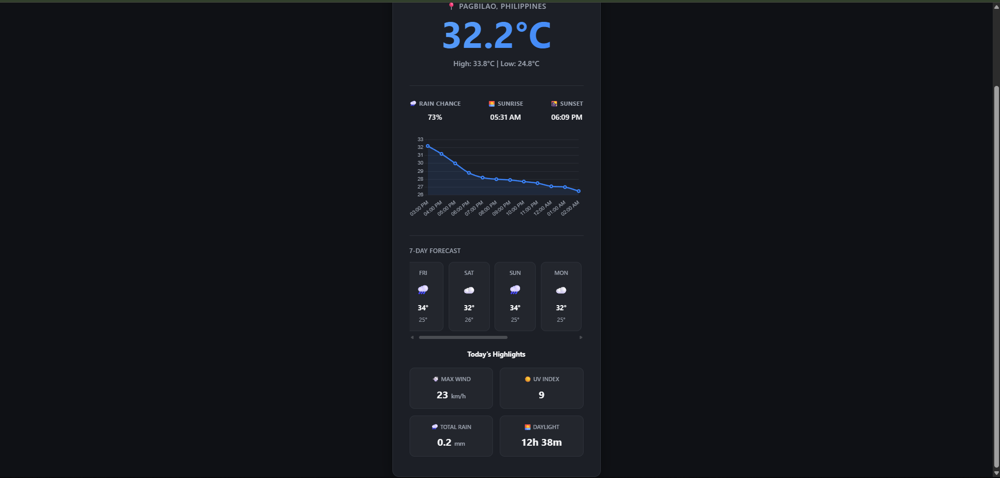
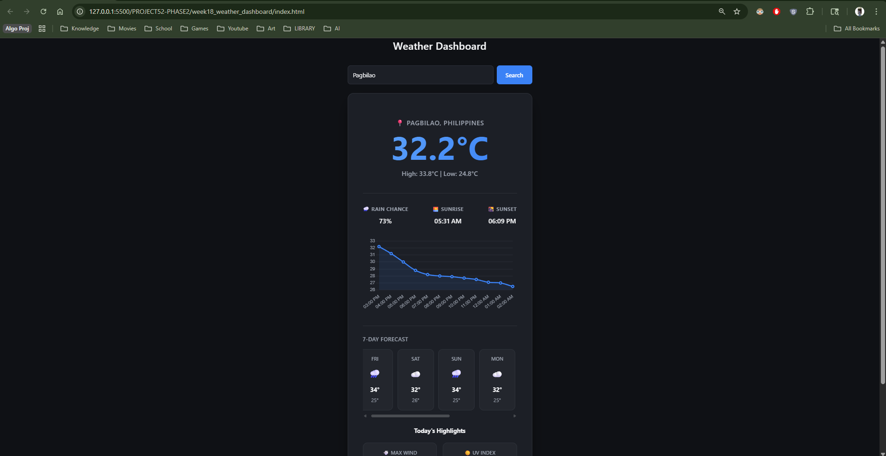

# 🚀 DEV LOG: WEEK 18, DAY 5 (FINAL)

## 1. Executive Summary
Day 5 served as the capstone for the Phase 2 Weather Dashboard. The objective was to transition the application from a basic weather card into a data-dense, professional dashboard by extracting the remaining dormant data (Wind, UV, Rainfall, Sunrise/Sunset) from the Open-Meteo payload and displaying it in a highly structured 2x2 grid format.

## 2. DOM Architecture: ID-Targeted Injection (`index.html`)
Pivoted the DOM manipulation strategy from dynamic string generation (used in Day 4's `for` loop) to a static placeholder architecture.
* **Structural Blueprint:** Constructed the 4-card layout directly in the HTML.
* **Placeholder Nodes:** Assigned highly specific IDs (e.g., `#metric-wind`, `#metric-uv`) to the exact `` elements meant to hold the numerical data. We initialized these with `--` as a visual loading state. This approach is highly performant because the JavaScript only has to locate specific nodes and update their `innerText`, rather than forcing the browser to parse and repaint entirely new HTML structures.

## 3. The Layout Engine: CSS Grid (`style.css`)
Implemented CSS Grid to handle the 2-dimensional UI requirements.
* **The Grid Rule:** Applied `display: grid;` and `grid-template-columns: repeat(2, 1fr);` to the container.
* **Why it Works:** This single line of CSS instructs the browser to divide the available container width into exactly two equal fractions (`1fr`). Because there are four child elements (`.metric-card`), the CSS Grid automatically wraps the third and fourth elements into a second row, instantly and perfectly generating a 2x2 dashboard layout with zero media queries or manual width calculations required.

## 4. Advanced Data Parsing & Date Math (`ui.js`)
Extracted the raw Phase 2 data points and formatted them for human readability.
* **Precision Control:** Utilized `Math.round()` for whole-number metrics (Wind, UV) and `.toFixed(1)` to maintain exactly one decimal place for granular metrics like precipitation (e.g., `0.2 mm`).
* **Daylight Calculation (Date Math):** A professional dashboard shows daylight *duration*, not just timestamps. 
  1. Converted the raw `sunrise` and `sunset` strings into JavaScript `Date` objects.
  2. Subtracted `sunrise` from `sunset` to yield the absolute difference in milliseconds.
  3. Applied division and modulo math (`diffMs / (1000 * 60 * 60)`) to extract the exact remaining hours and minutes.

