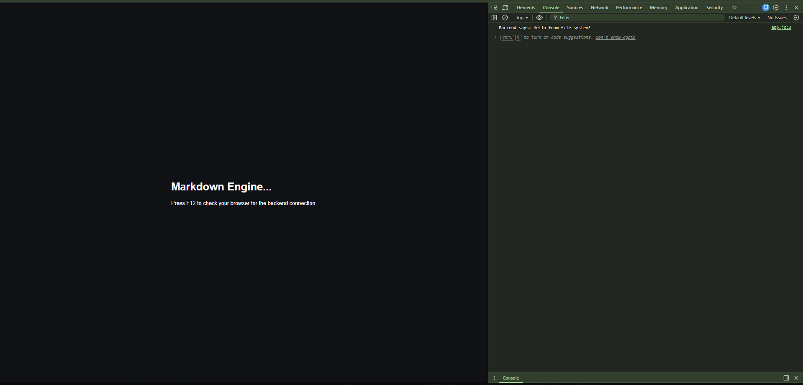
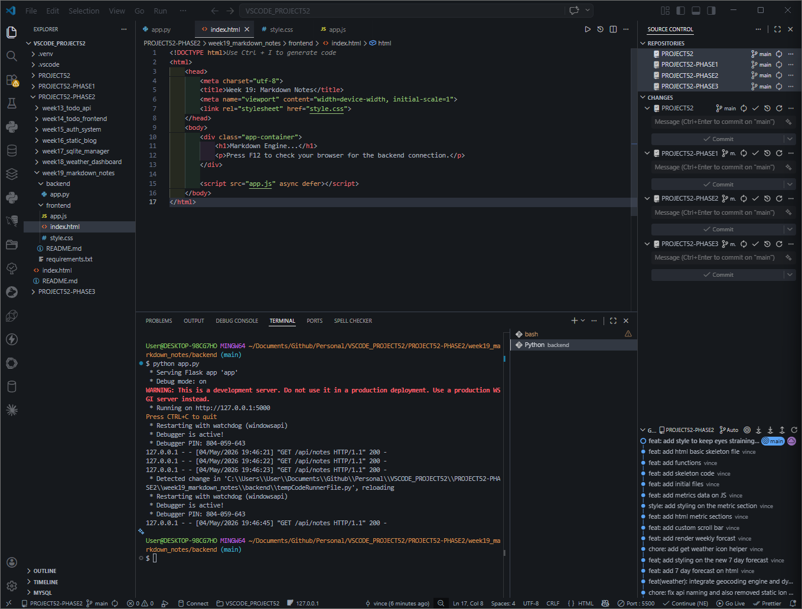

# 🚀 DEV LOG: WEEK 19, DAY 1 

## 1. Executive Summary & The Architectural Pivot
Day 1 of Week 19 represents a massive paradigm shift in Phase 2. Up until now, our applications (like the Weather Dashboard) relied on consuming *external* APIs managed by third parties. Today, we began constructing our own **Internal Local API**. 

The objective is to engineer a Full-Stack Markdown Note-Taking Application. Instead of a monolithic application (like our Week 12 Tkinter Calculator), we are enforcing a strict **Client-Server Architecture**. The application is split into two completely isolated environments: a Python/Flask backend and an HTML/JS frontend. They know nothing about each other's internal logic; they only communicate via HTTP network requests using JSON payloads.

## 2. System Architecture: The Great Decoupling
We established a strict boundary between the Data Layer and the Presentation Layer. This prevents "spaghetti code" and allows either side to be swapped out in the future without breaking the other.

* **The Backend (`/backend`):** 
  * **Tech Stack:** Python 3 & Flask.
  * **Role:** The File System Engine. Browsers (JavaScript) are intentionally blocked from reading a user's local hard drive for security reasons. Therefore, the Python backend acts as our authorized agent. It has the administrative privileges to open, read, write, and delete `.md` files in the `/data` directory. It packages this raw text into JSON and serves it over `localhost:5000`.
* **The Frontend (`/frontend`):**
  * **Tech Stack:** HTML5, CSS3, Vanilla JavaScript (ES6).
  * **Role:** The Presentation Engine. It contains zero logic regarding file saving. Its only job is to dispatch `fetch()` requests to port 5000, await the JSON payload, parse the Markdown text into HTML, and paint it to the DOM.

## 3. The Pygame Bridge (Mental Model Translation)
This client-server architecture maps directly to the 3D Pygame engine built in the Day 30 Bootcamp:

| Web Architecture | Pygame Engine Equivalent | The "Why" |
| :--- | :--- | :--- |
| **Python Backend (`app.py`)** | `AssetManager.py` & `SaveSystem.py` | It reaches into the OS file system, loads the raw level data (Markdown), and holds it in memory. |
| **JS Frontend (`app.js`)** | `RenderEngine.py` | It asks the AssetManager for data, applies visual styling (CSS/Shaders), and draws it to the screen. |
| **JSON Payload** | Serialized Dictionary (`.json`) | The universal data format passed between systems. |

## 4. Network Security: The CORS Implementation
The most critical engineering hurdle of Day 1 was establishing the network bridge.
* **The Problem (Same-Origin Policy):** Modern web browsers enforce strict security. Because our frontend runs on a Live Server (e.g., `http://127.0.0.1:5500`) and our Flask backend runs on a different port (`http://127.0.0.1:5000`), the browser flags this as a "Cross-Origin" threat and actively blocks the JavaScript `fetch()` request.
* **The Solution (CORS):** We implemented Cross-Origin Resource Sharing (CORS) directly in the Flask application lifecycle. By intercepting the response via the `@app.after_request` decorator and appending the header `Access-Control-Allow-Origin: *`, we explicitly authorized the frontend to consume the backend's data, successfully bypassing the browser's security block.

## 5. Day 1 State & Proof of Concept (POC)
The repository was initialized with the strict folder structure. We deployed a minimal Proof of Concept:
1. Flask instantiated a single `GET` route at `/api/notes`.
2. The JS frontend executed an asynchronous `fetch()` upon DOM load.
3. The network handshake was successful, logging "Hello from the File System Engine!" to the browser console.

