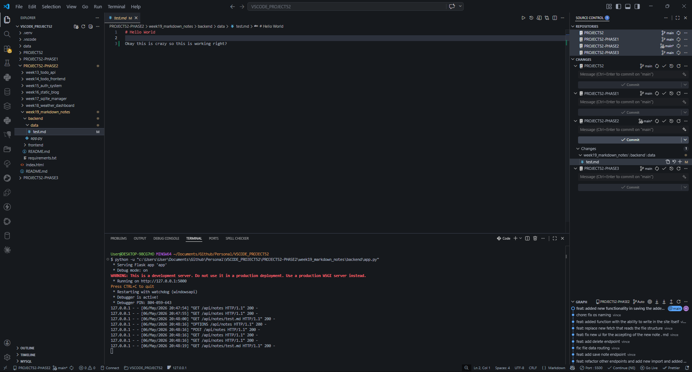
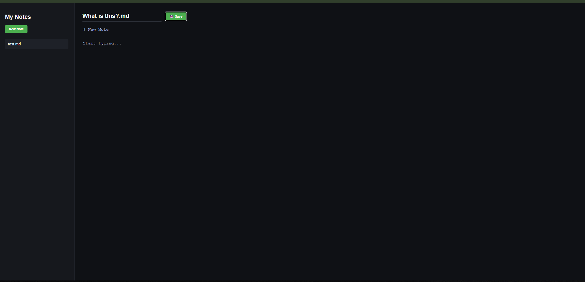
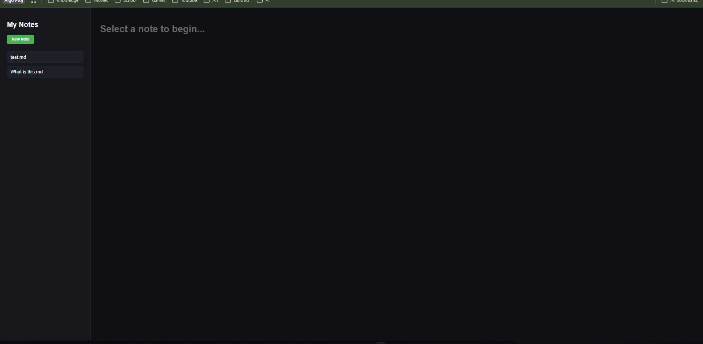
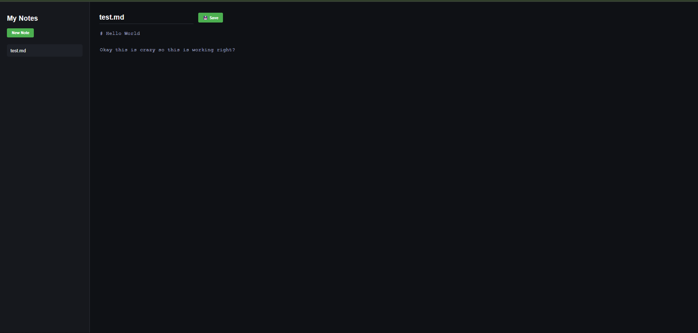

# 🚀 DEV LOG: WEEK 19, DAY 3

## 1. Executive Summary

Day 3 bridged the gap between the Client and the Server. We built a Split-Pane UI capable of dynamically fetching directory contents from the Python backend and displaying them as interactive UI elements. We also established the complete "Save Pipeline," allowing the frontend to package user input into JSON and write it directly to the local hard drive via the API.

## 2. Separation of Concerns & State-Based CSS

We identified and refactored technical debt regarding inline HTML styling (`style="display: none"`).

- **The Problem:** Inline styles mix presentation logic with structural markup, making it difficult to maintain and scale UI states.
- **The Solution:** Implemented CSS Utility Classes (e.g., `.hidden { display: none !important; }`).
- **The Result:** JavaScript no longer dictates _how_ elements are hidden. It simply toggles the `.hidden` class via `classList.add()` and `classList.remove()`, allowing CSS to act as the single source of truth for all visual states.

## 3. The Fetch Pipeline & Event Binding

We mapped backend API routes to frontend UI events:

- **Dynamic UI Generation:** On boot, the app fetches `GET /api/notes`, iterates over the returned array, and uses `document.createElement('li')` to build the sidebar menu dynamically.
- **Event Listeners:** Each generated `<li>` receives an `onClick` listener bound to its specific filename. Clicking triggers a secondary `fetch` to load the file's contents into the Markdown editor.

## 4. Overcoming The CORS Preflight Protocol

During the implementation of the Save (`POST`) pipeline, the browser's security model blocked the payload.

- **The Mechanism:** When a browser sends a "complex" cross-origin request (such as a `POST` with a `Content-Type: application/json` header), it first sends an invisible `OPTIONS` request (a "Preflight" check) to ask the server for permission.

- **The Fix:** Upgraded the Flask `@app.after_request` middleware to explicitly whitelist the required headers and methods:

```python
response.headers['Access-Control-Allow-Headers'] = 'Content-Type'
response.headers['Access-Control-Allow-Methods'] = 'GET, POST, DELETE, OPTIONS'
```

This allowed the `OPTIONS` request to return a `200 OK`, immediately followed by the successful `POST` request containing the file data.









