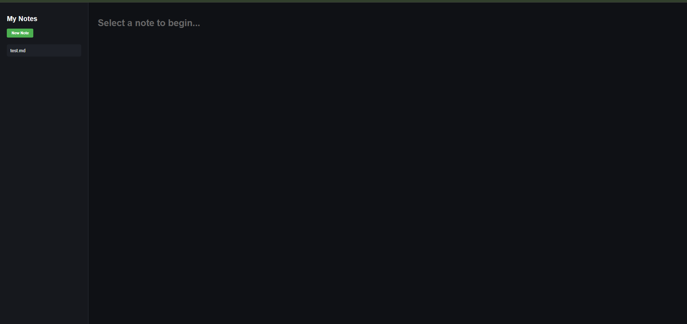
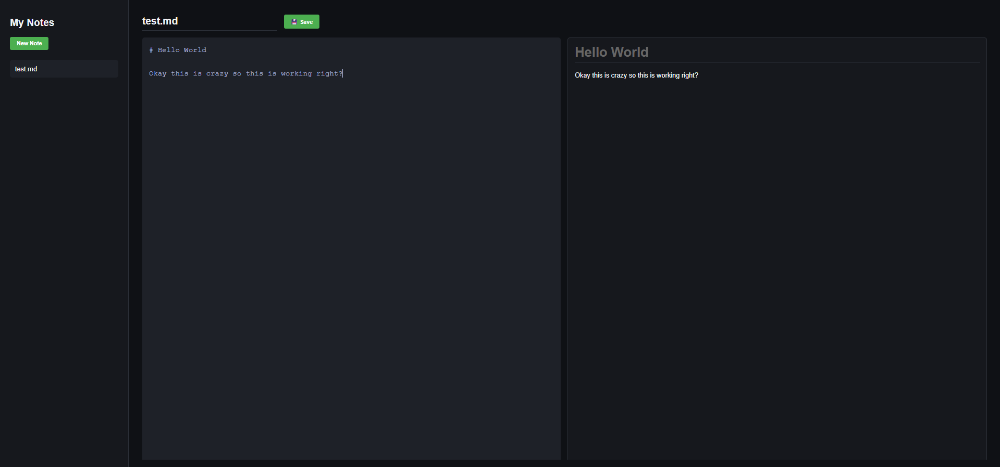
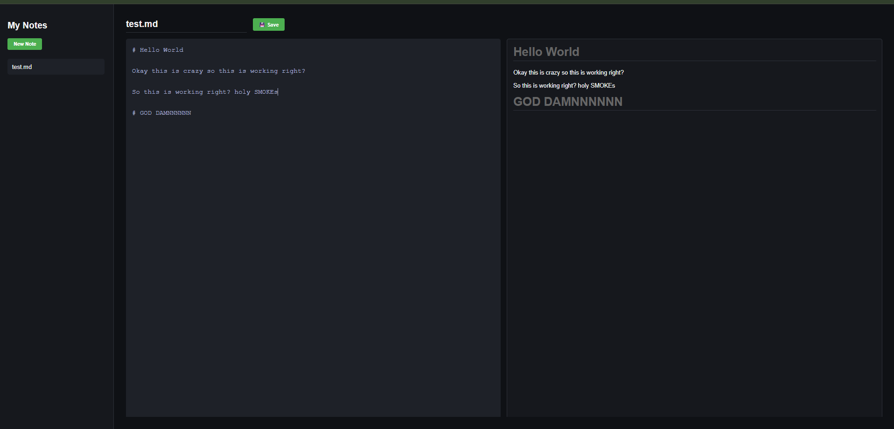
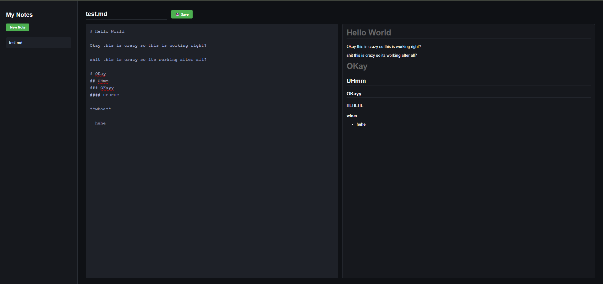

# 🚀 DEV LOG: WEEK 19, DAY 4

## 1. Executive Summary

Day 4 represented a critical evolution of the application's Presentation Layer. The primary objective was to transition the application from a rudimentary raw-text storage mechanism into a functional Markdown interpreter. This required a structural overhaul of the User Interface to accommodate a side-by-side editing paradigm and the integration of an external parsing engine to translate raw markdown syntax into valid HTML DOM nodes in real-time.

## 2. Architectural Paradigm: The Split-Pane Workspace

Modern data-entry applications that rely on markup languages (such as Markdown or LaTeX) heavily favor immediate visual feedback. To achieve this, we migrated the UI from a single-column layout to a **Split-Pane Architecture**.

- **The Input Node (`<textarea id="markdown-editor">`):** This serves as the data ingestion point. It captures raw string data and dispatches events upon mutation. It is strictly for plain text; no rich text formatting occurs within this node.
- **The Output Node (`<div id="markdown-preview">`):** This is a strictly read-only display container. It acts as the final destination for the parsed Abstract Syntax Tree (AST) generated by our rendering engine.
- **CSS Flexbox Implementation:** The parent container (`.workspace-split`) was assigned `display: flex`. Both child panes were assigned a flex-grow property of `flex: 1`, guaranteeing an exact 50/50 horizontal split regardless of viewport dimensions. Overflow behaviors were meticulously defined (`overflow-y: auto` on the preview pane) to ensure that lengthy documents scroll independently of the global window context, preventing UI layout breakage.

## 3. Dependency Management: Third-Party Integration

To convert raw text like `**bold**` or `# Header` into `<strong>` and `<h1>` tags, an application requires a robust parsing engine.

- **The Engineering Decision:** Writing custom Regular Expressions (RegEx) to parse Markdown is a classic anti-pattern. Markdown contains hundreds of edge cases (nested lists within blockquotes, escaped characters, code blocks). Developing an in-house parser would take weeks and introduce severe technical debt.
- **The Solution:** We integrated `marked.js`, an industry-standard, lightweight, open-source Markdown compiler.
- **Delivery Mechanism:** The library was ingested via a Content Delivery Network (CDN) directly into the HTML `<head>`. This defers the processing load and bandwidth cost to the CDN, keeping our local application bundle size extremely small.

## 4. The Controller Layer: Real-Time Event Driven Rendering

The crux of Day 4 was establishing the execution pipeline that ties the UI to the parsing engine. This operates on a highly optimized event-driven architecture.

### The Execution Pipeline

1.  **Event Binding:** An `input` event listener was attached to the `<textarea>`. Unlike a `change` event (which only fires when the user clicks away from the text box), the `input` event fires immediately upon _every single keystroke, deletion, or paste action_.
2.  **Data Extraction:** Upon event trigger, the current `value` of the textarea (a raw string) is extracted into local memory.
3.  **Compilation:** The raw string is passed into `marked.parse(rawText)`. The library tokenizes the string, applies Markdown rules, and returns a fully constructed HTML string.
4.  **DOM Injection:** The resulting HTML string is assigned to the `innerHTML` property of the preview pane. The browser's native rendering engine takes over, repainting the DOM to display the formatted text.

### Code Implementation Reference

```javascript
// Global scope variables caching the DOM nodes to prevent unnecessary queries
const markdownPreview = document.getElementById("markdown-preview");
const markdownEditor = document.getElementById("markdown-editor");

// The Real-Time Rendering Loop
markdownEditor.addEventListener("input", () => {
  // Extract -> Parse -> Inject
  const rawText = markdownEditor.value;
  markdownPreview.innerHTML = marked.parse(rawText);
});
```

## 5. State Initialization (The Load Pipeline Update)

A significant logical flaw was preempted during implementation: When a user clicks a file in the sidebar to load an existing note, the `input` event does not fire because the user hasn't typed anything yet.

To resolve this, the `loadNoteContent()` function was refactored. When the `GET` request resolves and populates the editor with the fetched content, we explicitly invoke the rendering engine (`markdownPreview.innerHTML = marked.parse(data.content);`) to ensure the preview pane immediately reflects the loaded state, maintaining synchronization between the data layer and the presentation layer.








