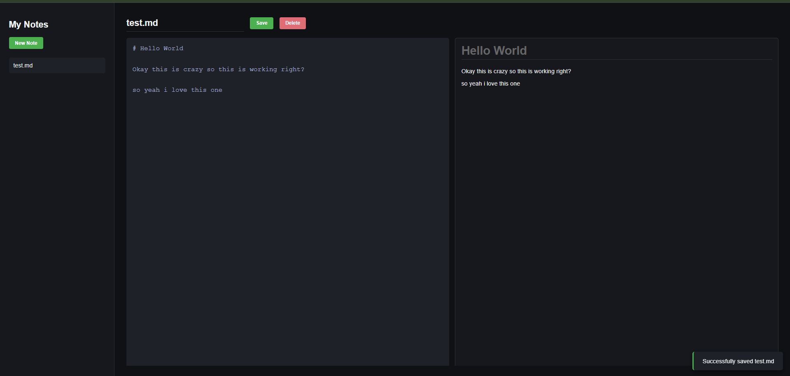
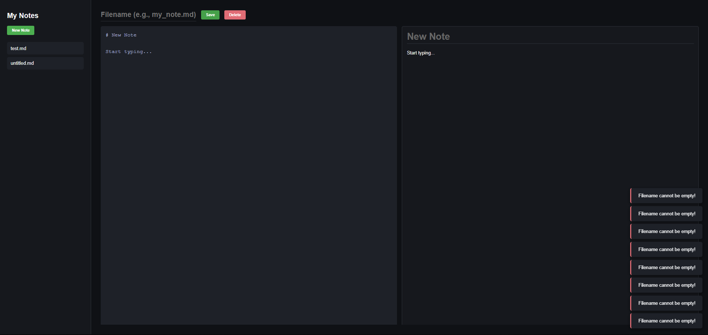
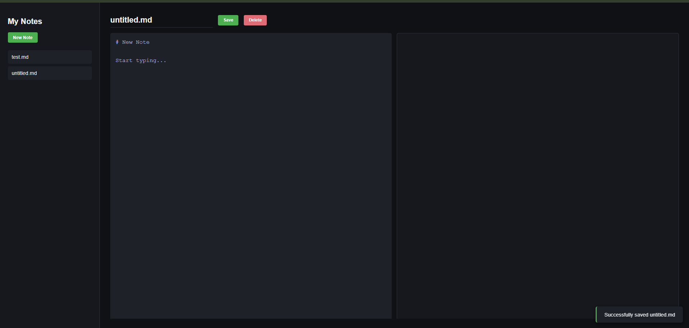
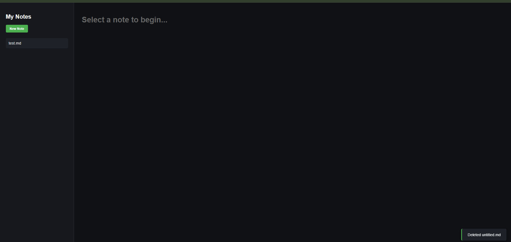

# DEV LOG: WEEK 19, DAY 5

## 1. Executive Summary

Day 5 was dedicated to system hardening, UX (User Experience) architecture, and completing the full CRUD lifecycle. We replaced blocking, synchronous browser alerts with a custom, asynchronous Toast Notification System. Furthermore, we implemented defensive programming techniques on the client side to sanitize data before network transmission, and finalized the `DELETE` pipeline with proper DOM state reconciliation.

## 2. Architecture: The Toast Notification Engine

Relying on `window.alert()` is an anti-pattern in production environments because it halts the main JavaScript execution thread. To resolve this, we engineered a non-blocking notification system.

- **Dynamic DOM Instantiation:** The `showToast()` function dynamically creates `
` elements in memory using `document.createElement()`, applies state-specific CSS utility classes (`.toast`, `.error`), and appends them to a fixed `#toast-container` overlay.
- **Garbage Collection & Memory Management:** Unmanaged DOM injection leads to memory leaks and UI bloat. We implemented a self-destruct mechanism using `setTimeout()`. After 3,000 milliseconds, the element receives a `.fade-out` class to trigger a CSS exit animation.
- **Event-Driven Cleanup:** Rather than blindly removing the element from the DOM, we attached an `'animationend'` event listener to the toast. This ensures the Node is only removed (`toast.remove()`) _after_ the CSS transition is fully complete, guaranteeing a buttery-smooth 60FPS visual experience.

## 3. Defensive Programming: The Save Pipeline

Before transmitting a `POST` payload to the Python API, the frontend must act as the first line of defense against malformed data.

- **String Sanitization:** We implemented `.trim()` on the filename input to strip trailing and leading whitespace that could corrupt the OS file path.
- **Null & Edge Case Guardrails:** We established strict execution barriers:
  1. `if (!filename)` intercepts empty strings.
  2. `if (!filename.endsWith('.md'))` enforces strict file-type compliance.
- If a barrier is hit, the function returns early (`return;`), halting execution and firing an error Toast, thus preventing a wasted HTTP request and potential backend exception.

## 4. State Reconciliation: The Delete Pipeline

Deleting a file introduces a complex state management problem: the data no longer exists on the disk, but the presentation layer (the UI) might still reflect it.

- **The Execution Flow:**
  1. **User Intent Verification:** A `confirm()` dialog intercepts accidental clicks.
  2. **Network Request:** A `DELETE` fetch is dispatched to the Python API.
  3. **Data Layer Sync:** Upon a `200 OK` response, `loadNoteList()` is invoked to rebuild the sidebar, explicitly erasing the deleted file's UI node.
  4. **Active State Purge:** The editor pane is forcibly hidden (`classList.add('hidden')`) and the welcome screen is restored. This prevents the critical bug where a user could continue typing in an editor pane attached to a file that the OS has already destroyed.

