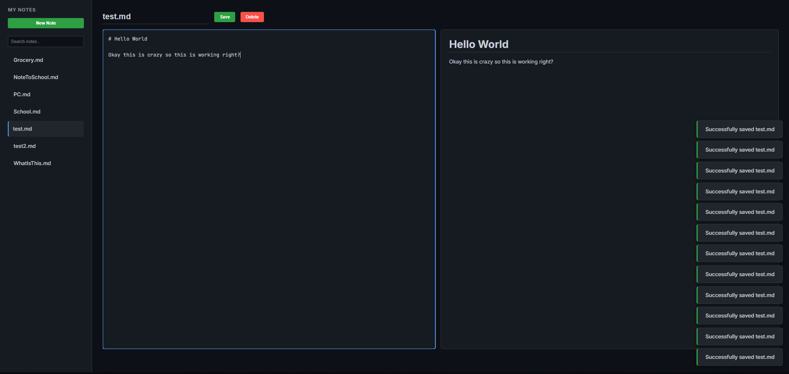
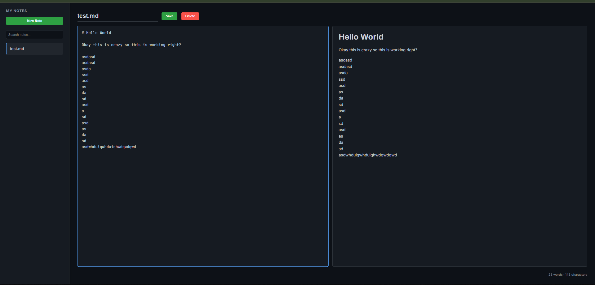
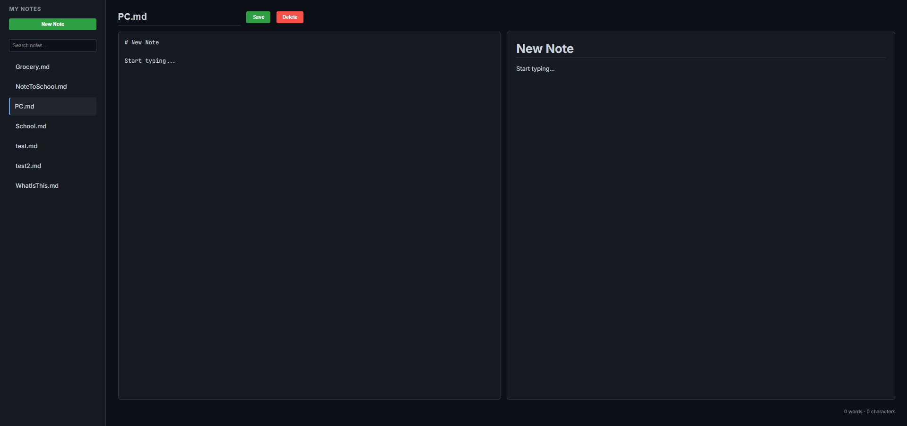
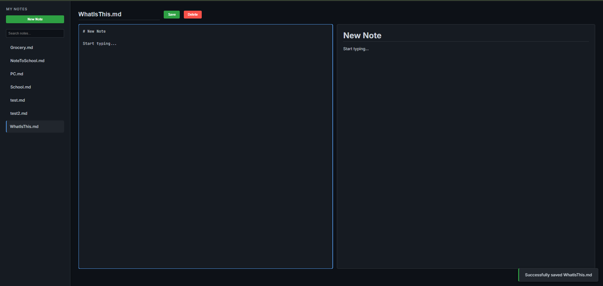
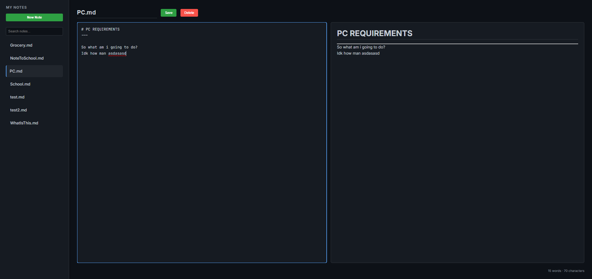
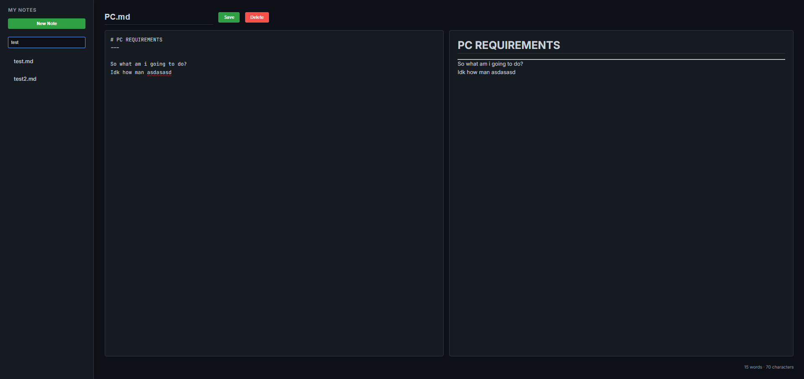

# DEV LOG: WEEK 19, DAY 6

## 1. Executive Summary

The final phase of Week 19 transitioned the application from a functional prototype (MVP) into a production-grade software system. The primary objectives were: securing the backend against file-system attacks, implementing global state management to prevent data loss, engineering a full-stack `PUT` pipeline for file renaming, and injecting advanced UX features (Search, Live Metrics, Keyboard Shortcuts).

## 2. Cybersecurity: Path Traversal Protection

A critical security vulnerability existed in the initial API design. By blindly trusting the `filename` provided by the client, the server was susceptible to **Path Traversal (Directory Climbing) Attacks**.

- **The Threat:** A malicious user could send a request with a filename like `../../../Windows/System32/config.sys` to overwrite or delete vital operating system files outside the designated `data/` directory.
- **The Solution:** Implemented `werkzeug.utils.secure_filename` across all Python routes (`GET`, `POST`, `PUT`, `DELETE`).
- **Mechanism:** This utility sanitizes the incoming string, stripping out absolute paths and navigation characters (like `../`), ensuring that the resulting file operations are strictly jailed within the intended backend directory.

## 3. Global State Management (The Client "Brain")

To provide advanced UI responses, the JavaScript execution context required a memory structure to track the user's current context.

- `API_BASE`: Centralized the backend URL. This completely eliminates hardcoded URLs, adhering to the DRY (Don't Repeat Yourself) principle and making future deployments significantly easier.
- `currentNote`: Tracks the filename currently loaded into the DOM. This enables the UI to highlight the active file in the sidebar and tells the `Save` function whether it is creating a new file or updating an existing one.
- `isDirty`: A boolean flag that flips to `true` the moment an `input` event fires on the editor. It powers the **Data Loss Prevention** system, triggering a `confirm()` guardrail if the user attempts to navigate away with unsaved modifications.

## 4. Full-Stack Architecture: The Rename Pipeline (`PUT`)

Previously, saving a note with an altered title resulted in data duplication (a new file was created via `POST`). We engineered a proper update mechanism.

- **The Backend (`PUT` Route):** We authored a new Flask endpoint that accepts an `old_filename` in the URL and a `new_filename` in the JSON payload. It securely uses the OS-level `os.rename()` command to modify the file on the hard drive before writing the new content.
- **CORS Configuration:** The Flask `@app.after_request` firewall was updated to explicitly whitelist the `PUT` method, preventing the browser's preflight `OPTIONS` request from blocking the network call.
- **The Frontend Switch:** The `saveBtn` listener was refactored with conditional routing. If `currentNote` exists and differs from the input title, it dispatches a `PUT` request. Otherwise, it defaults to a standard `POST` creation request.

## 5. Advanced User Experience (UX) Engineering

We implemented several "Quality of Life" features expected in modern web applications:

- **DOM Filtering (Search):** Bound an `input` listener to the search bar. It captures the query, iterates through the `.note-item` NodeList, and applies a `.hidden` CSS utility class to any element whose `textContent` does not match, creating an instant, client-side filter without requiring database queries.
- **Live Telemetry (Word Count):** Piggybacked on the real-time Markdown rendering loop. It utilizes Regular Expressions (`/\s+/`) to split the raw text array by whitespace, filtering out empty strings to generate an accurate, live-updating word and character count.
- **Keyboard Accessibility:** Attached a global `keydown` listener to the `document` object to intercept `Ctrl+S` and `Ctrl+N`. Critical to this was the use of `e.preventDefault()`, which overrides the browser's native "Save Webpage" dialog, seamlessly routing the action to our custom application logic.

## 6. Debugging Post-Mortem: The Null Reference Exception

During deployment, the application suffered a fatal execution halt resulting in a completely blank UI.

- **Root Cause:** UI buttons (Save, Delete) were accidentally omitted from the HTML DOM during a code migration.
- **The Chain Reaction:** When `app.js` attempted to bind `document.getElementById('save-note-btn')`, it returned `null`. The subsequent attempt to call `.addEventListener()` on `null` triggered an `Uncaught TypeError`.
- **The Lesson:** JavaScript operates sequentially. A fatal error on line 20 will completely prevent the execution of initialization functions on line 150. Ensuring DOM node integrity is paramount before binding event listeners.

