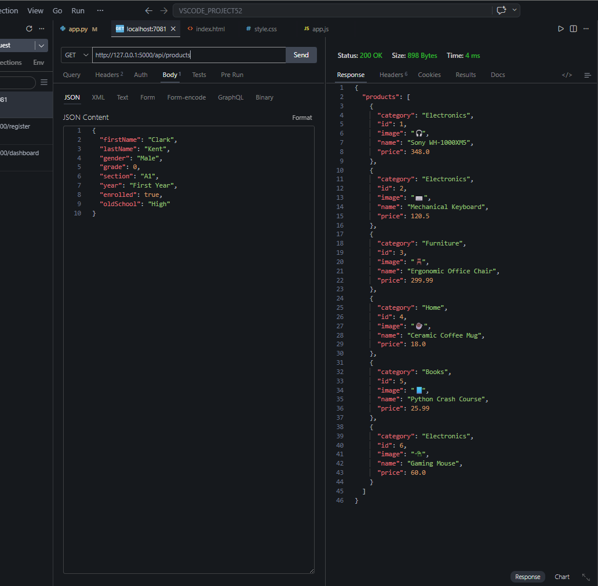
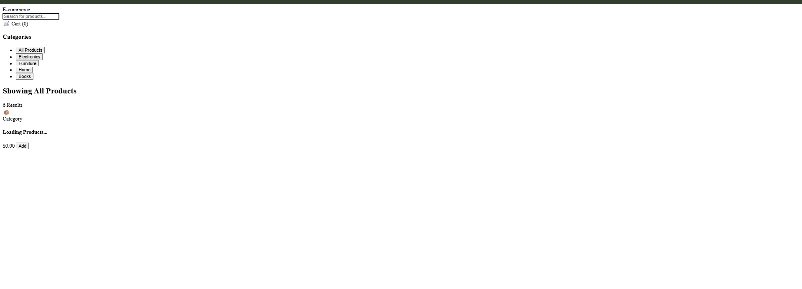
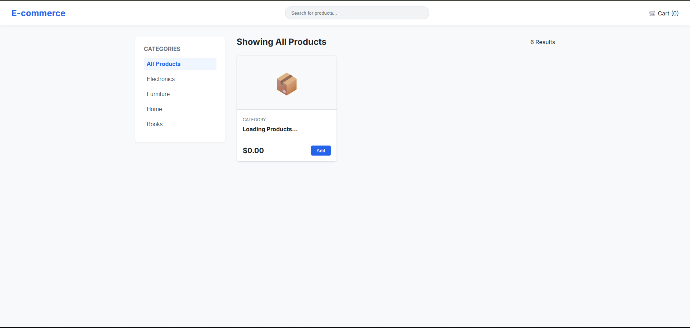
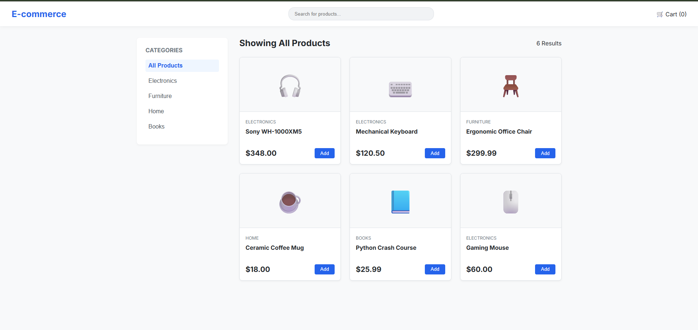
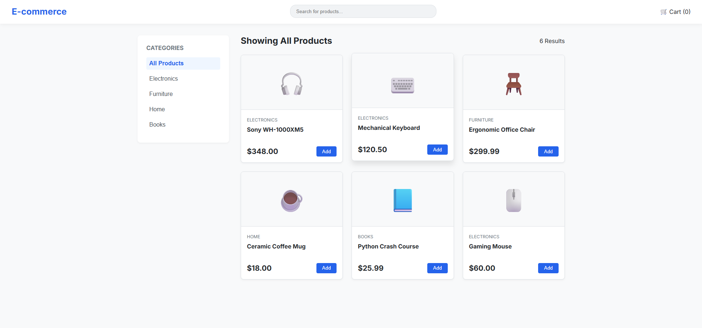

# DEV LOG: WEEK 20, DAY 1

## 1. Executive Summary
Initiated Week 20 by tackling enterprise-level data architecture, beginning the development of a full-stack E-Commerce Product Catalog. The primary objective for Day 1 was establishing the storefront UI and connecting a dynamic JavaScript rendering engine to a Python Flask API.

## 2. Backend Architecture (The API Stub)
* Configured a lightweight Flask server handling Cross-Origin Resource Sharing (CORS) policies.
* Established a `/api/products` endpoint restricted to `GET` requests.
* Engineered an initial data "stub"—a hardcoded list of JSON product models containing structured keys (`id`, `name`, `category`, `price`, and `image`) to simulate a database response prior to SQLite integration.

## 3. Frontend Architecture (UI & Layout)
* Designed a modern storefront interface using a split-layout methodology.
* Implemented a highly responsive product matrix using CSS Grid. 
* Utilized `grid-template-columns: repeat(auto-fill, minmax(250px, 1fr))` to create a fluid layout that automatically scales and wraps product cards based on the available viewport width without requiring media queries.

## 4. The Integration Pipeline (Dynamic Rendering)
* Authored an asynchronous JavaScript function utilizing the native `Fetch API` to request the JSON payload from the local Python server.
* Eliminated static HTML mockups in favor of a dynamic iteration loop. The script maps over the data array and injects template literals (`div.product-card`) directly into the DOM.
* Implemented localized data formatting, explicitly enforcing two decimal places for currency outputs using `.toFixed(2)`.

